# MakeCode_Tutorial

## 1. 获取资料和售后服务

代码和资源下载链接：[MakeCode_Tutorial](./MakeCode_Tutorial.7z)

如果发现某些东西丢失或损坏，或者学习套件时遇到一些困难，keyestudio会提供免费和快速支持，请给我们发送电子邮件：service@keyestudio.com

欢迎提出建议和反馈，我们会根据您的反馈不断更新套件和教程，以使其更好，谢谢！

**FKS0004 Keyestudio microbit 基础学习套件**

## 2. 产品清单

如果发现有缺失的配件，请立即联系我们的销售人员。

| 序号 | 图片 |规格 | 倍用量 |
| :--: | :--: | :--: | :--: |
| 1 | | micro:bit V2.0 主板 | 1 |
| 2 | | 面包板 | 1 |
| 3 |  |超声波传感器 |1 |
| 4 | 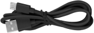| Micro USB线 | 1 |
| 5 | | 面包板线 | 1 |
| 6 | 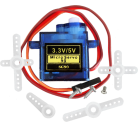| 舵机 | 1 |
| 7 | 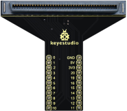|micro:bit T型扩展板 | 1 |
| 8 | | 杜邦线 | 1 |
| 9 | | XHT11温湿度传感器（兼容DHT11） | 1 |
| 10 | | OLED模块 | 1 |
| 11 | |RGB LED | 1 |
| 12 | |电位器 | 1 |
| 13 | |220Ω电阻 | 5 |
| 14 | 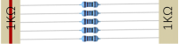| 1KΩ电阻 | 5 |
| 15 | | 10KΩ电阻 |5 |
| 16 |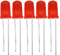| 红色 LED| 5 |
| 17 | 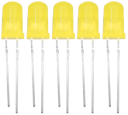| 黄色 LED | 5 |
| 18 | 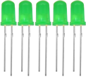| 绿色 LED | 5 |
| 12 |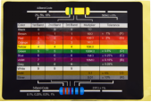| 电阻卡| 1 |
| 12 |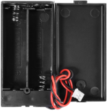|电池盒| 1|
| 13 |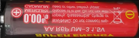|AA电池(不提供，自备)| 2|
|14|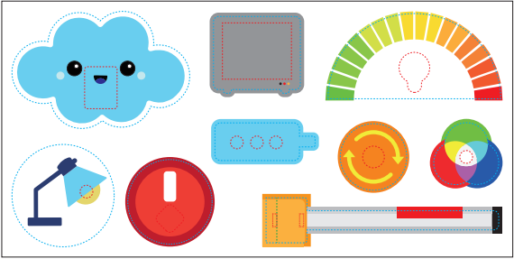|卡片|1|
|15||卡片|1|
## 3. 产品介绍

这是一款基于Microbit主板的基础学习套件，通过集成多种传感器和电子元器件，配合精美的彩色卡片，为用户提供直观生动的学习体验。该套件不仅能让学生和初学者在实践操作中领略科技创新的乐趣，更能有效培养其逻辑思维能力，同时充分展现科技应用的实用价值与教育意义。

## 4. T型扩展板介绍

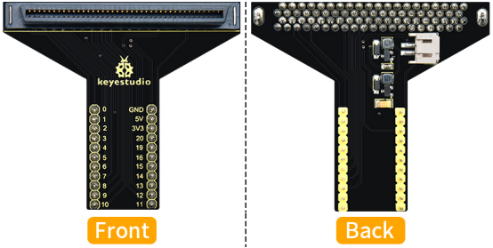

### 4.1. 简介

在教育市场，micro:bit主板越来越受欢迎。然而，单个micro:bit控制板不容易与其他传感器模块进行测试。我们特别设计了这款 micro:bit T 型扩展板，用于micro:bit主板。

micro:bit T 型扩展板将micro:bit主板上的所有IO口拆分为引脚间距为2.54mm的引脚接口(GND,5V,3V3,Signal)，非常方便地连接micro:bit主板和其他传感器模块或电子元件。

此外，您可以通过T 型扩展板上的白色DC插孔(DC 3V)或micro USB端口(DC 5V)为micro:bit主板供电。

T 型扩展板有升压功能和转换功能,外接电源连接3V，可以输出3.3V和5V电压。

### 4.2. 特点

- 输入电压：白色DC插孔(DC 3V)或micro USB接口(DC 5V)
- 输出电压：3.3V或5V
- 将micro:bit的IO口拆分为引脚间距为2.54mm的引脚接口
- 外形尺寸：64mm x 56mm x 18mm
- 重量：13.1g

### 4.3. 引脚分配

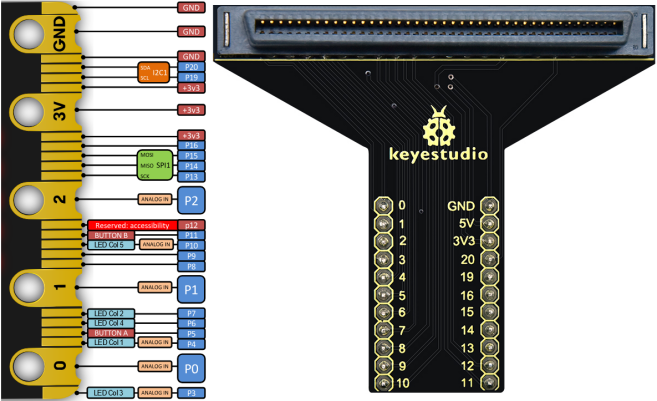

## 5. 下载资源与代码

代码和资源下载链接：[MakeCode_Tutorial](./MakeCode_Tutorial.7z)

（特别提醒：如果已经下载了资源和代码，那么这一步就跳过。）

下载并解压，将资源与代码存放于方便使用的地方。本教程使用的全部代码在MakeCode_Tutorial文件夹中的对应 Codes 文件夹中。

## 6. Micro:bit快速掌握

### 6.1. Micro:bit是什么？

micro:bit 是一款由英国广播电视公司（BBC）推出的专为青少年编程教育设计的微型电脑开发板。

micro:bit主板只有信用卡一半大小，但功能非常强大。micro:bit V2.0主板拥有丰富的板资源，搭载了5×5可编程LED点阵、2颗可编程按键、加速度计、电子罗盘、温度计、可触摸感应的Logo、MEMS麦克风、低功耗蓝牙等电子模块，背面还有一个蜂鸣器，可以在没有外部设备的情况下也可以播放各种声音。此外，micro:bit主板还支持休眠模式，用户可以长按micro:bit主板后面的复位&电源按钮，使进入睡眠模式，降低电池功耗。

#### 6.1.1 Micro:bit V2主板硬件介绍

#### 6.1.2 Micro:bit V2引脚配置介绍

Micro:bit引出的引脚中，其引脚功能分类如下表所示：

| 功能 | 引脚 |
| :--: | :--: | 
| GPIO | P0，P1，P2，P3，P4，P5，P6，P7，P8，P9，P10，P11，P12，P13，P14，P15，P16，P19，P20 |
| ADC/DAC | P0，P1，P2，P3，P4，P10 |
| IIC | P19（SCL），P20（SDA）|
| SPI | P13（SCK），P14（MISO），P15（MOSI） |
| PWM（常用） |P0，P1，P2，P3，P4，P10|
|已占用|P5(Button A)，P6(LED Col4)，P7(LED Col2)，P10(LED Col5)，P11(Button B)|

详细信息请参考官方网站：

- [https://tech.microbit.org/hardware/edgeconnector/](https://tech.microbit.org/hardware/edgeconnector/)

- [https://microbit.org/guide/hardware/pins/](https://microbit.org/guide/hardware/pins/)

#### 6.1.3. Micro:bit V2 主板注意事项

1. Micro:bit主板上有很多精密的电子元件，建议戴上硅胶保护套进行使用，防止短路。

2. Micro:bit主板的IO口驱动能力很弱，IO口电流不足300mA，请勿接大电流器件（例如大舵机MG995、直流电机），否则会烧坏micro:bit主板，使用前必须完全了解清楚你所使用的器件电流情况，一般建议配搭micro:bit扩展板进行使用。

3. 供电建议从Micro:bit主板的USB口进行供电，或者micro:bit主板上的3V电池座接口。Micro:bit主板本身IO口是3V3电平，所以是不支持5V传感器的，如需支持5V传感器需要使用 Micro:bit扩展板。

4. 使用与Micro:bit主板LED点阵的共用引脚（如P3、P4、P6、P7、P10），记得在代码中把LED点阵禁用掉，否则会有LED点阵乱亮的现象。

5. **不要使用P19、P20 IO 口，P19和P20是不能当做IO口来使用的，** 虽然makecode软件上显示可以使用，实际是用不了的！只能用于I2C通讯。

6. 3V电池座接口上不能使用超过3.3V电池，插上去很容易会把micro:bit主板烧坏。

7. 禁止放在金属制品上使用，以免发生短路。

总之：micro:bit主板就像是一台微型计算机，它使编程变得有形，并促进数字创造力。

### 6.2. micro:bit 驱动安装说明

miro:bit是可以免安装USB驱动的，如果你的电脑识别不了micro:bit主板，则需要安装一下micro:bit驱动。

**驱动安装步骤：**

首先将micro:bit主板用micro USB数据线连接到电脑上。

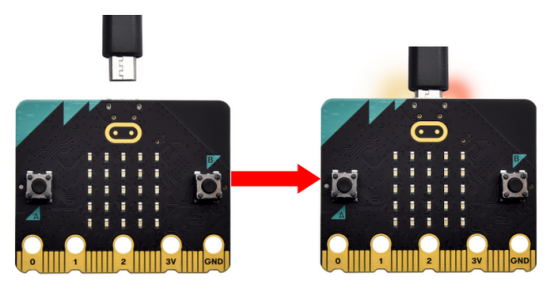

在MakeCode_Tutorial文件夹中找到驱动文件，然后鼠标左键双击驱动文件，点击 “**Install**”。

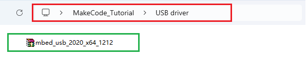

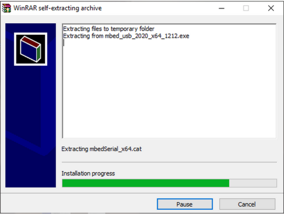

继续点击 “**Install**”，然后点击 “**Next**”，安装驱动。

先点击 “**Install**”，再点击 “**Finish**”，安装完成。

安装完成后，点击 “**Computer**” —> “**Properties**” —> “**Device manager**”, 可以看到如下图所示。

### 6.3. 上传代码

以下的步骤说明基于Windows 操作系统，如果你使用其他操作系统，可以将其作为参考。

#### 6.3.1. 快速开始

**Step1 连接micro:bit主板**

通过micro USB线将micro:bit 主板连接到电脑。

不管是使用外接电源还是连接到电脑上的micro USB数据线供电，micro:bit主板背后的红色LED指示灯亮起来，说明显示micro:bit 主板有电了。在micro:bit主板上，当你的电脑通过micro USB与micro:bit主板通信时，黄色LED指示灯会闪烁。

micro:bit主板连接到电脑时，你的电脑上将显示为一个名为 ' MICROBIT ' 的驱动器。但请注意，它不是普通的USB磁盘！

**Step2 编写heartbeat程序**

在浏览器中访问Makecode编辑器：[https://makecode.microbit.org/](https://makecode.microbit.org/)

然后单击 “New Project”，出现 “Creating a project” 对话框，在文本框中输入 “heartbeat”，单击 “Create √” 并开始编程。

（以下案例是在Google Chrome演示）

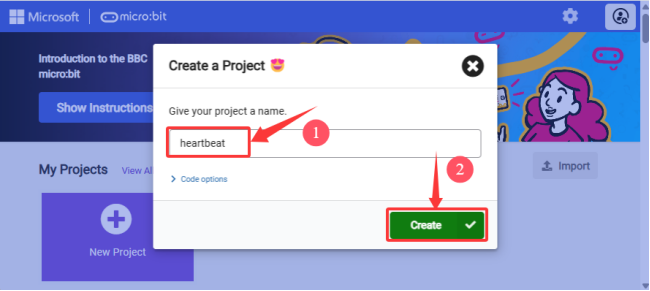

编写一个micro:bit代码需要从模块区拖放一些代码块放入代码编辑区，然后MakeCode编辑器左上角的Simulator会演示你的程序结果。

我们提供了一个示例代码，同时也制作了一个视频以展示如何编写 heartbeat 程序，示例代码和视频的路径如下：

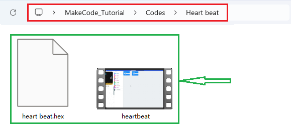

**Step3 下载程序**

如果使用Windows 10 App [Get Windows 10 App](https://apps.microsoft.com/detail/9pjc7sv48lcx?hl=zh-CN&gl=CN#activetab=pivot:overviewtabdocx)（单击）编写程序，则只需单击 “Download” 按钮，该代码将直接下载到micro:bit主板，而无需任何其他操作。

如果使用浏览器编写程序，请按照以下步骤将代码上传到micro:bit： 
单击编辑器中的 “Download” 按钮。 这将下载一个 “.hex” (十六进制)文件，该文件是micro:bit主板可以读取的格式文件。十六进制文件下载后，将其复制到你的micro:bit 主板，就像将文件复制到USB驱动器一样。 在Windows上，你还可以右键单击并选择 “**发送到→MICROBIT**” 将 “.hex” 文件拷贝到micro:bit主板。

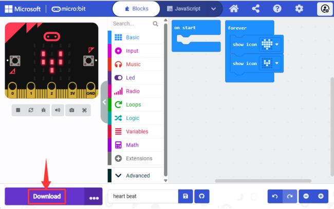

也可以将 “.hex” 文件直接拖入MICROBIT磁盘中。

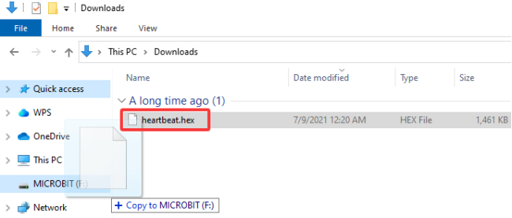

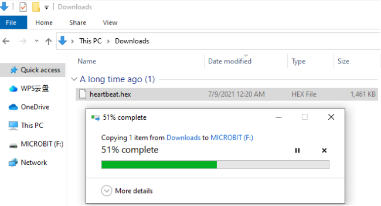

将下载好的 “.hex” 文件拷贝到micro:bit 主板过程中，micro:bit主板背面的黄色信号灯会闪烁，当拷贝完成后黄色信号灯停止闪烁，保持长亮。

**Step4 运行程序**

将代码程序上传micro: bit主板后，通过micro USB线或外接电源给micro: bit主板供电，micro: bit主板上可编程 5 x 5 LED点阵显示heartbeat的图案。

外接3V电源供电：

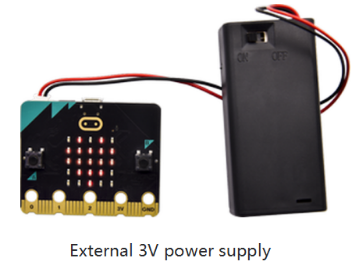

警告： 
每次编程时，MICROBIT磁盘都会自动弹出并返回，但是你已经拷贝到MICROBIT磁盘的十六进制（.hex）文件将不会被显示。 micro:bit主板只能接收并运行最新上传的十六进制（.hex）文件，不会存储任何其他文件！

#### 6.3.2. MakeCode介绍

打开MakeCode在线版本: [https://makecode.microbit.org/](https://makecode.microbit.org/)

MakeCode 编译器如下:

在代码编辑区中，有两个固定的代码块 “**on start**” 和 “**forever**”。 上电或复位后，“on start”代码块中的代码将仅执行一次；并且“forever”代码块中的代码将循环执行。

点击 “**JS JavaScript**”，你可以看到对应的JavaScript语言代码程序，如下图：

你还可以点击下拉按钮选择 “**Python**”，可以看到对应的Python语言代码程序，如下图：

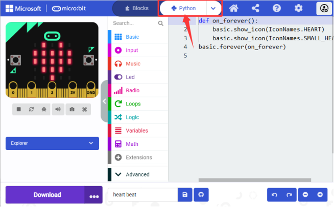

#### 6.3.3. WebUSB功能介绍

如果使用MakeCode的Windows 10 App，则可以通过单击 “Download” 按钮将代码快速下载到micro:bit主板。 在这里，我们将介绍 **Google Chrome** 的webUSB功能，该功能允许你直接通过网页访问你的micro USB硬件设备。

**配对装置：**

1\. 用micro USB线连接电脑和micro:bit主板。

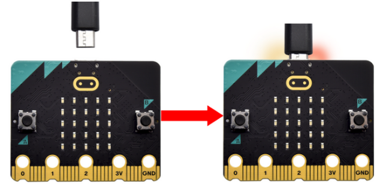

2\. 单击 “Download” 后面的 “...” ，然后单击 “Connect device”。

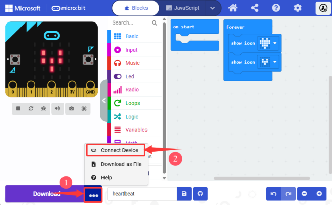

3\. 然后继续单击 “Next” 按钮。

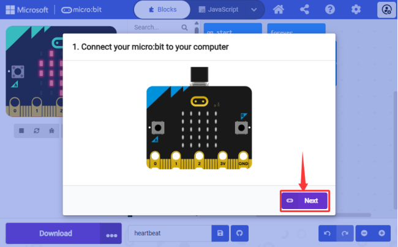

4\. 再继续单击 “Pair” 按钮。

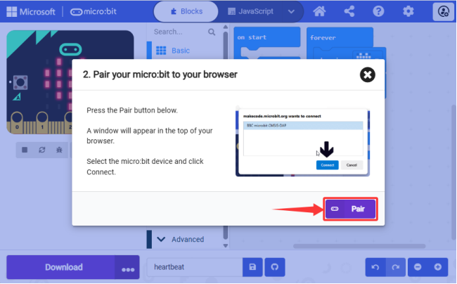

5\. 在弹出窗口中选中对应的 “**设备**” ，然后单击 “Connect” 按钮。 

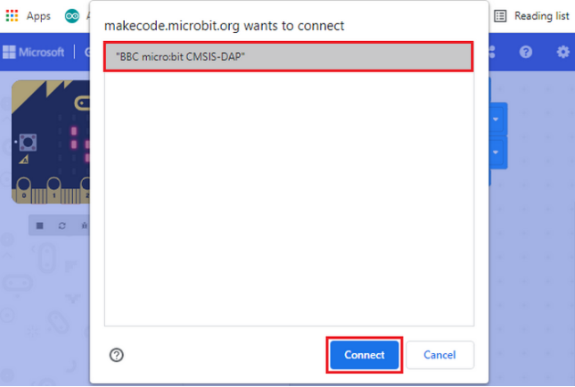

6\. 单击 “Done” ，设备连接成功。

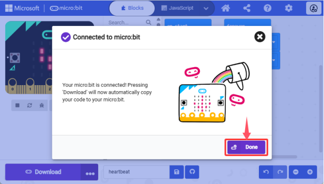

**下载程序：**

设备连接成功后，单击 “Download” 按钮，程序将直接下载到micro:bit主板，如果程序成功下载到micro:bit主板上，下载按钮  会变成 。

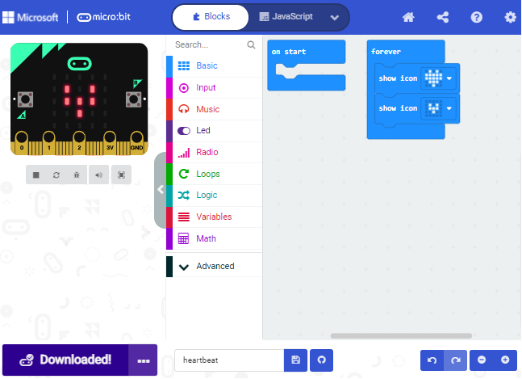

如果弹出窗口中没有设备，请参考以下链接中的内容进行故障排插：

[https://makecode.microbit.org/device/usb/webusb/troubleshoot](https://makecode.microbit.org/device/usb/webusb/troubleshoot)

如果你的micro:bit主板需要更新micro:bit的固件，请参考以下链接中的内容：

[https://microbit.org/guide/firmware/](https://microbit.org/guide/firmware/)

#### 6.3.4. 添加MakeCode扩展库

**3.4.1 如何添加扩展库文件**

打开MakeCode，先单击右上角的图标（设置），再点击 “**Extensions**”。

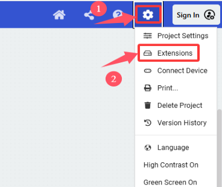

或者单击Advanced上面的 “**Extensions**”。

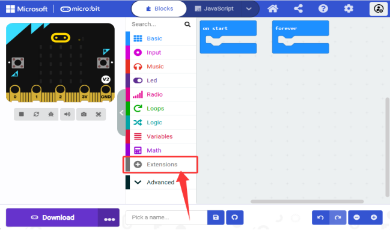

你可以选择关键词搜索或者输入GitHub链接来搜索扩展库。

我们为每个项目提供十六进制代码文件（项目文件）。十六进制代码文件包含运行项目所需的所有内容，你可以直接将其导入makecode中使用，也可以手动拖动代码块来创建每个项目的代码。如果选择通过手动拖动代码块来创建项目代码，则需要添加以下三个库。

添加OLED库的步骤：

1\. 点击 “**Extensions**”。

2\. 在页面的搜索框输入 “**OLED**” ,然后点击搜索图标。

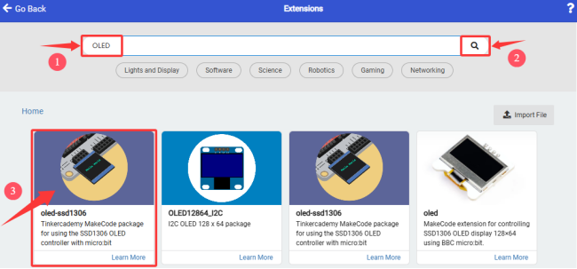

单击选中第一个 **oled-ssd1306** ，等待添加。

3\. 添加成功：

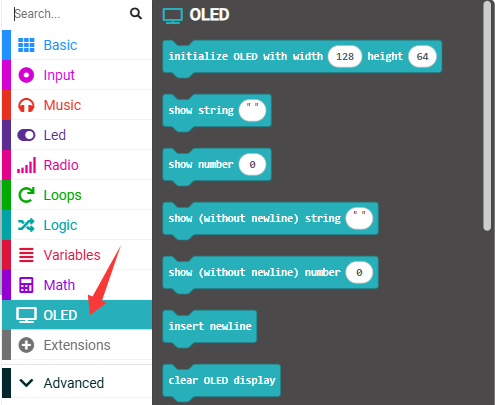

添加超声波库的步骤：

1\. 点击 “**Extensions**”。

2\. 在页面的搜索框输入 “**sonar**” ，然后点击搜索图标，在更新的页面中单击选中sonar。

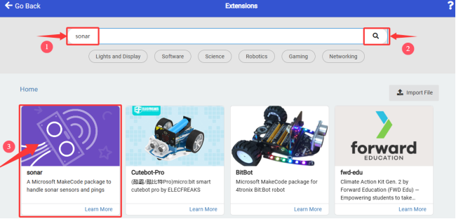

3\. 添加成功：

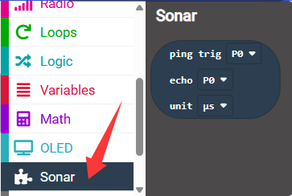

添加DHT11库的步骤：

1\. 点击 “**Extensions**”。

2\. 在页面的搜索框输入 “**DHT11**”，点击搜索图标，然后在更新的页面中单击选中DHT11_DHT22。

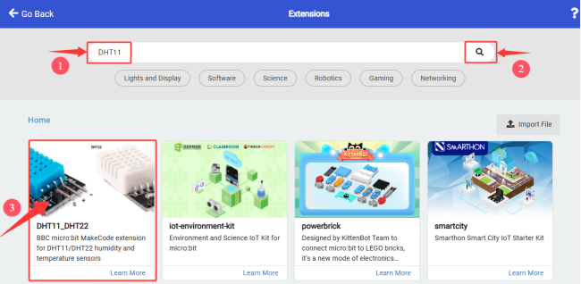

3\. 添加成功：

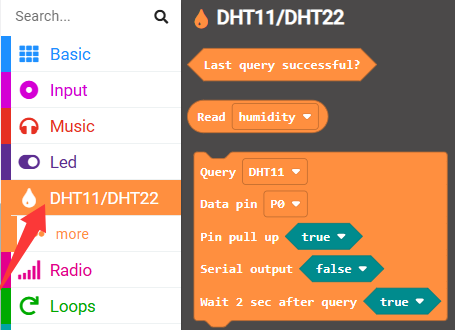

**3.4.2 更新或删除扩展库**

1\. 单击 “**JavaScript**” 按钮切换到文本代码。

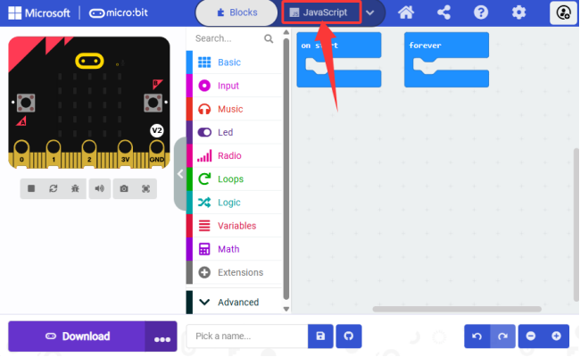

2\. 单击左边的 “**Explorer**”。

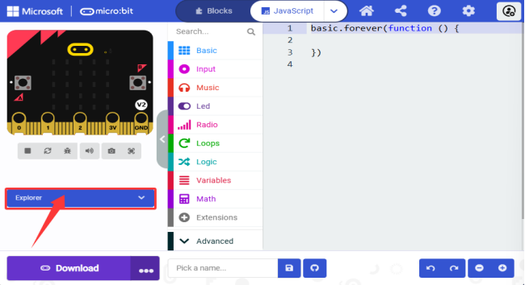

3\. 在扩展列表中找到 “**OLED**” 扩展库文件，单击垃圾箱图标以删除 “**OLED**” 扩展库文件。

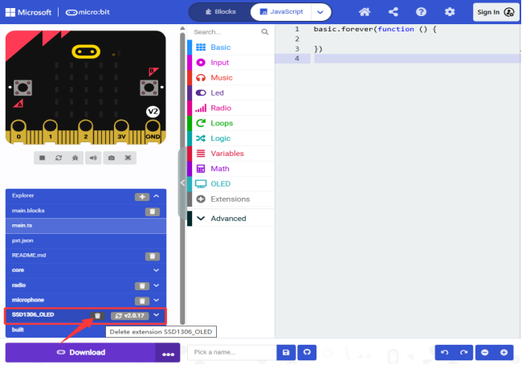

4\. 选择单击 “**Remove it**” 即可删除。

其他库的删除方法类似，可以参照。

#### 6.3.5. 如何在makecode中导入代码

接下来，我们以 “**heatbeat**” 项目为例，介绍如何在makecode中导入代码。

1\. 打开Web版本的makecode编辑器或Windows10 APP版本的makecode编辑器，单击 “Import” 。

2\. 在弹出的对话框中，单击 “Import File...”。

3\. 单击 “Choose File” ，导航到你下载的示例代码所保存的位置。

4\. 打开我们提供的示例代码 “heartbeat.hex” 。

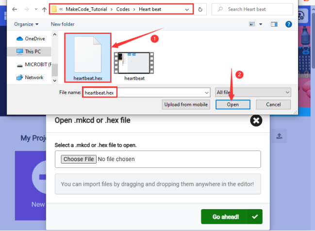

5\. 单击 “Go ahead √” 进入MakeCode 编译器。

除了上述将提供的示例代码文件直接导入到Makecode编译器中的方法之外，也可以将我们提供的示例代码文件直接拖入到Makecode编译器中的代码编辑区，如下图所示：

示例代码成功加载。

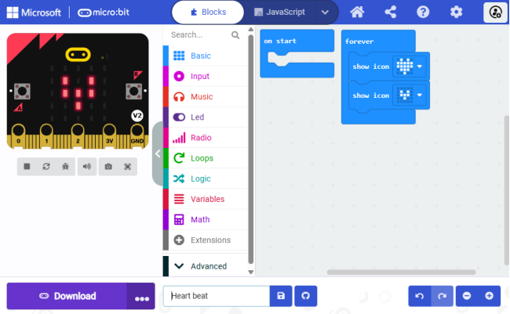

## 7. 项目教程

### Project 01: 按键小台灯

#### 1. 实验介绍

micro:bit主板正面有两个可编程按键（按键A与B），将按键A与B、红色LED灯和灯型卡片组合起来模拟按键小台灯，实现按下按键A时，红色LED灯点亮；按下按键B时，红色LED灯熄灭的效果。

#### 2. 所需组件

| 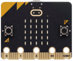| 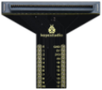 | 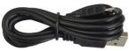 |
| :--: | :--: | :--: |
| micro:bit主板 *1 | micro:bit T型扩展板 *1 | micro USB 线 *1 |
| | 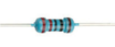 | 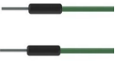 |
| 红色LED *1 | 220Ω电阻 *1 | 面包板线 *2 |
| 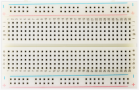 | 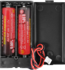 |   |
| 面包板 *1 |电池盒 *1(你需自己准备2个AA电池) | 台灯卡片 *1 |

#### 3. 元件知识

**按键**

按键是可以控制电路的通断，把按键接入电路中，不按下按键时电路是断开的，按下按键时电路是导通的。micro:bit主板上有三个按键，反面有一个复位按键，正面有两个可编程按键（按键A与B）。

**电阻**

电阻是一种能限制支路电流的电子元件。固定电阻是一种电阻，它的电阻是不能改变的，而电位器或可变电阻的电阻是可以调节的。

下面是电阻的两个常用电路符号，如果你在电路中看到这些符号，它代表一个电阻。

Ω为电阻单位，较大的单位有KΩ、MΩ等。它们的关系可以表示为：1 MΩ=1000 KΩ，1 KΩ =1000 Ω。通常情况下，有些电阻的阻值都标在它本身表面上。
在使用电阻时，我们首先需要知道它的电阻值。这里有两种方法：可以观察电阻上的色带，或者用万用表测量电阻。建议您使用第一种方法，因为它更方便、更快捷。

如电阻卡所示，每种颜色代表一个数字。

经常使用4色带和5色带电阻，其上有4条色带和5条色带。

通常情况下，当你得到一个电阻，你可能会发现很难决定从哪一端开始读取颜色。

**因此，可以观察电阻一端的两个色带之间的间隙；如果它比任何其他色带间隙都大，那么你可以从相反的方向读取。**

提示：第4条色带和第5条色带之间的差距会相对较大（以5色带电阻为例），第3条色带和第4条色带之间的差距会相对较大（以4色带电阻为例）。

让我们看看如何读取5色带电阻的电阻值，如下所示：

所以，对于这个电阻，电阻应该从左到右读取。该值应该是这样的格式：第1色带第2色带第3色带 x 10^乘数（Ω），允许误差为±公差%。因此该电阻的阻值为2（红色）2（红色）0（黑色）× 10^0（黑色）Ω = 220 Ω，允许误差为±1%（棕色）。

您可以从Wiki了解更多关于电阻的信息：[https://en.wikipedia.org/wiki/Resistor](https://en.wikipedia.org/wiki/Resistor)

**LED**

LED是一种被称为“发光二极管”的半导体，是一种由半导体材料(硅、硒、锗等)制成的电子器件。它有正极和负极，短腿为负极，接GND ( G 或 - )；长腿为正极，接VCC ( V 或 3.3V 或 5V 或 + )。电流从正极流向负极，是单向流动的。

LED的电子符号和实物：

LED各种尺寸和颜色：

红、黄、蓝、绿、白是LED最常见的颜色，发出的光通常与外观颜色相同。我们很少使用透明的LED，但发出的光可能不是白色的。LED有四种尺寸：3mm，5mm，8mm和10mm，5mm是最常见的尺寸。

正向电压是使用LED时需要知道的一个非常重要的参数，因为它决定了你使用多少功率以及限流电阻应该有多大。正向电压是LED亮起时需要使用的电压。对于大多数红色、黄色、橙色和浅绿色LED，它们通常使用1.9V到2.1V之间的电压。

根据欧姆定律，通过该电路的电流随着电阻的增加而减小，从而导致LED变暗。

I = (VP-Vl)/R

为了使LED安全发光并具有合适的亮度，我们应该在电路中使用多大的电阻？

对于99% 的5mm LED，推荐电流为20mA，可以从其数据表的条件栏中看到：

现在将上述公式转换为如下所示：

R = (VP-Vl)/I

如果VP为5V，Vl（正向电压）为2V，I为20mA，则R为150Ω。所以我们可以通过降低电阻的阻值使LED更亮，但不建议降到150Ω以下（这个电阻可能不是很准确，因为提供的LED有差异）

下面是不同颜色LED的正向电压和波长，您可以作为参考:

提醒：不要把电阻值很低的电阻直接连接在电源两极，这样会使电流过高而损坏电子元件。电阻是没有正负极之分的。

**面包板**

在完成任何电路设计之前，面包板用于快速构建和测试电路。面包板上有许多孔，可以插入集成电路和电阻等电路元件。一个典型的面包板如下所示：

面包板有很多金属条，它们在面包板的下面，连接面包板顶部的孔。金属条的摆放如下图所示。

注意，顶部和底部的孔是水平连接，而其余的孔是垂直连接。

面包板的前两行(上)和后两行(下)分别用于电源的正极（+）和负极（-）。面包板的导电布局图如下图所示：

电子初学者在连接DIP (Dual In-line Packages)组件时，如集成电路、微控制器、芯片等，中间一条凹槽隔离中间部分，凹槽上下是不连通的。因此，DIP组件可以连接如下图所示：

**面包板线或杜邦线**

连接两个端子的导线称为面包板线或杜邦线。有各种各样的面包板线或杜邦线，这里我们主要关注那些在面包板中使用的。其中，它们用于将电信号从面包板上的任何地方传输到微控制器的输入/输出引脚。

面包板线或杜邦线是通过将其“两个端子”插入面包板上提供的槽中来安装的，在面包板的表面下有几组平行板，根据区域将这些槽按行或列分组连接起来。“两个端子”插入面包板，无需焊接，在特定原型中需要连接的特定插槽中。

有三种类型的杜邦线：母对母、公对公和公对母。我们称它为“公对母”的原因是它的一端有突出的尖端，而另一端则是凹陷的母端。“公对公”意味着两端都是突出的尖端，“母对母”意味着两端都是凹陷的母端。

在一个项目中可以使用不止一种类型。跳线颜色不同，但不代表其功能不同；它的设计只是为了更好地识别每个电路之间的连接。

#### 4. 实验接线

提醒：micro:bit主板需要如下图所示插入micro:bit T型扩展板的槽内。

注意：LED的Microbit控制引脚是P0（T型扩展板的引脚接线是数字0）。Microbit的安装方向是LED matrix朝向扩展板的logo方向。

#### 5. 程序流程图

#### 6. 示例代码

教程附带的资源文件夹中，在文件夹Project 01：Small Lamp with Button中找文件Project-01-Small-Lamp-with-Button.hex。

**代码：**

#### 7. 实验现象

下载代码，使用Windows 10 App下载代码只需单击 “Download” 按钮即可，使用浏览器下载代码则需要将下载的 “.hex” 文件发送到micro:bit主板。

代码下载到micro:bit主板后，5×5 LED点阵屏显示图案，按下micro:bit主板上正面按键A，可以看到5×5 LED点阵显示图案，LED灯点亮；按下micro:bit主板上正面按键B，可以看到5×5 LED点阵显示图案，LED灯熄灭。（特别提示：如果未看到实验现象，请用手按下microbit主板上背面的复位按钮，）

如果使用外接电池供电时，请将电池盒拨码开关拨到ON端。

### Project 02: 交通灯

#### 1. 实验介绍

在这个项目实验中，我们可以用红、黄、绿3个LED灯，micro:bit主板上的蜂鸣器和5×5 LED点阵屏来模拟马路上的交通灯。

#### 2. 所需组件

| |  |  |
| :--: | :--: | :--: |
| micro:bit主板 *1 | micro:bit T型扩展板 *1 | micro USB 线 *1 |
| |  |  |
| 红色LED *1 | 黄色LED *1  | 绿色LED *1  |
|  |  | |
| 220Ω电阻 *3 | 面包板线若干 |面包板 *1 |
|   |   |  |
| 电池盒 *1(你需自己准备2个AA电池) | 交通灯卡片 *1 | |

#### 3. 元件知识

**扬声器**

micro:bit主板有内置扬声器，这使得在你的项目中添加声音变得非常容易。

#### 4. 实验接线

提醒：micro:bit主板需要如下图所示插入micro:bit T型扩展板的槽内。

#### 5. 程序流程图

#### 6. 示例代码

教程附带的资源文件夹中，在文件夹Project 02：Traffic Lights中找文件Project-02-Traffic-Lights.hex。

**代码：**

#### 7. 实验现象

下载代码，使用Windows 10 App下载代码只需单击 “Download” 按钮即可，使用浏览器下载代码则需要将下载的 “.hex” 文件发送到micro:bit主板。

示例代码下载到micro:bit主板后，绿色LED先点亮，同时microbit的5×5 LED点阵倒计时6秒；倒计时结束绿色LED熄灭黄色LED闪烁三次，扬声器鸣叫三次；黄色LED熄灭后红灯点亮，同时5×5 LED点阵倒计时6秒。循环进行！（特别提示：如果未看到实验现象，请用手按下microbit主板上背面的复位按钮，）

如果使用外接电池供电时，请将电池盒拨码开关拨到ON端。

### Project 03: 测距蝙蝠

#### 1. 实验介绍

测距蝙蝠实验基于超声波传感器，该超声波传感器能检测前方障碍物的距离，并将检查到的距离实时显示在 OLED 显示屏上。当距离小于10cm时，microbit主板上的扬声器发出警报提醒。

#### 2. 所需组件

| |  |  |
| :--: | :--: | :--: |
| micro:bit主板 *1 | micro:bit T型扩展板 *1 | micro USB 线 *1 |
| | |  |
| 超声波传感器 *1 | OLED模块 *1  | 杜邦线若干  |
| |  |  |
|面包板 *1 |  面包板线若干 |电池盒 *1(你需自己准备2个AA电池) | 
|| | |
|蝙蝠卡片 *1| OLED 卡片 *1| |

#### 3. 元件知识

**超声波传感器**

超声波测距模块利用了超声波在遇到障碍物时会反射回来的原理。我们可以通过计算超声波发送和接收的时间间隔来测量距离，时间差就是超声波从发送到接收的总时间。由于声音在空气中的传播速度是一个常数，约为v=340m/s，因此我们可以计算出超声波测距模块与障碍物之间的距离：s=vt/2。

HC-SR04超声波测距模块集成了超声波发射器和接收器。发射器用于将电信号（电能）转换为高频（超出人的听觉）声波（机械能），接收器的功能与此相反。HC SR04超声波测距模块的图片和示意图如下图所示：

**管脚定义：**

**模块参数:**

- 工作电压：5V
- 工作电流：12mA
- 最小测量距离：2cm
- 最大测量距离：200cm

**使用说明：**

在Trig引脚输出一个持续至少10us的高电平脉冲，模块开始传输超声波。与此同时，Echo引脚被拉高。当模块接收到遇到障碍物返回的超声波时，Echo引脚将被拉低。Echo引脚的高电平持续时间为超声波从发射到接收的总时间，s=vt/2。

**OLED模块**

OLED技术可以提供丰富的色彩表现、高对比度、广视角等优点。画面清晰生动,黑色表现尤其出色。OLED屏幕每个像素自发光,无需背光源,功耗相对较低。0.9寸OLED屏幕凭借其小尺寸、高分辨率(128*96像素)、低功耗等特点,非常适合嵌入式及可穿戴设备领域的应用。

提醒：我们这款OLED模块的SDA接口接到引脚P20，SCL接口接到引脚P19。

**模块参数：**

- 工作电压：DC 3.3V-5V
- 工作电流：30mA
- 接口：间距为2.54mm 的排针接口
- 通信方式：I2C通信
- 内部驱动芯片：SSD1306
- 分辨率：128*64
- 可视角度：大于150°

#### 4. 实验接线

提醒：使用OLED显示屏和超声波传感器时我们必须外接电源，并将电池盒拨码开关拨到ON端。

#### 5. 程序流程图

#### 6. 示例代码

教程附带的资源文件夹中，在文件夹Project 03：Ranging Bat中找文件Project-03-Ranging-Bat.hex。

**代码：** (条件中的阈值10可以根据实际情况修改)

#### 7. 实验现象

下载代码，使用Windows 10 App下载代码只需单击 “Download” 按钮即可，使用浏览器下载代码则需要将下载的 “.hex” 文件发送到micro:bit主板。

示例代码下载到micro:bit主板后，外接电源供电，将拨码开关拨到ON端， OLED显示屏实时显示超声波传感器检测到离障碍物之间的距离值。当距离值小于10cm时，micro:bit主板上的扬声器开始发出警报。（特别提示：如果未看到实验现象，请用手按下microbit主板上背面的复位按钮，）

### Project 04: 智能停车场

#### 1. 实验介绍

我们可以利用超声波传感器来检测前方是否有车辆，当检测到有车辆（或障碍物）靠近时，控制舵机将升降杆升起；当检测到有车辆（或障碍物）远离时，控制舵机将升降杆降下。

#### 2. 所需组件

| |  |  |
| :--: | :--: | :--: |
| micro:bit主板 *1 | micro:bit T型扩展板 *1 | micro USB 线 *1 |
| | |  |
| 超声波传感器 *1 | 舵机 *1  | 杜邦线若干  |
| |  |  |
|面包板 *1 |  面包板线若干 |电池盒 *1(你需自己准备2个AA电池) | 
| | | |
|蝙蝠卡片 *1 |升降杆 *1| |

#### 3. 元件知识

**舵机**

舵机是一种位置伺服的驱动器。我们可以通过舵机进行精确的位置控制或者输出较高的扭矩，通常用于机器人项目，也可以在遥控汽车，飞机等航模中找到它们。舵机有很多规格，但所有的舵机都有外接三根线。由于舵机品牌不同，颜色也会有所差异，我们实验用到的这款舵机分别用棕、红、橙三种颜色进行区分，棕色为接地线，红色为电源正极，橙色为信号线。

**内部结构图：**

- ①信号线：接收来自微控制器的控制信号；
- ②电位器：可以测量输出轴的位置量，属于整个舵机机构的反馈部分；
- ③内部控制器：处理来自外部控制的信号，驱动电机以及处理反馈的位置信号，是整个伺服机构的核心；
- ④直流电机：作为执行机构，输出多少转速，转矩，位置；
- ⑤传动机构/舵机系统：该机构根据一定传动比，将电机输出的行程缩放到最终输出的角度上。

**驱动舵机：**

通过向舵机的信号信号线发送PWM信号来控制舵机的输出量，PWM脉冲的占空比直接决定了输出轴的位置。舵机的周期通常为20毫秒，通常设置以50Hz的频率产生脉冲。

例如（这里以180°舵机为例）：

当我们向180°舵机发送脉冲宽度为1.5毫秒（ms）的信号时，舵机的输出轴将移至中间位置（90度）；

脉冲宽度为0.5ms时，舵机的输出轴将移至最小的位置（0度）；

脉冲宽度为2.5ms时，舵机的输出轴将移至最大的位置（180度）；

**舵机参数：**

- 工作电压: DC 3.3V~5V 
- 工作温度：-10°C ～ +50°C
- 尺寸：32.25mm x 12.25mm x 30.42mm
- 接口：2.54mm间距，3pin接口

#### 4. 实验接线

提醒：驱动舵机和超声波传感器正常工作时我们必须外接电源，并将电池盒拨码开关拨到ON端。

#### 5. 程序流程图

#### 6. 示例代码

教程附带的资源文件夹中，在文件夹Project 04：Smart-Parking中找文件Project-04-Smart-Parking.hex。

**代码：** (条件中的阈值10可以根据实际情况修改)

#### 7. 实验现象

示例代码下载到micro:bit主板后，当超声波传感器检测到有车辆（或障碍物）靠近时，控制舵机将升降杆升起；当检测到有车辆（或障碍物）远离时，控制舵机将升降杆降下。（特别提示：如果未看到实验现象，请用手按下microbit主板上背面的复位按钮）

### Project 05: 汽车表盘

#### 1. 实验介绍

在本实验项目中，我们结合可调电位器，舵机和精美表盘卡片一起来模拟汽车表盘。

#### 2. 所需组件

| |  |  |
| :--: | :--: | :--: |
| micro:bit主板 *1 | micro:bit T型扩展板 *1 | micro USB 线 *1 |
| | |  |
| 电位器 *1 | 舵机 *1  | 面包板线若干  |
|  |  | |
|面包板 *1 |电池盒 *1(你需自己准备2个AA电池) | 电位器卡片 *1| 
| |  |  |
|表盘*1| |  |

#### 3. 元件知识

**电位器**

电位器也是一种具有3个接点的电阻元件，其电阻值可以根据某种规律变化进行调整。

电位器有各种形状、大小和数值，但它们都有以下共同点：

- ①它们有三个接线柱（或连接点）。 
- ②它们有一个可移动的旋钮或滑块，可以以改变中间接线柱和任一外部接线柱之间的电阻。 
- ③随着旋钮或滑块的移动，中间接线柱和任一外部接线柱之间的电阻从0Ω变化到电位器的最大电阻。

这是电位器的电路符号：

(1)\. 作为电压分压器 

电位器是一个可以连续调整的电阻器。当你调整电位器的轴或滑动把手时，移动触点会在电阻器上滑动。此时，根据施加在电位器上的电压以及可移动臂旋转的角度或行程，可以输出一个电压。

(2)\. 作为可变电阻器 

当电位器用作可变电阻器时，在电路中连接中间接线柱和另外两个接线柱中的一个。这样，你可以在移动触点行程范围内获得平稳和连续变化的电阻值。

(3)\. 作为电流控制器 

当电位器作为电流控制器时，移动触点端子必须作为输出端子之一连接。

#### 4. 实验接线

提醒：驱动舵机时我们必须外接电源，并将电池盒拨码开关拨到ON端.

#### 5. 程序流程图

#### 6. 示例代码

教程附带的资源文件夹中，在文件夹Project 05：Car Dial中找文件Project-05-Car-Dial.hex。

**代码：**

#### 7. 实验现象

示例代码下载到micro:bit主板后，外接电源，并将电池盒拨码开关拨到ON端。用手转动电位器上的旋钮，舵机带动指针在表盘上转动。（特别提示：如果未看到实验现象，请用手按下microbit主板上背面的复位按钮，）

### Project 06: 音乐派对

#### 1. 实验介绍

当我们拍拍手时，icro:bit 主板上的麦克风接收到声音信号，micro:bit 主板上的扬声器会自动播放欢快的生日歌曲，同时RGB LED发出炫彩光芒

#### 2. 所需组件

| |  |  |
| :--: | :--: | :--: |
| micro:bit主板 *1 | micro:bit T型扩展板 *1 | micro USB 线 *1 |
| |  |  |
| 红色LED *1 | 220Ω电阻 *3 | 面包板线 *2 |
|  |  |   |
| 面包板 *1 |电池盒 *1(你需自己准备2个AA电池) | RGB卡片 *1 |

#### 3. 元件知识

**麦克风**

micro:bit V2 板上集成了一个高质量的数字麦克风,可以用于检测声音和音频信号，位于主板的正面上方,用于控制和处理麦克风的芯片位于主板的背面。

麦克风的位置可以通过观察板子正面上方的一个小圆孔来识别。这个小孔就是麦克风的收音口，方便捕捉周围的声音信号。使用时只需将 micro:bit 主板正面朝上放置即可,小孔旁边紧挨着麦克风LED指示灯。当micro:bit 在麦克风测量声音级别时，麦克风LED指示灯就会亮起来。

**RGB LED**

RGB LED以三原色共同交集成像，三原色为：红、绿、蓝，称为RGB。RGB LED可以发出各种颜色的光。RGB LED将红色、绿色和蓝色三种LED封装在一个透明或半透明的塑料外壳中。通过改变R引脚、G引脚和B引脚的输入电压并叠加起来，RGB LED以红绿蓝三色混光而成可以显示各种颜色。

三基色原理

RGB LED可分为共阳极和共阴极两种：

在共阴极RGB LED中，三个LED共用一个负连接（阴极）；

在共阳极RGB LED中，三个LED共用一个正连接（阳极）。

提醒：本学习套件中，我们提供的是共阴极RGB LED。

**RGB LED引脚：**

RGB LED有4个引脚：最长的是GND；其他的是红色，绿色和蓝色。如图下图所示放置RGB LED，从左数，RGB LED的引脚编号依次是红色，GND(最长引脚)，绿色和蓝色。

#### 4. 实验接线

提醒： micro:bit主板需要如下图所示插入micro:bit T型扩展板的槽内。

#### 5. 程序流程图

#### 6. 示例代码

教程附带的资源文件夹中，在文件夹Project 06：Music Party中找文件Project-06-Music-Party.hex。

**代码：**

#### 7. 实验现象

示例代码下载到micro:bit主板后，拍拍手时,micro:bit 主板上的麦克风接收到声音信号，micro:bit 主板上的扬声器会自动播放欢快的生日歌曲，同时RGB LED发出炫彩光芒。（特别提示：如果未看到实验现象，请用手按下microbit主板上背面的复位按钮，）

### Project 07: 智能环境监测

#### 1. 实验介绍

智能环境监测系统通过 OLED 显示屏实时显示 DHT11 温湿度传感器检测到的温度和湿度数据，以及 micro:bit 主板上光传感器检测到光的亮度级别值。

#### 2. 所需组件

| |  |  |
| :--: | :--: | :--: |
| micro:bit主板 *1 | micro:bit T型扩展板 *1 | micro USB 线 *1 |
| | |  |
| XHT11温湿度传感器 *1 | OLED模块 *1  | 杜邦线若干  |
| |  |  |
|面包板 *1 |  面包板线若干 |电池盒 *1(你需自己准备2个AA电池) | 
| |  | |
|XHT11卡片 *1| OLED 卡片 *1| |

#### 3. 元件知识

**XHT11温湿度传感器**

XHT11温湿度传感器是一款含有已校准数字信号输出的温湿度复合传感器，可以用来检测空气中的湿度和温度。其精度：湿度±5%RH，温度±2℃，湿度量程5%RH ～ 95%RH，温度量程-25℃ ～ +60℃。温湿度传感器应用专用的数字模块采集技术和温湿度传感技术，确保产品具有极高的可靠性和卓越的长期稳定性。温湿度传感器包括一个电阻式感湿元件和一个NTC测温元件，非常适用于对精度和实时性要求不高的温湿度测量场合。

**XHT11通信方式：**

XHT11 器件采用简化的单总线通信。单总线即只有一根数据线，系统中的数据交换、控制均由单总线完成。

单总线传送数据位定义：

单总线数据格式：一次传送 40 位数据，高位先出。

8bit 湿度整数数据 + 8bit 湿度小数数据 + 8bit 温度整数数据 + 8bit 温度小数数据 + 8bit 校验位。注：其中湿度小数部分为 0。

校验位数据定义：

8bit 湿度整数数据 + 8bit 湿度小数数据 + 8bit 温度整数数据 + 8bit 温度小数数据。8bit 校验位等于所得结果的末 8 位。

数据时序图如下：

用户主机（MCU）发送一次开始信号后，XHT11 从低功耗模式转换到高速模式，待主机开始信号结束后，XHT11 发送响应信号，送出 40bit 的数据，并触发一次信采集。信号发送如图所示:

 **模块参数：**

- 工作电压: DC 3.3V～5V 
- 工作电流: 2.1mA
- 最大功率: 0.0105W
- 温度范围: -25℃ ～ +60℃ (± 2℃)
- 湿度范围: 5%RH ～ 95%RH（25C°左右精度为±5%RH）

**Microbit光传感器**

micro:bit光传感器是一种测量外界光线亮度的输入设备，micro:bit主板并不自带光敏传感器，它对外界光线亮度的检测是通过LED点阵进行的。LED点阵被用来感知周围的光，并反复地将光线亮度转换成值输入，并采样电压衰减时间，这样检测出来的光线亮度级别值是一个相对值。（注意：将光线亮度级别输出至串口，输出的是一个相对值。）

#### 4. 实验接线

提醒：使用OLED显示屏时我们必须外接电源，并将电池盒拨码开关拨到ON端.

#### 5. 程序流程图

#### 6. 示例代码

教程附带的资源文件夹中，在文件夹Project 07：Environment Monitoring中找文件Project-07-Environment-Monitoring.hex。

**代码：**

#### 7. 实验现象

示例代码下载到micro:bit主板后，OLED屏幕显示温湿度值和光线亮度级别值。（特别提示：如果未看到实验现象，请用手按下microbit主板上背面的复位按钮，）

### Project 08: 智能防盗警报

#### 1. 实验介绍

当智能防盗报警装置被移动时，micro:bit 主板上的扬声器会发出警报，红色LED灯闪烁。

#### 2. 所需组件

| |  |  |
| :--: | :--: | :--: |
| micro:bit主板 *1 | micro:bit T型扩展板 *1 | micro USB 线 *1 |
| |  |  |
| 红色LED *1 | 220Ω电阻 *1 | 面包板线 *2 |
|  |  |   |
| 面包板 *1 |电池盒 *1(你需自己准备2个AA电池) | 警报卡片 *1 |

#### 3. 元件知识

**加速度计**

micro:bit主板内置有LSM303AGR加速度传感器（加速度计），LSM303AGR包括支持标准、快速模式、快速模式plus和高速(100 kHz、400 kHz、1 MHz和3.4 MHz)的I2C串行总线接口和SPI串行标准接口与外部通信，8/10/12 bits的分辨率，可设置量程为±2g、±4g,、±8g。

当micro:bit主板处于静止或匀速运动状态时，加速度计仅检测到重力加速度；将micro:bit主板轻微甩动，加速度计检测到甩动的加速度远小于重力加速度，可忽略不计。因此，在使用micro:bit主板过程中，主要是检测当姿态变化时，重力加速度在x、y、z轴上的变化。

#### 4. 实验接线

提醒：micro:bit主板需要如下图所示插入micro:bit T型扩展板的槽内。

注意：LED的Microbit控制引脚是P1（T型扩展板的引脚接线是数字1）。

#### 5. 程序流程图

#### 6. 示例代码

教程附带的资源文件夹中，在文件夹Project 08：Burglar Alarm中找文件Project-08-Burglar-Alarm.hex。

**代码：** (如果导入代码后不动面包板时，蜂鸣器不停地鸣叫，LED闪烁；可能是地理位置不同导致的，则条件中的阈值-60和50可以根据实际情况加以修改。)

#### 7. 实验现象

示例代码下载到micro:bit主板后，移动面包板，如果加速度值x＜-60或x＞50时，micro:bit主板上的扬声器发出警报声，LED闪烁，micro:bit主板上的LED点阵显示图案；否则，micro:bit主板上的扬声器不响，LED不亮，micro:bit主板上的LED点阵显示图案。（特别提示：如果未看到实验现象，请用手按下microbit主板上背面的复位按钮）

## 8. 故障排除

关于Microbit无法下载程序，盘符显示MAINTENANCE的解决方法

#### 1. 问题现象：

很多新用户最近遇到，刚买到的Micro:bit主板插上Micro USB线连接到计算机上，点击 “**下载**” ，代码程序下载不进去，Micro:bit主板没有反应。

如果用户的软件操作没有问题的话，可能是自己不小心按着Micro:bit主板背面上的复位键进入了Micro:bit刷固件模式或者可能是自己的一些误操作导致Micro:bit主板丢失了固件。
所谓的刷固件模式：插上Micro:bit主板，显示多了一个盘符“MAINTENANCE”，进入了刷固件模式后，是无法进行正常的代码程序下载的。

 #### 2. 解决办法：

（1）从此页面将十六进制文件（.hex）下载到您的计算机上。 

下载最新的micro:bit固件-0255的链接：[https://www.microbit.org/get-started/user-guide/firmware/](https://www.microbit.org/get-started/user-guide/firmware/)
 
（注意：你可以点击上述链接下载最新固件-0255十六进制文件；如果你不下载，在相应的文件夹中也有我们事前下载好的最新固件-0255十六进制文件）

（2）按照下图操作，直接将下载好的最新固件-Firmware for V2.20_V2.21十六进制文件拖到 “MAINTENANCE”，即可将Micro:bit主板恢复到正常模式。(特别提醒：根据Micro:bit主板的型号选择不同的固件，这里是以固件-Firmware for V2.20_V2.21为例。)

#### 3. 如何避免进入“MAINTENANCE”：

（1）Micro:bit主板插入Micro USB线时，不要按着Micro:bit主板背面上的复位键，再插Micro USB线。

 很多新手不小心按着Micro:bit主板背面上的复位键插上Micro USB线就进入了刷固件模式。（新手常犯的错误）

（2）在micro:bit程序下载过程中，不要突然拔掉，这可能导致固件丢失，micro:bit主板就会进入刷固件模式了。

（3）在实验过程中，接线接错，导致短路，也有可能导致micro:bit固件丢失，新手操作一定要注意。

#### 4. 使用 WebUSB 进行下载的故障排除:

Micro：bit与WebUSB（/ device / usb / webusb）配对时遇到问题？让我们尝试找出原因。

**步骤1: 检查你的micro USB线**

确保使用micro USB线将micro：bit连接到电脑。 连接后，您应该会在Windows资源管理器中看到一个MICROBIT 驱动器。 

如果可以看到MICROBIT驱动器，请转到步骤2。如果看不到该驱动器，请执行以下操作：

确保micro USB线正常工作。micro USB线是否在另一台电脑上工作？如果不是，请查找其他micro USB线。某些micro USB线可能仅提供电源连接，实际上并未传输数据。在电脑上尝试另一个USB端口。 USB线是否正常，但是您仍然看不到MICROBIT 驱动器？ 嗯，您的micro：bit可能有问题。尝试在microbit.org上的故障查找页面中（[https://support.microbit.org/support/solutions/articles/19000024000-fault-finding-with-a-micro-bit](https://support.microbit.org/support/solutions/articles/19000024000-fault-finding-with-a-micro-bit)）描述的其他步骤。如果这样做没有帮助，您可以创建支持通知单（[https://support.microbit.org/support/tickets/new](https://support.microbit.org/support/tickets/new)）将问题通知Micro：bit基金会。 跳过其余步骤。

**步骤2: 检查您的固件版本**

micro：bit上的固件版本可能需要更新，让我们检查： 

1. 找到 **MICROBIT** 驱动。 

2. 打开 DETAILS.TXT 文件。

3. 在文件中查找接口版本行和引导装载程序行等相关信息。

如果版本为0234、0241、0243，则需要更新固件（/设备/固件）在您的micro：bit上。转到步骤3，然后按照升级说明进行操作。

如果版本是0249、0257或更高版本，则您具有正确的固件，请转到步骤4。

**步骤3: 升级固件**

将您的micro：bit进入维护模式。为此，请从micro：bit主板上拔下micro USB线，然后在按住复位按钮的同时重新连接micro USB线。 插入micro USB线后，可以释放复位按钮。 现在，您应该像以前一样看到一个MAINTENANCE驱动器，而不是MICROBIT驱动器。 同样，黄色的LED指示灯将在重置按钮旁边保持点亮。

（1）下载 firmware .hex file ([https://microbit.org/guide/firmware/](https://microbit.org/guide/firmware/))。(特别提醒：根据Micro:bit主板的型号选择不同的固件，这里是以固件-Firmware for V2.20_V2.21为例。)

（2）将固件.hex文件拖放到 **MAINTENANCE** 驱动器上。

（3）复制.hex文件时，黄色LED指示灯将闪烁。复制完成后，LED会熄灭，并且micro：bit会重置。现在，MAINTENANCE驱动器会变回MICROBIT。 

（4）升级完成！ 您可以打开 DETAILS.TXT 文件进行检查并查看固件版本已更改为与您复制的HEX文件的版本相匹配。

如果您想了解有关连接板，维护模式和升级固件的更多信息，请在固件指南请在固件指南（[https://microbit.org/guide/firmware/](https://microbit.org/guide/firmware/)）中进行阅读。

**步骤4: 检查您的浏览器版本**

WebUSB是一项相当新的功能，可能需要您更新浏览器。 检查您的浏览器版本是否符合以下条件之一： 适用于Android，Chrome操作系统，Linux，macOS和Windows 10的Chrome 65+。 

**步骤5: 配对装置**

更新固件后，打开Chrome浏览器，转到编辑器，然后点击齿轮菜单中的“配对设备”。 有关配对说明，请参见WebUSB（/ device / usb / webusb），对应的链接：[https://microbit.org/get-started/user-guide/web-usb/](https://microbit.org/get-started/user-guide/web-usb/) 。

享受快速下载！

