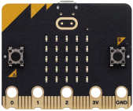
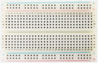
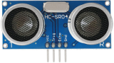
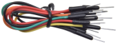
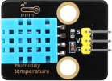
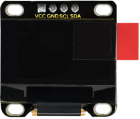
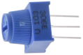

首先感谢选择keyestudio产品
我们将继续为你提供好的产品和服务!

**关于keyestudio**

Keyestudio是KEYES Corporation旗下最畅销的品牌，我们的产品包括Arduino开发板，扩展板，传感器模块，树莓派，micro：bit扩展板和智能小车，以及为各种级别的客户设计的完整入门套件，这些入门套件旨在为任何水平的客户学习Arduino知识。

我们所有的产品均符合国际质量标准，并在世界各地的不同市场中得到了极大的赞赏。 

欢迎从我们的官方网站查看更多内容：[http://www.keyestudio.com](http://www.keyestudio.com)

**售后服务**

如果发现某些东西丢失或损坏，或者学习套件时遇到一些困难 ，keyestudio会提供免费和快速支持，如果您有任何疑问，请给我们发送电子邮箱：[service@keyestudio.com](service@keyestudio.com)

欢迎提出建议和反馈，我们会根据您的反馈不断更新套件和教程，以使其更好，谢谢！

**产品安全**

1.本产品内含排针针脚，注意刺伤，请勿让7岁以下的儿童接触，放在他们拿不到的地方。

2.本产品包含导电部件(控制板和电子模块），请按照本教程的要求进行操作，不当的操作可能导致过热并且损害零件，请勿触摸并立即断开电路电源。

**版权**

Keyestudio商标和徽标是KEYES DIY ROBOT co.,的版权，任何人和公司在没有授权的情况下不得复制，售卖，转卖，keyestudio品牌的产品。如果你有兴趣在当地售卖我们的产品，请联系我们专业的批发销售人员：fennie@keyestudio.com

**Keyestudio microbit 学习套件**

# 产品介绍

这款是Microbit主板控制传感器和元器件的Microbit学习套件，搭配动画卡片使得实验效果更加精致美观，不仅能让创客爱好者在玩耍中体验科技的魅力，还可以培养创客爱好者的逻辑思维，让他们感受到科技的实用性。

除了动手操作，这款套件还配备了编程教程和科学实验，能全方位培养创客爱好者的动手能力和创造力。创客爱好者不仅能学会编程，还能进行有趣的科学探索，在玩中学、在学中玩，收获知识的同时也能获得无穷的乐趣。

这款Microbit学习套件融合了创意设计、智能科技和趣味教育于一体，是一款非常适合初级创客爱好者的优质产品。它不仅能吸引他们的兴趣，还能培养他们的动手能力和创新思维，为他们的创作和学习注入源源不断的动力。

# 产品特点

这款专为初级爱好者设计的学习编程套件，‌不仅为他们提供了一个安全、‌有趣的学习环境，‌还通过寓教于乐的方式引导他们学习编程，‌培养他们的创造力和逻辑思维能力。

1. **多样化的学习模块**  
   
   套件包含各种传感器和模块，如LED、蜂鸣器、舵机、OLED显示屏和超声波传感器，覆盖电子系统设计的不同主题，提供丰富的实践机会，适合不同学习阶段的初学爱好者。
   
2. **循序渐进的课程设计**  
   
   提供系统化的学习课程，从简单的单个感应元件实验到复杂的多个元件组合实验，帮助爱好逐步掌握 micro:bit 的编程及电子原理，适合初学爱好者和有一定基础的学习者。

3. **互动与实用性** 
  
   课程通过互动实验，例如制作按钮小台灯、红绿灯和音乐派对等项目，让初学爱好者在实际操作中理解编程逻辑和电子电路知识，增强学习的趣味性和实用性。

4. **全面的技术支持**  

   每个课程都附有详细的实验原理说明、接线方法和实验代码，学生可以轻松跟随，确保学习过程中的每一步都有清晰的指导。

5. **增强创造力与动手能力** 
 
   鼓励初学爱好者发挥创造力，设计并实现自己的项目，通过解决实际问题培养分析能力和动手能力，为未来的学习和职业奠定坚实基础。

这些特点突出了 micro:bit 学习套件的教育价值与实际应用，吸引对编程和电子感兴趣的青少年。

# 产品清单

收到产品时，请根据清单进行清点，以确保所有配件完整无损。如果发现有缺失的配件，请立即联系我们的销售人员。

| 序号 | 图片 |规格 | 倍用量 |
| :--: | :--: | :--: | :--: |
| 1 | | micro:bit V2.0 主板 | 1 |
| 2 | | 面包板 | 1 |
| 3 |  |超声波传感器 |1 |
| 4 | | Micro USB线 | 1 |
| 5 | | 面包板线 | 1 |
| 6 | | 舵机 | 1 |
| 7 | |micro:bit T型扩展板 | 1 |
| 8 | | 杜邦线 | 1 |
| 9 | | XHT11温湿度传感器（兼容DHT11） | 1 |
| 10 | | OLED模块 | 1 |
| 11 | |RGB LED | 1 |
| 12 | |电位器 | 1 |
| 13 | |220Ω电阻 | 3 |
| 14 | 2 | 3 | 3 |
| 15 | 2 | 3 | 3 |
| 16 | 2 | 3 | 3 |
| 17 | 2 | 3 | 3 |
| 18 | 2 | 3 | 3 |
| 12 | 2 | 3 | 3 |
| 12 | 2 | 3 | 3 |

