## 1. Programming On MakeCode

The following instructions are applied for Windows system but can also serve as a reference if you are using a different system.

#### 1.1. Fast Start

**Step 1 Connect to micro:bit**

Connect the board to computer via USB cable. 

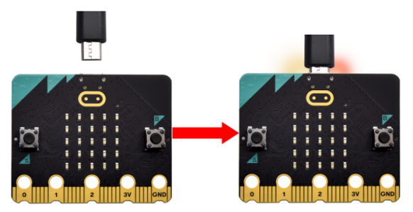

If the red LED on the back of the board is on, that means the board is powered. When your computer communicates with the main board via the USB cable, the yellow LED on it will flashes. For example, it will flash when you burn a “.hex” file.

Then Micro: bit main board will appear on your computer as a driver named “MICROBIT”. Please note that it is not an ordinary USB disk as shown below.

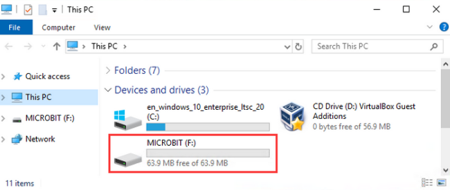

**Step 2 Write heartbeat program**

Enter the link：[online version of Makecode](https://makecode.microbit.org/)

Click “New Project” and you will see a “Creating a project”, fill it with “heartbeat” and click “Create √”.

Here we write programs on Google Chrome.

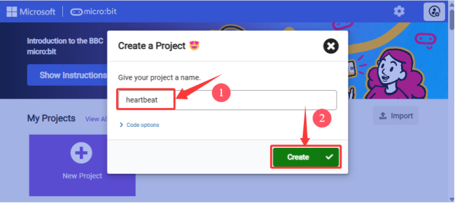

Let’s write a micro:bit code. 

You can drag some Blocks to the editing area and then run your program in Simulator as shown below. Here we demonstrate how to edit heartbeat program. 

Operation video guide:

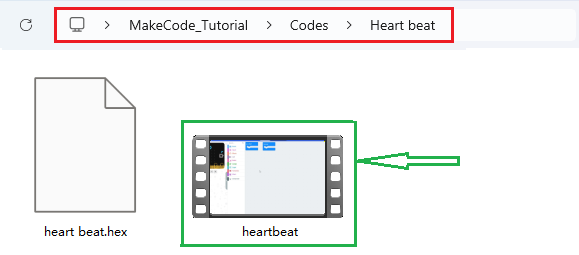

**Step3 Download codes**

Generally, for Windows 10 APP ([Get Windows 10 App](https://apps.microsoft.com/detail/9pjc7sv48lcx?hl=zh-CN&gl=CN#activetab=pivot:overviewtabdocx))(Click), simply clicking the  “Download” will directly download the code to the micro:bit board without any additional steps.

Yet for browsers, please:

Click “Download” in the editor. This will download a “hex” file, which is a format that the micro:bit board can read. After that, copy it to your micro:bit board just like you would copy a file to a USB drive. On Windows, you can also right-click on the “.hex” file and select “**Send to → MICROBIT**” to copy the file to the micro:bit board.

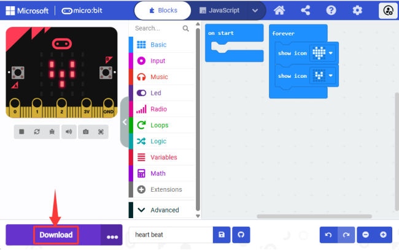

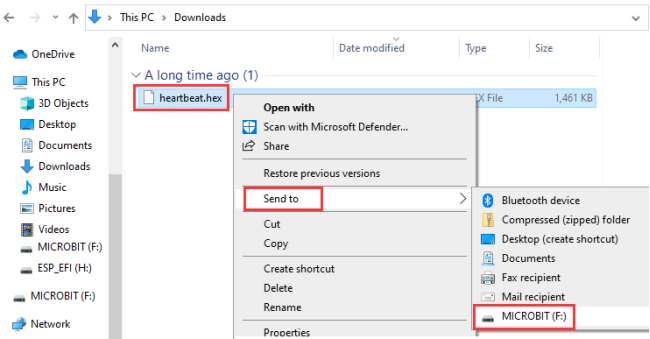

Or, you may directly drag the “.hex” file into MICROBIT.

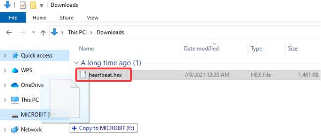

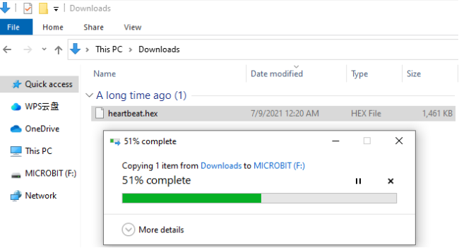

During copying the “.hex” file to the Micro: bit, the yellow LED on the back of the board flashes. When the duplication is completed, the LED will stop flashing and remain on.

**Step 4 Run porgram**

After the program is uploaded to the Micro: bit, you can power it via USB cable or an external power. Then the 5 x 5 LED dot matrix displays a heartbeat pattern.

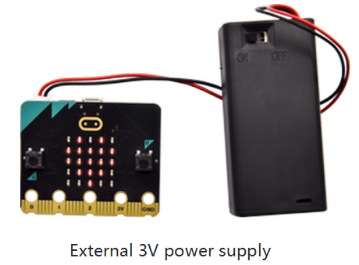

**Caution:** When you programs each time, the driver of Micro: bit will automatically eject and return so the hex files will disappear. The board only has access to hex files rather than save them.

#### 1.2. MakeCode

Enter [Makecode Google Chrome online version](https://makecode.microbit.org/) . Here is its main interface.

There are blocks “**on start**” and “**forever**”in the code editing area. After powering on, codes in “on start” only executes once, while those in “forever” runs cyclically.

Click “**JS JavaScript**” language:

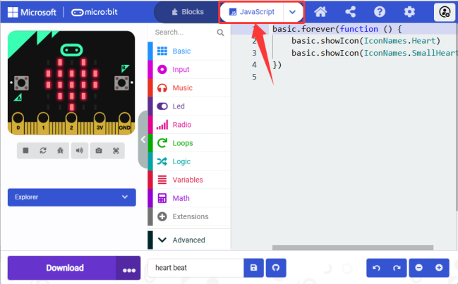

Switch it to “**Python**” language:

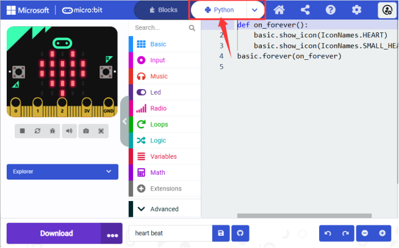

#### 1.3. Introduction to WebUSB Functions

As mentioned before, if your computer is Windows 10 and you have downloaded the APP MakeCode, you can quickly download codes to the board by “Download” button. We use the webUSB of **Google Chrome** to access the hardware device connected by USB. 

**Devices Pairing:**

1\. Connect the board to computer via USB cable.

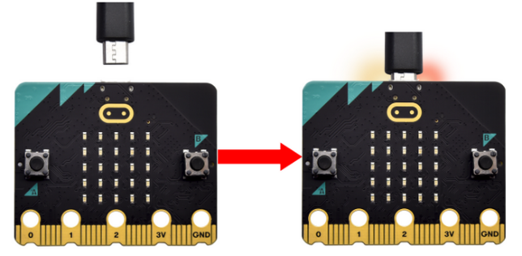

2\. Click “Download” -> “...” , and “Connect device”.

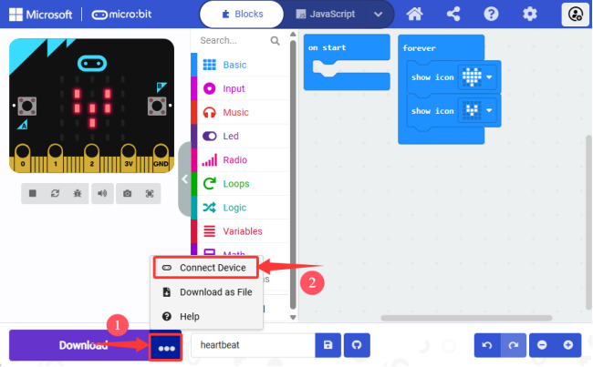

3\.  “Next”.

4\.  “Pair” .

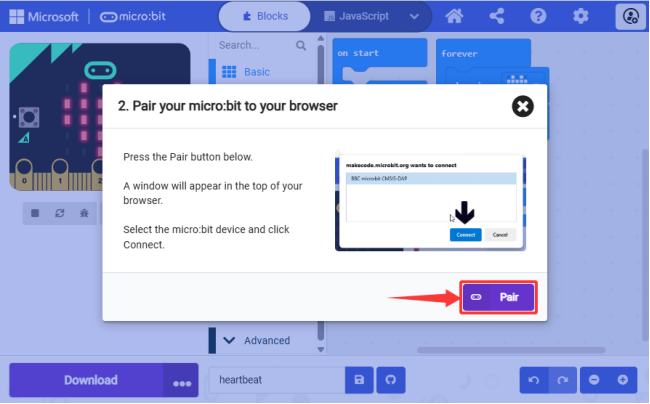

5\. Then select the corresponding device and  “Connect” . 

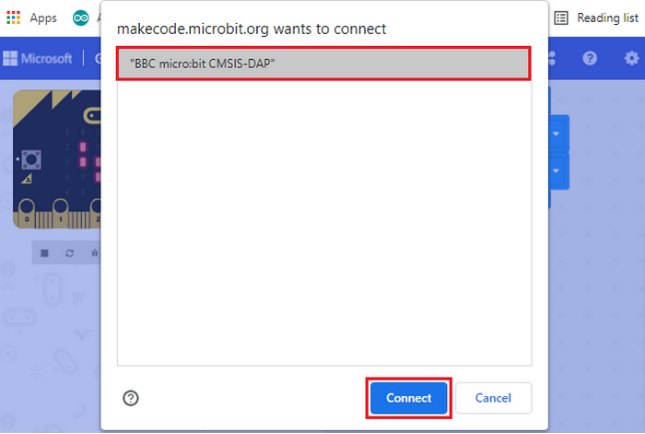

6\. “Done”.

**Download Program:**

After connection, click “Download” and you will see the  becomes . The program is downloaded to the micro:bit board. 

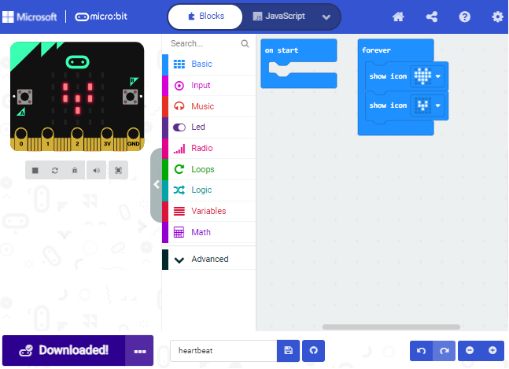

If no device shows up for selection, please refer to [Troubleshooting downloads with WebUSB](https://makecode.microbit.org/device/usb/webusb/troubleshoot). Browse [the user guide](https://microbit.org/guide/firmware/) to know how to update micro:bit firmware. 

#### 1.4. MakeCode Extensions Library

**3.4.1 Import Library Extensions**

Open makecode to enter a certain project, click  to choose “**Extensions**”.

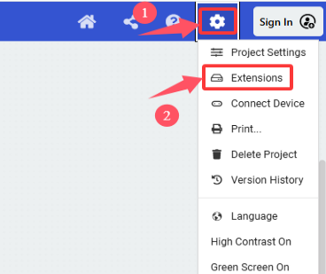

Or click “**Extensions**”  above the Advanced.

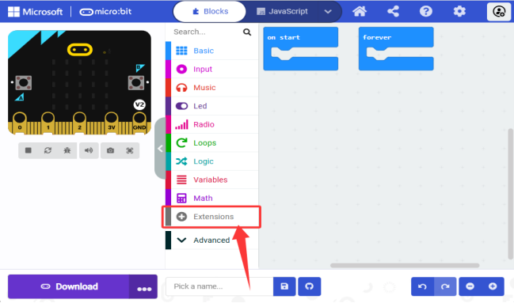

Search the library you want.

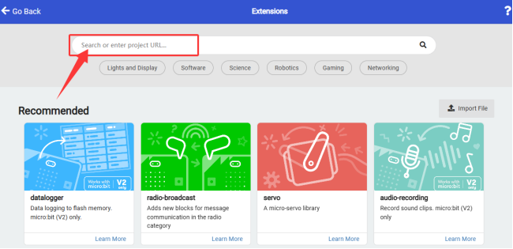

We provide the code files for each project containing everything you need to run a project, so you can load it directly. If you want to build code blocks by yourself, remember to add the following three extensions.

**OLED Extension:**

1\. Click “**Extensions**” to add library extensions.

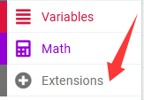

2\. Search “**OLED**” and click .

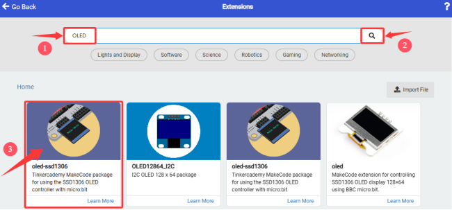

Click the first **oled-ssd1306** and wait for it to be added.

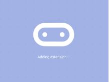

3\. Add successful:

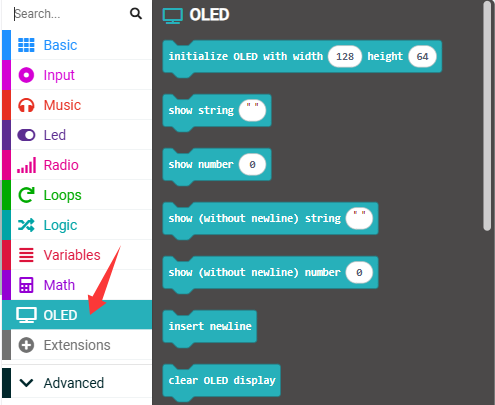

**Ultrasonic sensor extension:**

1\. Click “**Extensions**” to add library extensions.

2\. Search “**sonar**” and click to find and load “sonar”.

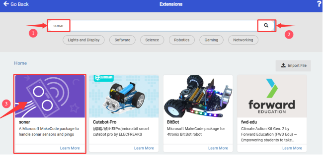

3\. Add successful:

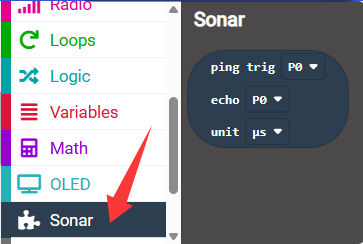

**DHT11 sensor extension:**

1\. Click “**Extensions**” to add library extensions.

2\. Search “**DHT11**” and click  to find and load “DHT11_DHT22”.

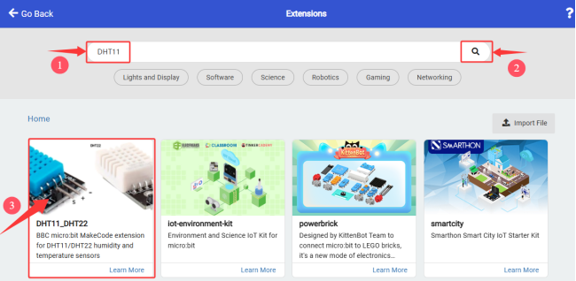

3\. Add successful:

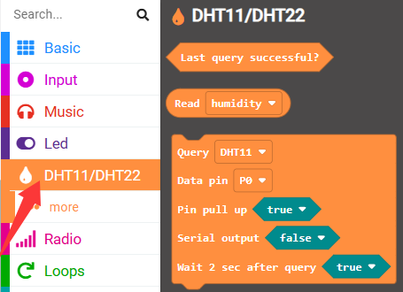

**3.4.2 Update/Delete Extensions**

1\. Click “**JavaScript**” to switch to text code.

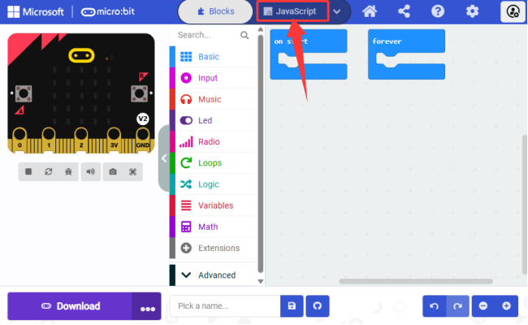

2\. Click “**Explorer**”.

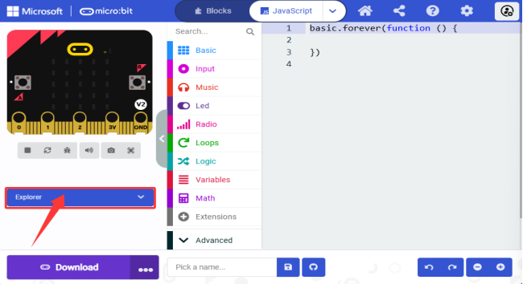

3\. Find the “**OLED**” library and click  to delete it.

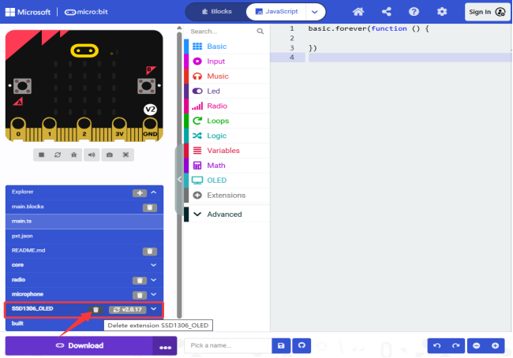

4\.  “**Remove it**”.

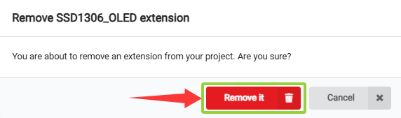

It is removed.

#### 1.5. How to Import Codes to MakeCode

Let’s take the “**heatbeat**” project as an example to show how to load the code. 

1\. Open the Web version of Makecode or the Windows 10 App Makecode, and click “Import” .

2\. “Import File...”

3\. “Choose File”  to import the file you want to load.

4\. Here we load “heartbeat.hex” .

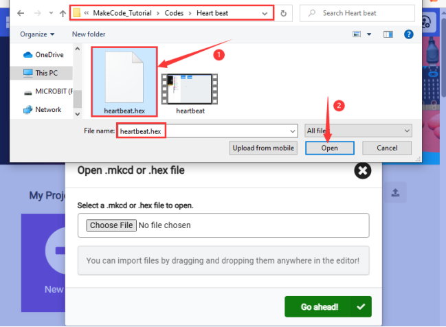

5\. “Go ahead √”

In addition to the above method, you can also drag the the test code into the code editing area, as shown below:

Wait for loading.

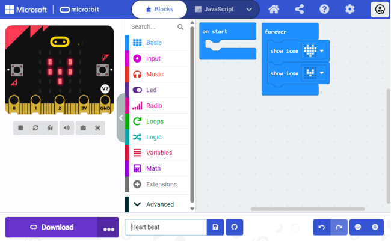
