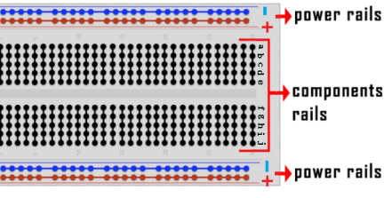
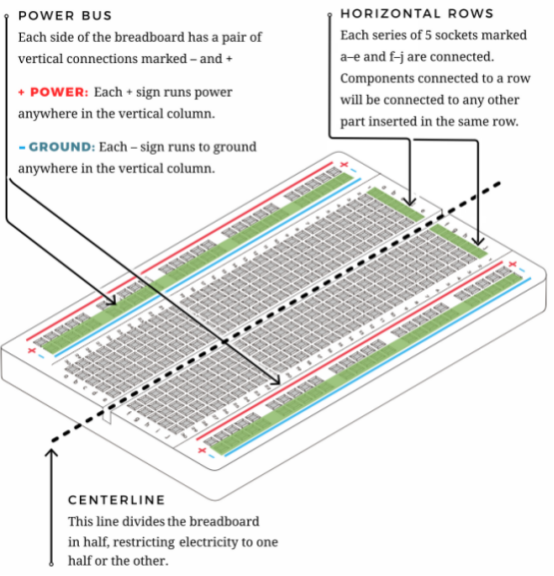
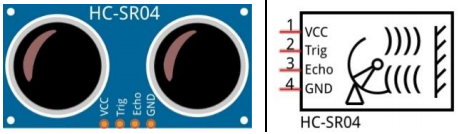
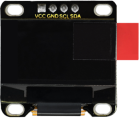
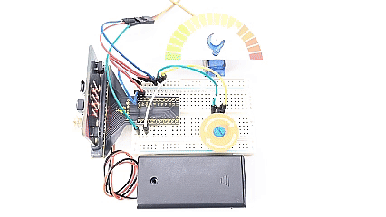
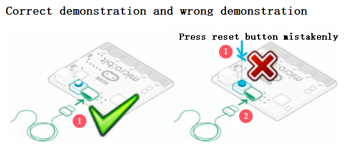
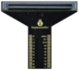

.. _MakeCode_Tutorial:

MakeCode_Tutorial
=================

.. _1.-Programming-On-MakeCode:

1. Programming On MakeCode
--------------------------

The following instructions are applied for Windows system but can also
serve as a reference if you are using a different system.

.. _1.1.-Fast-Start:

1.1. Fast Start
~~~~~~~~~~~~~~~

**Step 1 Connect to micro:bit**

Connect the board to computer via USB cable.

.. image:: ./media/A800.png
   :alt: Img

If the red LED on the back of the board is on, that means the board is
powered. When your computer communicates with the main board via the USB
cable, the yellow LED on it will flashes. For example, it will flash
when you burn a “.hex” file.

Then Micro: bit main board will appear on your computer as a driver
named “MICROBIT”. Please note that it is not an ordinary USB disk as
shown below.

.. image:: ./media/A849.png
   :alt: Img

**Step 2 Write heartbeat program**

Enter the link：\ `online version of
Makecode <https://makecode.microbit.org/>`__

Click “New Project” and you will see a “Creating a project”, fill it
with “heartbeat” and click “Create √”.

Here we write programs on Google Chrome.

Let’s write a micro:bit code.

You can drag some Blocks to the editing area and then run your program
in Simulator as shown below. Here we demonstrate how to edit heartbeat
program.

Operation video guide:

.. image:: ./media/A100.png
   :alt: Img

**Step3 Download codes**

Generally, for Windows 10 APP (`Get Windows 10
App <https://apps.microsoft.com/detail/9pjc7sv48lcx?hl=zh-CN&gl=CN#activetab=pivot:overviewtabdocx>`__)(Click),
simply clicking the “Download” will directly download the code to the
micro:bit board without any additional steps.

Yet for browsers, please:

Click “Download” in the editor. This will download a “hex” file, which
is a format that the micro:bit board can read. After that, copy it to
your micro:bit board just like you would copy a file to a USB drive. On
Windows, you can also right-click on the “.hex” file and select
“\ **Send to → MICROBIT**\ ” to copy the file to the micro:bit board.

.. image:: ./media/A319.png
   :alt: Img

Or, you may directly drag the “.hex” file into MICROBIT.

.. image:: ./media/A341.png
   :alt: Img

.. image:: ./media/A345.png
   :alt: Img

During copying the “.hex” file to the Micro: bit, the yellow LED on the
back of the board flashes. When the duplication is completed, the LED
will stop flashing and remain on.

**Step 4 Run porgram**

After the program is uploaded to the Micro: bit, you can power it via
USB cable or an external power. Then the 5 x 5 LED dot matrix displays a
heartbeat pattern.

Caution: When you programs each time, the driver of Micro: bit will
automatically eject and return so the hex files will disappear. The
board only has access to hex files rather than save them.

.. _1.2.-MakeCode:

1.2. MakeCode
~~~~~~~~~~~~~

Enter `Makecode Google Chrome online
version <https://makecode.microbit.org/>`__ . Here is its main
interface.

.. image:: ./media/A637.png
   :alt: Img

There are blocks “\ **on start**\ ” and “\ **forever**\ ”in the code
editing area. After powering on, codes in “on start” only executes once,
while those in “forever” runs cyclically.

Click “\ **JS JavaScript**\ ” language:

.. image:: ./media/A754.png
   :alt: Img

Switch it to “\ **Python**\ ” language:

.. image:: ./media/A814.png
   :alt: Img

.. _1.3.-Introduction-to-WebUSB-Functions:

1.3. Introduction to WebUSB Functions
~~~~~~~~~~~~~~~~~~~~~~~~~~~~~~~~~~~~~

As mentioned before, if your computer is Windows 10 and you have
downloaded the APP MakeCode, you can quickly download codes to the board
by “Download” button. We use the webUSB of **Google Chrome** to access
the hardware device connected by USB.

**Devices Pairing:**

1. Connect the board to computer via USB cable.

2. Click “Download” -> “...” , and “Connect device”.

.. image:: ./media/A028.png
   :alt: Img

3. “Next”.

.. image:: ./media/A046.png
   :alt: Img

4. “Pair” .

5. Then select the corresponding device and “Connect” .

.. image:: ./media/A127.png
   :alt: Img

6. “Done”.

**Download Program:**

After connection, click “Download” and you will see the |Img| becomes
|image1|. The program is downloaded to the micro:bit board.

.. image:: ./media/A232.png
   :alt: Img

If no device shows up for selection, please refer to `Troubleshooting
downloads with
WebUSB <https://makecode.microbit.org/device/usb/webusb/troubleshoot>`__.
Browse `the user guide <https://microbit.org/guide/firmware/>`__ to know
how to update micro:bit firmware.

.. _1.4.-MakeCode-Extensions-Library:

1.4. MakeCode Extensions Library
~~~~~~~~~~~~~~~~~~~~~~~~~~~~~~~~

**3.4.1 Import Library Extensions**

Open makecode to enter a certain project, click |image2| to choose
“\ **Extensions**\ ”.

Or click “\ **Extensions**\ ” above the Advanced.

.. image:: ./media/A900.png
   :alt: Img

Search the library you want.

We provide the code files for each project containing everything you
need to run a project, so you can load it directly. If you want to build
code blocks by yourself, remember to add the following three extensions.

OLED Extension:

1. Click “\ **Extensions**\ ” to add library extensions.

2. Search “\ **OLED**\ ” and click |image3|.

.. image:: ./media/A306.png
   :alt: Img

Click the first **oled-ssd1306** and wait for it to be added.

3. Add successful:

.. image:: ./media/A335.png
   :alt: Img

Ultrasonic sensor extension:

1. Click “\ **Extensions**\ ” to add library extensions.

2. Search “\ **sonar**\ ” and click\ |image4| to find and load “sonar”.

3. Add successful:

DHT11 sensor extension:

1. Click “\ **Extensions**\ ” to add library extensions.

2. Search “\ **DHT11**\ ” and click |image5| to find and load
“DHT11_DHT22”.

3. Add successful:

**3.4.2 Update/Delete Extensions**

1. Click “\ **JavaScript**\ ” to switch to text code.

2. Click “\ **Explorer**\ ”.

.. image:: ./media/A749.png
   :alt: Img

3. Find the “\ **OLED**\ ” library and click |image6| to delete it.

.. image:: ./media/A824.png
   :alt: Img

4. “\ **Remove it**\ ”.

.. image:: ./media/A727.png
   :alt: Img

It is removed.

.. _1.5.-How-to-Import-Codes-to-MakeCode:

1.5. How to Import Codes to MakeCode
~~~~~~~~~~~~~~~~~~~~~~~~~~~~~~~~~~~~

Let’s take the “\ **heatbeat**\ ” project as an example to show how to
load the code.

1. Open the Web version of Makecode or the Windows 10 App Makecode, and
click “Import” .

.. image:: ./media/A956.png
   :alt: Img

2. “Import File...”

.. image:: ./media/A042.png
   :alt: Img

3. “Choose File” to import the file you want to load.

.. image:: ./media/A06.png
   :alt: Img

4. Here we load “heartbeat.hex” .

.. image:: ./media/A28.png
   :alt: Img

5. “Go ahead √”

In addition to the above method, you can also drag the the test code
into the code editing area, as shown below:

.. image:: ./media/A202.png
   :alt: Img

Wait for loading.

.. image:: ./media/A217.png
   :alt: Img

.. _2.-Projects:

2. Projects
-----------

.. _Project-01:-Small-Lamp-with-Button:

Project 01: Small Lamp with Button
~~~~~~~~~~~~~~~~~~~~~~~~~~~~~~~~~~

.. _1.-Overview:

1. Overview
^^^^^^^^^^^

There are two programmable buttons on the front of the micro:bit board
(A and B). We combine them with a red LED and a lamp card to build a
small desk lamp. When the button A is pressed, the red LED lights up;
when B is pressed, it goes off.

.. _2.-Components:

2. Components
^^^^^^^^^^^^^

.. container:: table-wrapper

   +-----------------------+-----------------------+-----------------------+
   | |image7|              | |image8|              | |image9|              |
   +=======================+=======================+=======================+
   | micro:bit board \*1   | micro:bit T-type      | micro USB cable \*1   |
   |                       | expansion board \*1   |                       |
   +-----------------------+-----------------------+-----------------------+
   | |image10|             | |image11|             | |image12|             |
   +-----------------------+-----------------------+-----------------------+
   | red LED \*1           | 220Ω resistor \*1     | jump wire \*2         |
   +-----------------------+-----------------------+-----------------------+
   | |image13|             | |image14|             | |image15|             |
   +-----------------------+-----------------------+-----------------------+
   | breadboard \*1        | battery holder \*1    | lamp card \*1         |
   |                       | (self-provided AA     |                       |
   |                       | batteries \*2)        |                       |
   +-----------------------+-----------------------+-----------------------+

.. _3.-Components-Knowledge:

3. Components Knowledge
^^^^^^^^^^^^^^^^^^^^^^^

**Buttons**

Buttons can control the circuit on and off. When a button is connected
to a circuit, the circuit is opened when the button is not pressed; the
circuit will be closed after pressing the button.

There are three buttons on the micro:bit board: a reset button on its
back and two programmable buttons (A and B) on its front.

**Resistors**

.. image:: ./media/A248.png
   :alt: Img

A resistor is an electronic component that limits the current in a
branch circuit. The resistance of a fixed resistor cannot be adjusted,
while that of a potentiometer or a variable resistor can.

Here are two common circuit symbols for resistors. If you see these
symbols in a circuit, they represent a resistor.

.. image:: ./media/A303.png
   :alt: Img

Ω is the unit of resistance, including Ω, KΩ, MΩ, etc. They can be
expressed as: 1 MΩ=1000 KΩ, 1 KΩ =1000 Ω. In general, some resistances
are marked on the surface.

When using a resistor, we first need to know its resistance. There are
two ways: observe the color band on it, or measure its resistance by a
multimeter. Obviously, the former one is more convenient and faster.

.. image:: ./media/A317.png
   :alt: Img

As shown in the resistor card, each color represents a number.

4-band and 5-band resistors are commonly used.

Often, when you get a resistor, you may find it difficult to decide
where to start reading the color.

**Therefore, you can observe the gap between the two bands at one end of
it; if it is wider than any other band gap, read from the opposite
end.**

Note that the gap between the 4th and 5th bands (the 3rd and 4th) is
relatively wide in a 5-band (4-band) resistor.

Let’s see how to read the resistance of a 5-band resistor, as shown
below:

.. image:: ./media/A426.png
   :alt: Img

For this resistor, the resistance should be read from left to right. The
value should be: 1st band 2nd band 3rd band x 10^multiplier(Ω),
±tolerance%.

Therefore, the resistance of this resistor is 2(red) 2(red) 0(black) ×
10^0 (black)Ω = 220Ω, ±1%(brown). Learn more about `resistor from
Wiki <https://en.wikipedia.org/wiki/Resistor>`__.

**LED**

LED, fully called “light-emitting diode”, which is an electronic device
made of semiconductor materials (silicon, selenium, germanium, etc.). It
is polar, with a positive pole - the long pin connected to VCC (V or
3.3V or 5V or +), and a negative pole - the short pin connected to GND
(G or-). The current flows from the positive to the negative, in a
one-way flow.

Electronic and graphic symbol of LED:

LED in various sizes and colors:

Red, yellow, blue, green and white are the most common colors of LED,
which is same as their appearance colors. We rarely use transparent LED,
and the light emitted may not be white. There are four sizes of LED:
3mm, 5mm(most common), 8mm and 10mm.

.. image:: ./media/A535.png
   :alt: Img

Forward voltage needs to be used when the LED is on. It is a very
important parameter to know when using an LED, as it determines how much
power you use and how large the current limiting resistor should be. For
most red, yellow, orange and light green LED, they typically use a
voltage between 1.9V and 2.1V.

.. image:: ./media/A548.png
   :alt: Img

According to Ohm's law, the current through the circuit decreases as the
resistance increases, causing the LED to dim.

I = (VP-Vl)/R

In order to make the LED safe and have the right brightness, how much
resistance should we use in the circuit?

For 99% of 5mm LED, the recommended current is 20mA, which can be seen
from the conditions column in its data sheet:

.. image:: ./media/A613.png
   :alt: Img

Now convert the above formula to the following:

R = (VP-Vl)/I

If VP = 5V, Vl (forward voltage) = 2V, and I = 20mA, we can tell R is
150Ω. Therefore, we can make the LED brighter by reducing the
resistance, but the resistance should not be below 150Ω (this value may
not be accurate because the provided LED varies).

The forward voltage and wavelength of different colors of LED are shown
below for your reference:

Do not connect a resistor with very low resistance directly to the two
poles of the power supply, or the electronic components may be damaged
due to excessive current. Resistors are non-polar.

**Breadboard**

Before completing any circuit, a breadboard is used for quickly
designing and testing circuits. There are many holes on a breadboard
that can be inserted with circuit components (say, resistors). A typical
breadboard is shown below:

.. image:: ./media/A655.png
   :alt: Img

A breadboard has many metal strips under it to connect to the holes at
the top. They are arranged as shown below.

Note that the top and bottom holes are horizontally connected, while the
rest of the holes are vertically connected.

.. image:: ./media/A723.png
   :alt: Img

The first two rows(top) and the last two(bottom) of the breadboard are
used for the positive(+) and negative(-) poles of the power supply,
respectively. The conductive layout diagram is shown below:

When connecting DIP(Dual In-line Packages) components, such as
integrated circuits, microcontrollers, chips, etc., the groove isolates
the two parts. Therefore, DIP components can be connected as shown
below:

.. image:: ./media/A740.png
   :alt: Img

**Jump wire and DuPont wire**

Jump wires and DuPont wires connect two terminals. There are various
types of them, but here we focus on those used in breadboard. They
transmit electrical signals from anywhere on the breadboard to the
input/output pins of a microcontroller.

When using, insert “two pins” of the wires into the breadboard without
soldering. Several sets of parallel boards are arranged under the
surface of the breadboard, so wires only need to be inserted in specific
holes in a particular prototype.

There are three types of DuPont wires: F-F, M-M and M-F. On the wire,
the pin is called male end(M), while the hole is female(F).

More than one type can be used in a project. Although the colors of
wires are different, they serve the same purpose. Colors are used to
distinguish circuits.

.. _4.-Wiring-Diagram:

4. Wiring Diagram
^^^^^^^^^^^^^^^^^

Note: the micro:bit board needs to be inserted into the T-type expansion
board as shown below. The micro:bit board LED matrix should be on the
same side with the logo of the expansion board.

The board control pin of LED is P0 (the pin of T-type expansion board is
digital 0).

.. _5.-Code-Flow:

5. Code Flow
^^^^^^^^^^^^

.. _6.-Test-Code:

6. Test Code
^^^^^^^^^^^^

The code file is provided in folder Project 01：Small Lamp with Button,
file Project-01-Small-Lamp-with-Button.hex.

**Load code blocks:**

.. image:: ./media/A440.png
   :alt: Img

.. _7.-Test-Result:

7. Test Result
^^^^^^^^^^^^^^

For Windows 10 App, click “Download” . For browsers, send the downloaded
“.hex” file to the micro:bit board.

After downloading the code to the board, 5x5 LED matrix shows |image16|
icon. Press button A, and 5x5 LED matrix shows |image17| icon, LED turns
on. Press button B, 5x5 LED matrix shows |image18| icon, LED goes off.
Does it look like a mini lamp?

ATTENTION: If the wiring is correct but you cannot see the results,
press the reset button on the back of the board.

.. image:: ./media/A359.gif
   :alt: Img

When powering on via external power supply, turn the DIP switch to ON.

.. image:: ./media/A904.png
   :alt: Img

.. _Project-02:-Traffic-Lights:

Project 02: Traffic Lights
~~~~~~~~~~~~~~~~~~~~~~~~~~

.. _1.-Overview:

1. Overview
^^^^^^^^^^^

In this project, we adopt three LEDs( red, yellow and green), a speaker
on micro:bit board and 5x5 LED matrix to make a model of traffic lights.

.. _2.-Components:

2. Components
^^^^^^^^^^^^^

.. container:: table-wrapper

   +-----------------------+-----------------------+-----------------------+
   | |image19|             | |image20|             | |image21|             |
   +=======================+=======================+=======================+
   | micro:bit board \*1   | micro:bit T-type      | micro USB cable \*1   |
   |                       | expansion board \*1   |                       |
   +-----------------------+-----------------------+-----------------------+
   | |image22|             | |image23|             | |image24|             |
   +-----------------------+-----------------------+-----------------------+
   | red LED \*1           | yellow LED \*1        | green LED \*1         |
   +-----------------------+-----------------------+-----------------------+
   | |image25|             | |image26|             | |image27|             |
   +-----------------------+-----------------------+-----------------------+
   | 220Ω resistor \*3     | jump wires            | breadboard \*1        |
   +-----------------------+-----------------------+-----------------------+
   | |image28|             | |image29|             |                       |
   +-----------------------+-----------------------+-----------------------+
   | battery holder \*1    | traffic lights card   |                       |
   | (self-provided AA     | \*1                   |                       |
   | batteries \*2)        |                       |                       |
   +-----------------------+-----------------------+-----------------------+

.. _3.-Components-Knowledge:

3. Components Knowledge
^^^^^^^^^^^^^^^^^^^^^^^

**Speaker**

.. image:: ./media/A833.png
   :alt: Img

Micro: bit comes with a speaker, which makes it easy to make sound in
your project.

.. _4.-Wiring-Diagram:

4. Wiring Diagram
^^^^^^^^^^^^^^^^^

Note: the micro:bit board needs to be inserted into the T-type expansion
board as shown below. The micro:bit board LED matrix should be on the
same side with the logo of the expansion board.

.. image:: ./media/A940.png
   :alt: Img

.. _5.-Code-Flow:

5. Code Flow
^^^^^^^^^^^^

.. _6.-Test-Code:

6. Test Code
^^^^^^^^^^^^

The code file is provided in folder Project 02：Traffic Lights, file
Project-02-Traffic-Lights.hex.

**Load code blocks:**

.. image:: ./media/A605.png
   :alt: Img

.. _7.-Test-Result:

7. Test Result
^^^^^^^^^^^^^^

For Windows 10 App, click “Download” . For browsers, send the downloaded
“.hex” file to the micro:bit board.

After downloading the code to the board, the green LED turns on and the
5×5 LED matrix counts down 6 seconds. After the green LED is off, the
yellow LED flashes and the matrix counts down 3s with speaker sounding.
At last, the red LED is on with a countdown of 6s. These actions repeat.

ATTENTION: If the wiring is correct but you cannot see the results,
press the reset button on the back of the board.

.. image:: ./media/A459.gif
   :alt: Img

When powering on via external power supply, turn the DIP switch to ON.

.. image:: ./media/A904.png
   :alt: Img

.. _Project-03:-Ranging-Bat:

Project 03: Ranging Bat
~~~~~~~~~~~~~~~~~~~~~~~

.. _1.-Overview:

1. Overview
^^^^^^^^^^^

Based on an ultrasonic sensor, the ranging bat detects the distance of
obstacles and displays it in real time on an OLED. When it is less than
10cm, the speaker alarms.

.. _2.-Components:

2. Components
^^^^^^^^^^^^^

.. container:: table-wrapper

   +-----------------------+-----------------------+-----------------------+
   | |image30|             | |image31|             | |image32|             |
   +=======================+=======================+=======================+
   | micro:bit board \*1   | micro:bit T-type      | micro USB cable \*1   |
   |                       | expansion board \*1   |                       |
   +-----------------------+-----------------------+-----------------------+
   | |image33|             | |image34|             | |image35|             |
   +-----------------------+-----------------------+-----------------------+
   | ultrasonic sensor \*1 | OLED module \*1       | DuPont wires          |
   +-----------------------+-----------------------+-----------------------+
   | |image36|             | |image37|             | |image38|             |
   +-----------------------+-----------------------+-----------------------+
   | breadboard \*1        | jump wires            | battery holder \*1    |
   |                       |                       | (self-provided AA     |
   |                       |                       | batteries \*2)        |
   +-----------------------+-----------------------+-----------------------+
   | |image39|             | |image40|             |                       |
   +-----------------------+-----------------------+-----------------------+
   | bat card \*1          | OLED card \*1         |                       |
   +-----------------------+-----------------------+-----------------------+

.. _3.-Components-Knowledge:

3. Components Knowledge
^^^^^^^^^^^^^^^^^^^^^^^

**ultrasonic sensor**

Ultrasonic waves bounce back when they hit an obstacle. We measure the
distance by calculating the time interval between sending and receiving
the waves. Since the propagation speed of sound in air is a constant
v=340m/s, we calculate the distance between the sensor and the obstacle:
s=vt/2.

.. image:: ./media/A846.png
   :alt: Img

The HC-SR04 ultrasonic module integrates a transmitter and receiver. The
former converts electrical signals (electric energy) into high frequency
(beyond human hearing) sound waves (mechanical energy), while the latter
does the opposite.

The schematic diagram of the HC SR04:

**Pin definition:**

.. image:: ./media/A702.png
   :alt: Img

**Parameters:**

-  Operating voltage: 5V
-  Operating current: 12mA
-  Minimum measuring distance: 2cm
-  Maximum measuring distance: 200cm

**Working principle:**

A high level pulse lasting at least 10us is output on the Trig pin, and
the module starts transmitting ultrasonic waves. At the same time, the
Echo pin is pulled up. When the module receives an ultrasonic wave back
when it encounters an obstacle, the Echo pin will be pulled down. The
duration of the high level of the Echo pin is the total time of wave
from sending to receiving: s=vt/2.

.. image:: ./media/A728.png
   :alt: Img

**OLED module**

OLED technology features rich color performance, high contrast and wide
perspective, providing clear and vivid pictures, especially outstanding
in black.

Each pixel of the OLED display emits light itself without backlight, so
it consumes relatively low power. With small size, high resolution and
low power consumption, the 0.9-inch OLED display is very suitable for
wearable devices.

In this project, the OLED display module connects the SDA interface to
pin P20 and SCL to pin P19.

**Parameters:**

-  Operating voltage: DC 3.3V-5V

-  Operating current: 30mA

-  Interface: Pin ports with a spacing of 2.54mm

-  Communication mode: I2C

-  Internal driver chip: SSD1306

-  Resolution: 128*64

-  Viewing Angle: greater than 150°

.. _4.-Wiring-Diagram:

4. Wiring Diagram
^^^^^^^^^^^^^^^^^

.. image:: ./media/A1849.png
   :alt: Img

When using the OLED display and ultrasonic sensor, we must connect an
external power supply and turn the DIP switch to ON.

.. image:: ./media/A902.png
   :alt: Img

.. _5.-Code-Flow:

5. Code Flow
^^^^^^^^^^^^

.. image:: ./media/A924.png
   :alt: Img

.. _6.-Test-Code:

6. Test Code
^^^^^^^^^^^^

The code file is provided in folder Project 03：Ranging Bat, file
Project-03-Ranging-Bat.hex.

.. image:: ./media/A955.png
   :alt: Img

**Load code blocks:** The threshold in the condition 10 can be modified
according to actual conditions.

.. _7.-Test-Result:

7. Test Result
^^^^^^^^^^^^^^

For Windows 10 App, click “Download” . For browsers, send the downloaded
“.hex” file to the micro:bit board.

After downloading the code to the board, power on via external power
supply and turn the DIP switch to ON, and the OLED displays the distance
between the ultrasonic sensor and the obstacle in real time. When the
distance value is less than 10cm, the speaker on micro:bit board alarms.

ATTENTION: If the wiring is correct but you cannot see the results,
press the reset button on the back of the board.

.. image:: ./media/A605.gif
   :alt: Img

.. _Project-04:-Smart-Paeking:

Project 04: Smart Paeking
~~~~~~~~~~~~~~~~~~~~~~~~~

.. _1.-Overview:

1. Overview
^^^^^^^^^^^

Smart parking lots are everywhere. Can we also create a smart parking
lot? Of course. We can use ultrasonic sensor to detect if there are
vehicles ahead. When a vehicle (or thing) is detected approaching, we
control servo to raise the lift rod; If it is detected to be moving
away, the servo will lower the lift rod.

.. _2.-Components:

2. Components
^^^^^^^^^^^^^

.. container:: table-wrapper

   +-----------------------+-----------------------+-----------------------+
   | |image41|             | |image42|             | |image43|             |
   +=======================+=======================+=======================+
   | micro:bit board \*1   | micro:bit T-type      | micro USB cable \*1   |
   |                       | expansion board \*1   |                       |
   +-----------------------+-----------------------+-----------------------+
   | |image44|             | |image45|             | |image46|             |
   +-----------------------+-----------------------+-----------------------+
   | ultrasonic sensor \*1 | servo \*1             | DuPont wires          |
   +-----------------------+-----------------------+-----------------------+
   | |image47|             | |image48|             | |image49|             |
   +-----------------------+-----------------------+-----------------------+
   | breadboard \*1        | jump wires            | battery holder \*1    |
   |                       |                       | (self-provided AA     |
   |                       |                       | batteries \*2)        |
   +-----------------------+-----------------------+-----------------------+
   | |image50|             | |image51|             |                       |
   +-----------------------+-----------------------+-----------------------+
   | bat card \*1          | lift rod card \*1     |                       |
   +-----------------------+-----------------------+-----------------------+

.. _3.-Components-Knowledge:

3. Components Knowledge
^^^^^^^^^^^^^^^^^^^^^^^

**Servo**

Servo is a position driver. We can use servo to control the exact
position or output high torque. Usually, it is used in robots, remote
control cars, and even aircraft models. There are many specifications,
but all servos comes with three wires: signal(orange), positive(red) and
negative(brown). The color will vary from servo brands.

.. image:: ./media/A5525.png
   :alt: Img

**Internal structure diagram:**

.. image:: ./media/A5534.png
   :alt: Img

① Signal: receives control signals from the microcontroller;

② potentiometer: The position of the output shaft can be measured, which
belongs to the feedback part of the whole servo;

③ Internal controller: The embedded board processes signals from
external control, drives the motor and feedback position signals, which
is the core of the whole servo;

④ DC motor: It is as an actuator to output speed, torque, position;

⑤ Transmission / servo mechanism: The mechanism zooms in the stroke
output by the motor to the final output angle according to a certain
transmission ratio.

**Drive the servo**

Send PWM signals to the servo signal line to control its output. The
duty cycle of PWM directly determines the position of the output shaft.
The period is usually 20 milliseconds and is typically set to generate
pulses at a frequency of 50Hz.

For example (180° servo):

When we send a pulse width of 1.5 milliseconds (ms) to the 180° servo,
the output shaft of the servo will move to the middle position (90
degrees);

If the pulse width is 0.5ms, the output shaft will move to 0 degree;

If the pulse width is 2.5ms, the output shaft will move to 180 degree;

.. image:: ./media/A5545.png
   :alt: Img

**Parameters:**

-  Operating voltage: DC 3.3V~5V

-  Operating temperature: -10°C ~ +50°C

-  Dimensions: 32.25mm x 12.25mm x 30.42mm

-  Interface: 3pin interface with a spacing of 2.54mm

.. _4.-Wiring-Diagram:

4. Wiring Diagram
^^^^^^^^^^^^^^^^^

.. image:: ./media/A606.png
   :alt: Img

When using the ultrasonic sensor and servo, we must connect an external
power supply and turn the DIP switch to ON.

.. image:: ./media/A902.png
   :alt: Img

.. _5.-Code-Flow:

5. Code Flow
^^^^^^^^^^^^

.. image:: ./media/A716.png
   :alt: Img

.. _6.-Test-Code:

6. Test Code
^^^^^^^^^^^^

The code file is provided in folder Project 04：Smart-Parking, file
Project-04-Smart-Parking.hex.

**Load code blocks:** The threshold in the condition 10 can be modified
according to actual conditions.

.. _7.-Test-Result:

7. Test Result
^^^^^^^^^^^^^^

After downloading the code to the board, when the ultrasonic sensor
detect a vehicle (or thing) approaching, the servo controls the lift rod
to raise; If the sensor detects it moving away, the servo will lower the
lift rod.

ATTENTION: If the wiring is correct but you cannot see the results,
press the reset button on the back of the board.

.. image:: ./media/A021.gif
   :alt: Img

.. _Project-05:-Car-Dial:

Project 05: Car Dial
~~~~~~~~~~~~~~~~~~~~

.. _1.-Overview:

1. Overview
^^^^^^^^^^^

In this project, we combine an adjustable potentiometer, a servo and a
beautiful dial card to make a simple car dial model.

.. _2.-Components:

2. Components
^^^^^^^^^^^^^

.. container:: table-wrapper

   +-----------------------+-----------------------+-----------------------+
   | |image52|             | |image53|             | |image54|             |
   +=======================+=======================+=======================+
   | micro:bit board \*1   | micro:bit T-type      | micro USB cable \*1   |
   |                       | expansion board \*1   |                       |
   +-----------------------+-----------------------+-----------------------+
   | |image55|             | |image56|             | |image57|             |
   +-----------------------+-----------------------+-----------------------+
   | potentiometer \*1     | servo \*1             | jump wires            |
   +-----------------------+-----------------------+-----------------------+
   | |image58|             | |image59|             | |image60|             |
   +-----------------------+-----------------------+-----------------------+
   | breadboard \*1        | battery holder \*1    | potentiometer card    |
   |                       | (self-provided AA     | \*1                   |
   |                       | batteries \*2)        |                       |
   +-----------------------+-----------------------+-----------------------+
   | |image61|             |                       |                       |
   +-----------------------+-----------------------+-----------------------+
   | car dial card*1       |                       |                       |
   +-----------------------+-----------------------+-----------------------+

.. _3.-Components-Knowledge:

3. Components Knowledge
^^^^^^^^^^^^^^^^^^^^^^^

**potentiometer**

.. image:: ./media/A350.png
   :alt: Img

A potentiometer is also a resistor element with three contacts, whose
resistance value can be adjusted according to some regularity.

They come in all shapes, sizes and values, but they all have the
followings in common:

① Three terminals (or connection points).

② A movable knob or slider that can change the resistance between the
intermediate terminal and any external terminal.

③ As the knob is moved, the resistance between the intermediate terminal
and any external terminal varies from 0Ω to its maximum.

The circuit symbol of potentiometer:

.. image:: ./media/A654.png
   :alt: Img

(1). As a voltage divider

The potentiometer is a continuously adjustable resistor. When you rotate
its slider, the moving contact slides across the resistor. At this
point, a voltage can be output according to the voltage applied to
potentiometer and the angle or stroke of rotation of the movable slider.

(2). As a variable resistor

When potentiometer is used as a variable resistor, connect its
intermediate terminal to one of two additional terminals in the circuit.
In this way, you can obtain a steady and continuously varying resistance
value within the range of it.

(3). As a current controller

When it is used as a current controller, the moving contact must be
connected as one of the output terminals.

.. _4.-Wiring-Diagram:

4. Wiring Diagram
^^^^^^^^^^^^^^^^^

.. image:: ./media/A812.png
   :alt: Img

When using the servo, we must connect an external power supply and turn
the DIP switch to ON.

.. image:: ./media/A902.png
   :alt: Img

.. image:: ./media/A836.png
   :alt: Img

.. _5.-Code-Flow:

5. Code Flow
^^^^^^^^^^^^

.. image:: ./media/A0854.png
   :alt: Img

.. _6.-Test-Code:

6. Test Code
^^^^^^^^^^^^

The code file is provided in folder Project 05：Car Dial, file
Project-05-Car-Dial.hex.

**Load code blocks:**

.. image:: ./media/A942.png
   :alt: Img

.. _7.-Test-Result:

7. Test Result
^^^^^^^^^^^^^^

After downloading the code to the board, rotate the knob on
potentiometer and the servo moves the pointer on the dial.

ATTENTION: If the wiring is correct but you cannot see the results,
press the reset button on the back of the board.

.. _Project-06:-Music-Party:

Project 06: Music Party
~~~~~~~~~~~~~~~~~~~~~~~

.. image:: ./media/A1317.png
   :alt: Img

.. _1.-Overview:

1. Overview
^^^^^^^^^^^

When we clap our hands, the microphone on the board picks up sound
signals, and the speaker plays a cheerful birthday song while the RGB
LED emits dazzling light.

.. _2.-Components:

2. Components
^^^^^^^^^^^^^

.. container:: table-wrapper

   +-----------------------+-----------------------+-----------------------+
   | |image62|             | |image63|             | |image64|             |
   +=======================+=======================+=======================+
   | micro:bit board \*1   | micro:bit T-type      | micro USB cable \*1   |
   |                       | expansion board \*1   |                       |
   +-----------------------+-----------------------+-----------------------+
   | |image65|             | |image66|             | |image67|             |
   +-----------------------+-----------------------+-----------------------+
   | red LED \*1           | 220Ω resistor \*3     | jump wire \*2         |
   +-----------------------+-----------------------+-----------------------+
   | |image68|             | |image69|             | |image70|             |
   +-----------------------+-----------------------+-----------------------+
   | breadboard \*1        | battery holder \*1    | RGB card \*1          |
   |                       | (self-provided AA     |                       |
   |                       | batteries \*2)        |                       |
   +-----------------------+-----------------------+-----------------------+

.. _3.-Components-Knowledge:

3. Components Knowledge
^^^^^^^^^^^^^^^^^^^^^^^

**Microphone**

A high-quality digital microphone is integrated on the front side of the
micro:bit V2 board to detect sound and audio signals. The chip that
controls and processes the microphone is on its back.

.. image:: ./media/A1317.png
   :alt: Img

The microphone is in a small round hole on the front of the board, which
is convenient to capture surrounding sound signals. Just place the
micro:bit board face up when using. Next to the hole is a microphone LED
indicator. When the micro:bit measures sound levels, the indicator will
light up.

.. image:: ./media/A116.png
   :alt: Img

**RGB LED**

.. image:: ./media/A2127.png
   :alt: Img

RGB LED is imaged in the intersection of three primary colors (RGB):
red, green and blue. Most colors can be synthesized by RGB in different
proportions. The red, green and blue LEDs are packaged in a transparent
plastic case to emit colors of light by changing the input voltage of R,
G and B pins.

.. image:: ./media/A137.png
   :alt: Img

**Trichromatic theory:**

.. image:: ./media/A150.png
   :alt: Img

RGB LED can be divided into two types: common anode and common cathode:

In a common cathode RGB LED, the three LEDs share a negative connection
(cathode);

In a common anode RGB LED, the three LEDs share a positive connection
(anode).

.. image:: ./media/A209.png
   :alt: Img

Note: Herein, we provide a common cathode RGB LED.

**RGB LED pins:**

RGB LED boasts 4 pins: GND(the longest one), R(red), G(green) and
B(blue). Place the RGB LED as shown below, pins from left to right are
red, GND, green and blue.

.. image:: ./media/A239.png
   :alt: Img

.. _4.-Wiring-Diagram:

4. Wiring Diagram
^^^^^^^^^^^^^^^^^

.. image:: ./media/A325.png
   :alt: Img

.. _5.-Code-Flow:

5. Code Flow
^^^^^^^^^^^^

.. image:: ./media/A343.png
   :alt: Img

.. _6.-Test-Code:

6. Test Code
^^^^^^^^^^^^

The code file is provided in folder Project 06：Music Party, file
Project-06-Music-Party.hex.

.. image:: ./media/A423.png
   :alt: Img

**Load code blocks:**

.. image:: ./media/A445.png
   :alt: Img

.. _7.-Test-Result:

7. Test Result
^^^^^^^^^^^^^^

After downloading the code to the board, when we clap our hands, the
microphone on the board picks up sound signals, and the speaker plays a
cheerful birthday song while the RGB LED emits dazzling light. Isn’t the
music party in a happy and joyful atmosphere?

ATTENTION: If the wiring is correct but you cannot see the results,
press the reset button on the back of the board.

.. image:: ./media/A757.gif
   :alt: Img

.. _Project-07:-Environment-Monitoring:

Project 07: Environment Monitoring
~~~~~~~~~~~~~~~~~~~~~~~~~~~~~~~~~~

.. _1.-Overview:

1. Overview
^^^^^^^^^^^

On the OLED, the smart environment monitoring system displays the
temperature and humidity values detected by the DHT11 sensor in real
time, as well as the brightness level value of ambient light detected by
the on-board light sensor.

.. _2.-Components:

2. Components
^^^^^^^^^^^^^

.. container:: table-wrapper

   +-----------------------+-----------------------+-----------------------+
   | |image71|             | |image72|             | |image73|             |
   +=======================+=======================+=======================+
   | micro:bit board \*1   | micro:bit T-type      | micro USB cable \*1   |
   |                       | expansion board \*1   |                       |
   +-----------------------+-----------------------+-----------------------+
   | |image74|             | |image75|             | |image76|             |
   +-----------------------+-----------------------+-----------------------+
   | XHT11 temperature and | OLED module \*1       | DuPont wires          |
   | humidity sensor \*1   |                       |                       |
   +-----------------------+-----------------------+-----------------------+
   | |image77|             | |image78|             | |image79|             |
   +-----------------------+-----------------------+-----------------------+
   | breadboard \*1        | jump wires            | battery holder \*1    |
   |                       |                       | (self-provided AA     |
   |                       |                       | batteries \*2)        |
   +-----------------------+-----------------------+-----------------------+
   | |image80|             | |image81|             |                       |
   +-----------------------+-----------------------+-----------------------+
   | cloud card \*1        | OLED card \*1         |                       |
   +-----------------------+-----------------------+-----------------------+

.. _3.-Components-Knowledge:

3. Components Knowledge
^^^^^^^^^^^^^^^^^^^^^^^

**XHT11 temperature and humidity sensor**

.. image:: ./media/A2637.png
   :alt: Img

XHT11 temperature and humidity sensor is a composite sensor with
calibrated digital signal output, which can detect the humidity and
temperature in the air.

**Accuracy**: humidity ±5%RH, temperature ±2℃

**Detection range**: humidity 5%RH ~ 95%RH, temperature -25℃ ~ +60℃

The sensor uses special digital module acquisition and temperature and
humidity sensing technology to ensure extremely high reliability and
excellent long-term stability. It includes a resistive humidity sensing
element and an NTC temperature sensing element, which is very suitable
for measurement with relatively low accuracy and real-time requirements.

**XHT11 communication mode:**

Single bus communication is adopted. It means that there is only one
data line for data exchange and control in the system.

-  Definition of data bits transmitted by single bus:

Single bus data format: 40 bits of data are transmitted at a time, with
the high bit coming first.

8bit humidity integer + 8bit humidity decimal + 8bit temperature integer
+ 8bit temperature decimal + 8bit parity bit (The decimal part of the
humidity is 0)

-  Definition of parity bit

8bit humidity integer + 8bit humidity decimal + 8bit temperature integer
+ 8bit temperature decimal. 8bit parity bit = the last 8 bits of the
obtained result

-  Data timeline:

After the user host (MCU) sends a starting signal, the XHT11 switches
from low power mode to high speed mode. After the starting signal, XHT11
sends a response signal and 40bit data, and triggers a signal
acquisition.

-  The signal transmission is shown in the figure:

.. image:: ./media/A229.png
   :alt: Img

**Parameters**

-  Operating voltage: DC 3.3V to 5V

-  Operating current: 2.1mA

-  Maximum power: 0.0105W

-  Temperature range: -25℃ ~ +60℃ (± 2℃)

-  Humidity range: 5%RH ~ 95%RH (accuracy ±5%RH under around 25 ° C)

**Microbit Light Sensor**

.. image:: ./media/A0335.png
   :alt: Img

A light sensor is an input device that measures the brightness of
external light. The micro:bit board does not include a built-in light
sensor. It detects and senses ambient brightness by an LED matrix that
repeatedly convert the light intensity into a value input, and then the
voltage attenuation time is sampled. In this way, the detected
brightness level is a relative value.

.. _4.-Wiring-Diagram:

4. Wiring Diagram
^^^^^^^^^^^^^^^^^

.. image:: ./media/A409.png
   :alt: Img

When using the OLED display, we must connect an external power supply
and turn the DIP switch to ON.

.. image:: ./media/A904.png
   :alt: Img

.. _5.-Code-Flow:

5. Code Flow
^^^^^^^^^^^^

.. image:: ./media/A638.png
   :alt: Img

.. _6.-Test-Code:

6. Test Code
^^^^^^^^^^^^

The code file is provided in folder Project 07：Environment Monitoring,
file Project-07-Environment-Monitoring.hex.

**Load code blocks:**

.. _7.-Test-Result:

7. Test Result
^^^^^^^^^^^^^^

After downloading the code to the board, the OLED displays the
temperature and humidity values and the light brightness level in real
time.

ATTENTION: If the wiring is correct but you cannot see the results,
press the reset button on the back of the board.

.. _Project-08:-Anti-theft-Alarm:

Project 08: Anti-theft Alarm
~~~~~~~~~~~~~~~~~~~~~~~~~~~~

.. _1.-Overview:

1. Overview
^^^^^^^^^^^

When the smart anti-theft alarm detects that the anti-theft box has been
moved, the speaker on the micro:bit board will alarm and the red LED
will flash.

.. _2.-Components:

2. Components
^^^^^^^^^^^^^

.. container:: table-wrapper

   +-----------------------+-----------------------+-----------------------+
   | |image82|             | |image83|             | |image84|             |
   +=======================+=======================+=======================+
   | micro:bit board \*1   | micro:bit T-type      | micro USB cable \*1   |
   |                       | expansion board \*1   |                       |
   +-----------------------+-----------------------+-----------------------+
   | |image85|             | |image86|             | |image87|             |
   +-----------------------+-----------------------+-----------------------+
   | red LED \*1           | 220Ω resistor \*1     | jump wire \*2         |
   +-----------------------+-----------------------+-----------------------+
   | |image88|             | |image89|             | |image90|             |
   +-----------------------+-----------------------+-----------------------+
   | breadboard \*1        | battery holder \*1    | alarm card \*1        |
   |                       | (self-provided AA     |                       |
   |                       | batteries \*2)        |                       |
   +-----------------------+-----------------------+-----------------------+

.. _3.-Components-Knowledge:

3. Components Knowledge
^^^^^^^^^^^^^^^^^^^^^^^

**Accelerometer**

The micro:bit board boasts a built-in LSM303AGR acceleration sensor (we
called accelerometer) which includes standard, fast, plus and high-speed
mode (100 kHz, 400 kHz, 1 MHz and 3.4 MHz) of I2C serial bus interface
and SPI serial standard interface for external communication, with
resolution of 8/10/12 bits and range of ±2g, ±4g, or ±8g.

When the micro:bit board is at rest or in uniform motion, the
accelerometer only detects the acceleration of gravity. If it is
slightly swung, the detected acceleration is much less than the that of
gravity, so the difference can be ignored. Therefore, we mainly detect
the change of gravitational acceleration on x, y, and z axes.

.. _4.-Wiring-Diagram:

4. Wiring Diagram
^^^^^^^^^^^^^^^^^

The board control pin of LED is P1 (the pin of T-type expansion board is
digital 1).

.. _5.-Code-Flow:

5. Code Flow
^^^^^^^^^^^^

.. image:: ./media/A4434.png
   :alt: Img

.. _6.-Test-Code:

6. Test Code
^^^^^^^^^^^^

The code file is provided in folder Project 08：Burglar Alarm, file
Project-08-Burglar-Alarm.hex.

.. image:: ./media/A4518.png
   :alt: Img

**Load code blocks:**

After importing the code, if the buzzer keeps sounding even though the
breadboard is not moved; it may be caused by geographical factors. You
can modify the threshold in the condition -60 and 50 according to actual
conditions.

.. image:: ./media/A611.png
   :alt: Img

.. _7.-Test-Result:

7. Test Result
^^^^^^^^^^^^^^

After downloading the code to the board, move the breadboard. If the
acceleration value x＜-60 or x＞50, the speaker on the board alarms and
the LED flashes, and the micro:bit LED matrix shows |image91|.
Otherwise, the speaker makes no sound and LED is off, and the micro:bit
LED matrix shows |image92|.

ATTENTION: If the wiring is correct but you cannot see the results,
press the reset button on the back of the board.

.. _3.-Troubleshooting:

3. Troubleshooting
------------------

.. _MAINTENANCE:-Code-fails-to-download-to-Micro:bit:

MAINTENANCE: Code fails to download to Micro:bit
~~~~~~~~~~~~~~~~~~~~~~~~~~~~~~~~~~~~~~~~~~~~~~~~

**1. Problem**

Recently, many users encounter the issue that Micro:bit board doesn’t
respond when download code.

If the way you operate is correct, maybe you accidentally press the
reset button and enter the Maintenance mode or the firmware is lost due
to mis-operation.

Plug in Micro:bit board, the “MAINTENANCE” drive appears, which means
the program can’t be downloaded.

**2. Solutions**

(1) Download the .hex file from this page to your computer.

Download `the latest micro:bit
firmware-0255 <https://www.microbit.org/get-started/user-guide/firmware/>`__.
If you do not want to download from this website, we also provide it in
our tutorial.

(2) After the latest firmware is downloaded, then drag Firmware for
V2.20_V2.21 into the “MAINTENANCE” to make Micro:bit back to normal
mode.

We install different firmwares according to micro:bit board models. Here
it is Firmware for V2.20_V2.21.

.. image:: ./media/A326.png
   :alt: Img

.. image:: ./media/A331.png
   :alt: Img

**3. Avoid to enter “MAINTENANCE”**

(1) Make sure the Reset button is not pressed when plugging the board by
USB cable.

(2) Don't unplug the cable suddenly during downloading micro:bit
program, otherwise, the firmware will be lost and micro:bit will enter
“MAINTENANCE” mode.

(3) In the experiment, wrong wiring also cause a short circuit or
firmware lost.

.. _Troubleshooting-Downloads-with-WebUSB:

Troubleshooting Downloads with WebUSB
~~~~~~~~~~~~~~~~~~~~~~~~~~~~~~~~~~~~~

Clink：\ `Troubleshooting Downloads with
WebUSB <https://makecode.microbit.org/device/usb/webusb/troubleshoot>`__

Having issues pairing your micro:bit with WebUSB? Let’s try to figure
out why!

**Step 1: Check your cable**

Make sure that your micro:bit is connected to your computer with a micro
USB cable. For example, in Windows Explorer you should see a
**MICROBIT** drive appear when it’s connected.

.. image:: ./media/A321.png
   :alt: Img

If you can see the MICROBIT drive go to step 2. If you can’t see the
drive:

(1) Make sure that the USB cable is working.

Does the cable work on another computer? If not, find a different cable
to use. Some cables may only provide a power connection and don’t
actually transfer data.

(2) Try another USB port on your computer.

Is the cable good but you still can’t see the MICROBIT drive? Hmm, you
might have a problem with your micro:bit.

Try the additional steps described in the `fault finding page at
microbit.org <https://support.microbit.org/support/solutions/articles/19000024000-fault-finding-with-a-micro-bit>`__.
If this doesn’t help, you can `create a support
ticket <https://support.microbit.org/support/tickets/new>`__ to notify
the Micro:bit Foundation of the problem. Skip the remaining
troubleshooting steps.

**Step 2: Check your firmware version**

If your downloads still aren’t working, it’s possible that the firmware
version on the micro:bit needs an update. Let’s check:

#. Go to the **MICROBIT** drive;

#. Open the DETAILS.TXT file;

.. image:: ./media/A0452.png
   :alt: Img

3. Find the firmware version number; Look for a line in the file that
   says the version number. It should say Version:

.. image:: ./media/A501.png
   :alt: Img

If the version is 0234, 0241, 0243 you NEED to update the firmware on
your micro:bit. Go to Step 3 and follow the upgrade instructions.

If the version is 0249, 0250 or higher, you have the right firmware go
to step 4.

**Step 3: Upgrade the firmware**

(1) Put your micro:bit into MAINTENANCE Mode.

To do this, unplug the USB cable from the micro:bit and then reconnect
the USB cable while you hold down the reset button. Once you insert the
cable, you can release the reset button.

You should now see a MAINTENANCE drive instead of the MICROBIT drive
like before. Also, a yellow LED light will stay on next to the reset
button.

(2) Download the `firmware .hex
file <https://microbit.org/guide/firmware/>`__.

We install different firmwares according to micro:bit board models. Here
it is Firmware for V2.20_V2.21.

(3) Drag and drop that file onto the **MAINTENANCE** drive.

(4) Look for the flashing LED.

The yellow LED will flash while the HEX file is copying. When the copy
finishes, the LED will go off and the micro:bit resets. The MAINTENANCE
drive now changes back to MICROBIT.

(5) Upgrade complete.

The upgrade is complete! You can open the DETAILS.TXT file to check and
see that the firmware version changed to the match the version of the
HEX file you copied.

If you want to know more about connecting the board, MAINTENANCE Mode,
and upgrading the firmware, read about it in the `Firmware
guide <https://microbit.org/guide/firmware/>`__.

**Step 4: Check your browser version**

WebUSB is a fairly new feature and may require you to update your
browser. Check that your browser version matches one of those below:
Browser versions for Android, Chrome OS, Linux, macOS, and Chrome 65+
for Windows 10.

**Step 5: Pair device**

Once you’ve updated the firmware, open the Chrome Browser, go to the
editor and click on Pair Device in the gearwheel menu. See
`WebUSB(/device/usb/webusb) <https://microbit.org/get-started/user-guide/web-usb/>`__
for pairing instructions.

Enjoy fast downloads!

.. |Img| image:: ./media/A212.png

.. |image2| image:: ./media/A806.png
.. |image3| image:: ./media/A3257.png
.. |image4| image:: ./media/A3257.png
.. |image5| image:: ./media/A3257.png

.. |image7| image:: ./media/A850.png

.. |image9| image:: ./media/A906.png

.. |image11| image:: ./media/A944.png
.. |image12| image:: ./media/A950.png
.. |image13| image:: ./media/A017.png

.. |image17| image:: ./media/A518.png
.. |image18| image:: ./media/A527.png
.. |image19| image:: ./media/A850.png

.. |image21| image:: ./media/A906.png

.. |image23| image:: ./media/A5652.png
.. |image24| image:: ./media/A658.png
.. |image25| image:: ./media/A944.png
.. |image26| image:: ./media/A950.png
.. |image27| image:: ./media/A017.png

.. |image30| image:: ./media/A850.png

.. |image32| image:: ./media/A906.png
.. |image33| image:: ./media/A356.png
.. |image34| image:: ./media/A406.png
.. |image35| image:: ./media/A415.png
.. |image36| image:: ./media/A017.png
.. |image37| image:: ./media/A950.png

.. |image39| image:: ./media/A315.png
.. |image40| image:: ./media/A557.png
.. |image41| image:: ./media/A850.png

.. |image43| image:: ./media/A906.png
.. |image44| image:: ./media/A356.png
.. |image45| image:: ./media/A309.png
.. |image46| image:: ./media/A415.png
.. |image47| image:: ./media/A017.png
.. |image48| image:: ./media/A950.png

.. |image50| image:: ./media/A336.png
.. |image51| image:: ./media/A131.png
.. |image52| image:: ./media/A850.png

.. |image54| image:: ./media/A906.png
.. |image55| image:: ./media/A350.png
.. |image56| image:: ./media/A309.png
.. |image57| image:: ./media/A950.png
.. |image58| image:: ./media/A017.png

.. |image60| image:: ./media/A233.png
.. |image61| image:: ./media/A1326.png
.. |image62| image:: ./media/A850.png

.. |image64| image:: ./media/A906.png

.. |image66| image:: ./media/A944.png
.. |image67| image:: ./media/A950.png
.. |image68| image:: ./media/A017.png

.. |image70| image:: ./media/A621.png
.. |image71| image:: ./media/A850.png

.. |image73| image:: ./media/A906.png
.. |image74| image:: ./media/A2637.png
.. |image75| image:: ./media/A406.png
.. |image76| image:: ./media/A415.png
.. |image77| image:: ./media/A017.png
.. |image78| image:: ./media/A950.png

.. |image80| image:: ./media/A0715.png
.. |image81| image:: ./media/A557.png
.. |image82| image:: ./media/A850.png

.. |image84| image:: ./media/A906.png

.. |image86| image:: ./media/A944.png
.. |image87| image:: ./media/A950.png
.. |image88| image:: ./media/A017.png

.. |image90| image:: ./media/A952.png
.. |image91| image:: ./media/A706.png

