### Projet 01 : Petite lampe avec bouton

#### 1. Aperçu

Il y a deux boutons programmables à l'avant de la carte micro:bit (A et B). Nous les combinons avec une LED rouge et une carte lampe pour construire une petite lampe de bureau. Lorsque le bouton A est pressé, la LED rouge s'allume ; lorsque le bouton B est pressé, elle s'éteint.

#### 2. Composants

| |  |  |
| :--: | :--: | :--: |
| carte micro:bit *1 | carte d'extension T-type micro:bit *1 | câble micro USB *1 |
| |  |  |
| LED rouge *1 | résistance 220Ω *1 | fil de connexion *2 |
|  |  |   |
| breadboard *1 | support de pile *1   (piles AA auto-fournies *2) | carte lampe *1 |

#### 3. Connaissances sur les composants

**Boutons**

Les boutons peuvent contrôler l'ouverture et la fermeture d'un circuit. Lorsqu'un bouton est connecté à un circuit, le circuit est ouvert lorsque le bouton n'est pas pressé ; le circuit se ferme après avoir appuyé sur le bouton.

Il y a trois boutons sur la carte micro:bit : un bouton reset à l'arrière et deux boutons programmables (A et B) à l'avant.

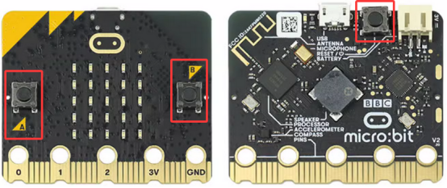

**Résistances**

Une résistance est un composant électronique qui limite le courant dans une branche de circuit. La résistance d'une résistance fixe ne peut pas être ajustée, tandis que celle d'un potentiomètre ou d'une résistance variable peut l'être.

Voici deux symboles de circuit courants pour les résistances. Si vous voyez ces symboles dans un circuit, ils représentent une résistance.

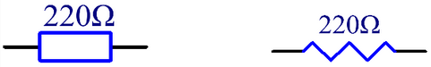

Ω est l'unité de résistance, incluant Ω, KΩ, MΩ, etc. Elles peuvent s'exprimer ainsi : 1 MΩ = 1000 KΩ, 1 KΩ = 1000 Ω. En général, certaines résistances sont marquées sur la surface.

Lors de l'utilisation d'une résistance, il faut d'abord connaître sa valeur. Il y a deux façons : observer la bande de couleur dessus, ou mesurer sa résistance avec un multimètre. Évidemment, la première méthode est plus pratique et rapide.

Comme montré sur la carte des résistances, chaque couleur représente un chiffre.

Les résistances à 4 bandes et 5 bandes sont couramment utilisées.

Souvent, lorsque vous obtenez une résistance, il peut être difficile de savoir par où commencer à lire les couleurs.

**Par conséquent, vous pouvez observer l'écart entre les deux bandes à une extrémité ; s'il est plus large que les autres écarts, lisez depuis l'autre extrémité.**

**Notez que l'écart entre la 4ème et la 5ème bande (la 3ème et la 4ème) est relativement large dans une résistance à 5 bandes (4 bandes).**

Voyons comment lire la résistance d'une résistance à 5 bandes, comme ci-dessous :

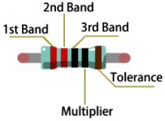

Pour cette résistance, la lecture doit se faire de gauche à droite. La valeur est : 1ère bande 2ème bande 3ème bande x 10^multiplicateur(Ω), ±tolérance %.

Ainsi, la résistance de cette résistance est 2(rouge) 2(rouge) 0(noir) × 10^0 (noir)Ω = 220Ω, ±1%(marron). En savoir plus sur la [résistance sur Wiki](https://en.wikipedia.org/wiki/Resistor).

**LED**

LED, appelée en entier « diode électroluminescente », est un dispositif électronique fabriqué à partir de matériaux semi-conducteurs (silicium, sélénium, germanium, etc.). Elle est polarisée, avec un pôle positif - la patte longue connectée à VCC (V ou 3.3V ou 5V ou +), et un pôle négatif - la patte courte connectée à GND (G ou -). Le courant circule du positif vers le négatif, dans un flux unidirectionnel.

Symbole électronique et graphique de la LED :

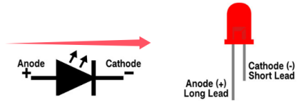

LED de différentes tailles et couleurs :

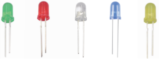

Rouge, jaune, bleu, vert et blanc sont les couleurs les plus courantes des LED, correspondant à leurs couleurs apparentes. Nous utilisons rarement des LED transparentes, et la lumière émise peut ne pas être blanche. Il existe quatre tailles de LED : 3mm, 5mm (la plus courante), 8mm et 10mm.

La tension directe doit être prise en compte lorsque la LED est allumée. C'est un paramètre très important à connaître lors de l'utilisation d'une LED, car il détermine la puissance utilisée et la taille de la résistance limitant le courant. Pour la plupart des LED rouges, jaunes, orange et vert clair, elles utilisent typiquement une tension entre 1,9V et 2,1V.

Selon la loi d'Ohm, le courant dans le circuit diminue lorsque la résistance augmente, ce qui fait que la LED s'atténue.

I = (VP-Vl)/R

Pour que la LED soit sûre et ait la bonne luminosité, quelle résistance devons-nous utiliser dans le circuit ?

Pour 99% des LED 5mm, le courant recommandé est de 20mA, comme indiqué dans la colonne conditions de sa fiche technique :

Convertissons la formule ci-dessus en :

R = (VP-Vl)/I

Si VP = 5V, Vl (tension directe) = 2V, et I = 20mA, on obtient R = 150Ω. Par conséquent, on peut rendre la LED plus brillante en réduisant la résistance, mais la résistance ne doit pas être inférieure à 150Ω (cette valeur peut ne pas être exacte car les LED fournies varient).

La tension directe et la longueur d'onde des LED de différentes couleurs sont indiquées ci-dessous pour référence :

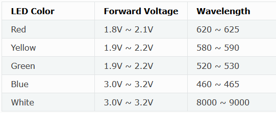

**Ne connectez pas une résistance de très faible valeur directement aux deux pôles de l'alimentation, sinon les composants électroniques pourraient être endommagés par un courant excessif. Les résistances ne sont pas polarisées.**

**Breadboard**

Avant de réaliser un circuit, une breadboard est utilisée pour concevoir et tester rapidement les circuits. Il y a de nombreux trous sur une breadboard dans lesquels on peut insérer des composants électroniques (par exemple, des résistances). Une breadboard typique est montrée ci-dessous :

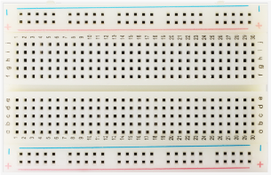

Une breadboard possède de nombreuses bandes métalliques en dessous pour connecter les trous en surface. Elles sont disposées comme montré ci-dessous.

Notez que les trous du haut et du bas sont connectés horizontalement, tandis que les autres trous sont connectés verticalement.

Les deux premières rangées (en haut) et les deux dernières (en bas) de la breadboard sont utilisées respectivement pour les pôles positif (+) et négatif (-) de l'alimentation. Le schéma de connexion conducteur est montré ci-dessous :

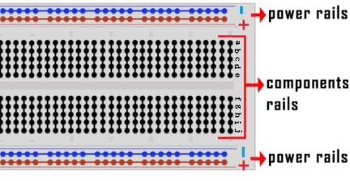

Lors de la connexion de composants DIP (Dual In-line Packages), tels que circuits intégrés, microcontrôleurs, puces, etc., la rainure isole les deux parties. Par conséquent, les composants DIP peuvent être connectés comme montré ci-dessous :

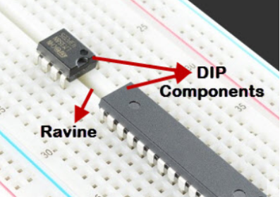

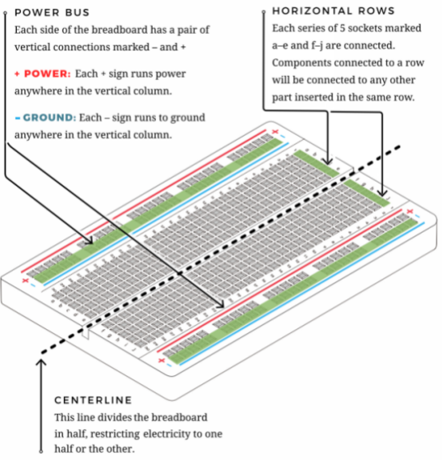

**Fil de connexion et fil DuPont**

Les fils de connexion et fils DuPont relient deux terminaux. Il en existe plusieurs types, mais ici nous nous concentrons sur ceux utilisés dans les breadboards. Ils transmettent les signaux électriques de n'importe où sur la breadboard vers les broches d'entrée/sortie d'un microcontrôleur.

Lors de l'utilisation, insérez les « deux broches » des fils dans la breadboard sans soudure. Plusieurs ensembles de bandes parallèles sont disposés sous la surface de la breadboard, donc les fils doivent seulement être insérés dans des trous spécifiques dans un prototype particulier.

Il existe trois types de fils DuPont : F-F, M-M et M-F. Sur le fil, la broche est appelée extrémité mâle (M), tandis que le trou est femelle (F).

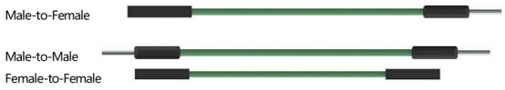

Plus d'un type peut être utilisé dans un projet. Bien que les couleurs des fils soient différentes, ils ont la même fonction. Les couleurs servent à distinguer les circuits.

#### 4. Schéma de câblage

Note : la carte micro:bit doit être insérée dans la carte d'extension T-type comme montré ci-dessous. La matrice LED de la carte micro:bit doit être du même côté que le logo de la carte d'extension.

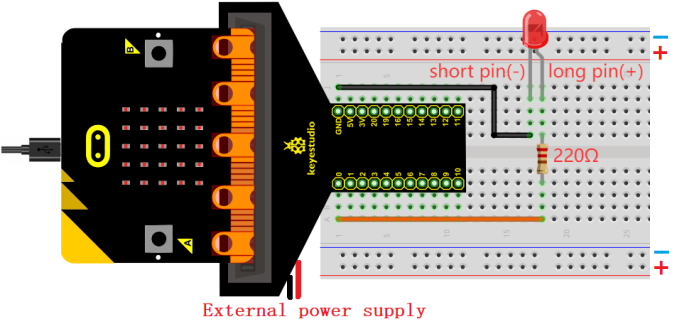

La broche de contrôle de la LED sur la carte est P0 (la broche de la carte d'extension T-type est digitale 0).

#### 5. Flux du code

#### 6. Code de test

Le fichier de code est fourni dans le dossier Projet 01 : Petite lampe avec bouton, fichier Project-01-Small-Lamp-with-Button.hex.

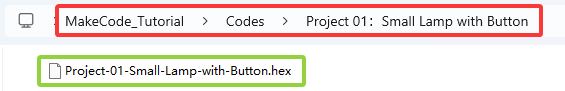

**Charger les blocs de code :**

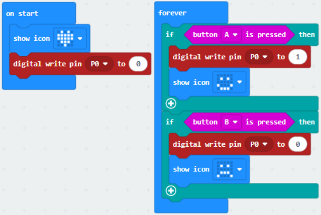

#### 7. Résultat du test

Pour l'application Windows 10, cliquez sur « Download ». Pour les navigateurs, envoyez le fichier « .hex » téléchargé vers la carte micro:bit.

Après avoir téléchargé le code sur la carte, la matrice LED 5x5 affiche l'icône . Appuyez sur le bouton A, la matrice LED 5x5 affiche l'icône , la LED s'allume. Appuyez sur le bouton B, la matrice LED 5x5 affiche l'icône , la LED s'éteint. Cela ressemble-t-il à une mini lampe ?

**ATTENTION :** Si le câblage est correct mais que vous ne voyez pas les résultats, appuyez sur le bouton reset à l'arrière de la carte.

**Lors de l'alimentation via une source externe, mettez l'interrupteur DIP sur ON.**

