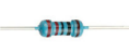
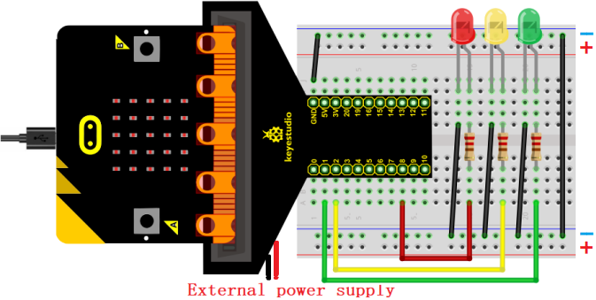
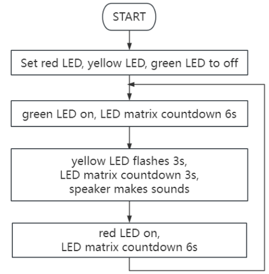
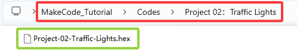
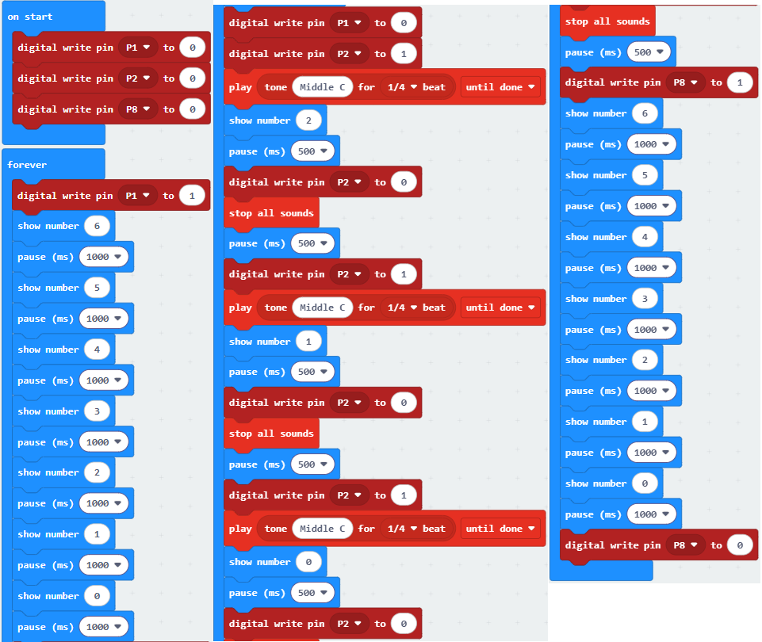
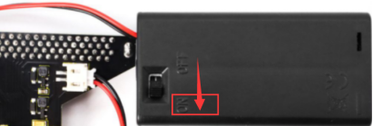

### Projekt 02: Ampel

#### 1. Übersicht

In diesem Projekt verwenden wir drei LEDs (rot, gelb und grün), einen Lautsprecher auf dem micro:bit Board und eine 5x5 LED-Matrix, um ein Modell einer Ampel zu erstellen.

#### 2. Komponenten

| |  |  |
| :--: | :--: | :--: |
| micro:bit Board *1 | micro:bit T-Typ Erweiterungsboard *1 | micro USB Kabel *1 |
| |  |  |
| rote LED *1 | gelbe LED *1 | grüne LED *1 |
|  |  | |
| 220Ω Widerstand *3 | Jumper Kabel | Steckbrett *1 |
|   |   |  |
| Batteriefach *1   (selbst mitgebrachte AA Batterien *2) | Ampelkarte *1 | |

#### 3. Komponentenwissen

**Lautsprecher**

Der micro:bit ist mit einem Lautsprecher ausgestattet, was es einfach macht, in deinem Projekt Töne zu erzeugen.

#### 4. Schaltplan

**Hinweis:** Das micro:bit Board muss wie unten gezeigt in das T-Typ Erweiterungsboard eingesteckt werden. Die LED-Matrix des micro:bit Boards sollte auf derselben Seite wie das Logo des Erweiterungsboards sein.

#### 5. Programmablauf

#### 6. Testcode

Die Code-Datei befindet sich im Ordner Projekt 02：Ampel, Datei Project-02-Traffic-Lights.hex.

**Codeblöcke laden:**

#### 7. Testergebnis

Für die Windows 10 App klicke auf „Download“. Für Browser sende die heruntergeladene „.hex“-Datei an das micro:bit Board.

Nach dem Herunterladen des Codes auf das Board leuchtet die grüne LED und die 5×5 LED-Matrix zählt 6 Sekunden herunter. Nachdem die grüne LED aus ist, blinkt die gelbe LED und die Matrix zählt 3 Sekunden mit Ton vom Lautsprecher herunter. Zum Schluss leuchtet die rote LED mit einem Countdown von 6 Sekunden. Diese Abläufe wiederholen sich.

**ACHTUNG:** Wenn die Verkabelung korrekt ist, du aber keine Ergebnisse siehst, drücke den Reset-Knopf auf der Rückseite des Boards.

**Beim Betrieb über externe Stromversorgung den DIP-Schalter auf ON stellen.**

