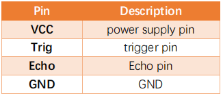
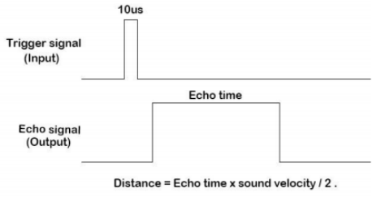
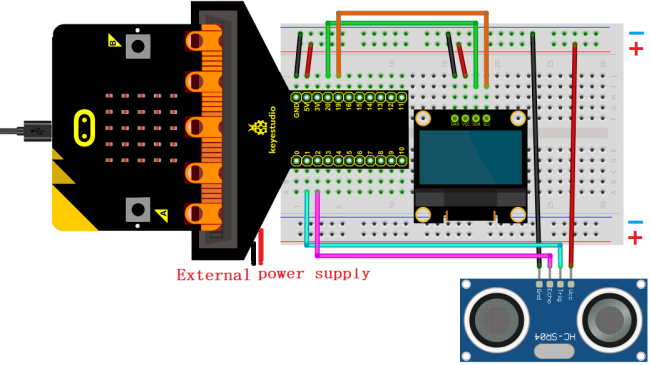
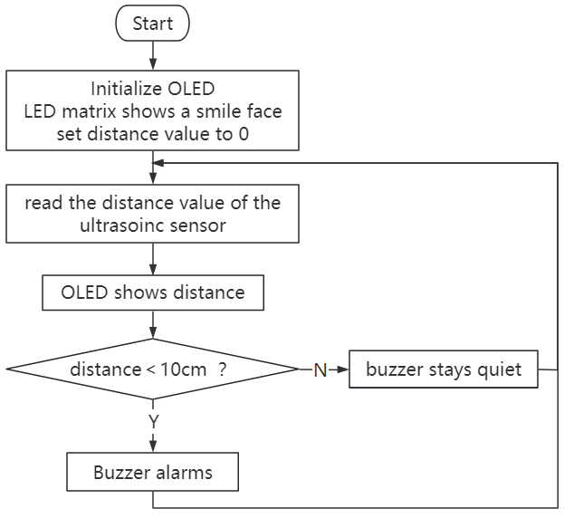
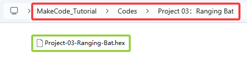
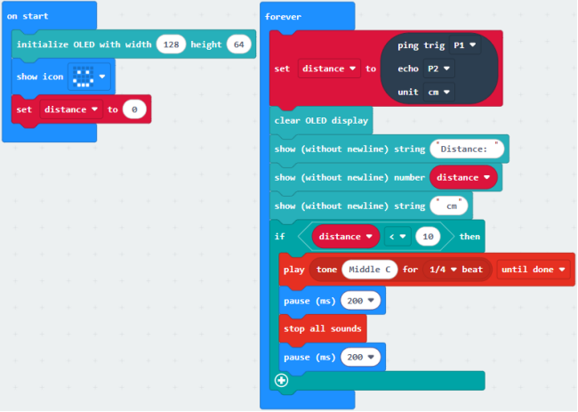
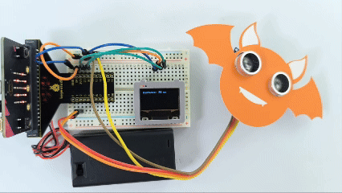

### Projet 03 : Chauve-souris à distance

#### 1. Vue d'ensemble

Basée sur un capteur ultrasonique, la chauve-souris à distance détecte la distance des obstacles et l'affiche en temps réel sur un OLED. Lorsque la distance est inférieure à 10 cm, le haut-parleur émet une alarme.

#### 2. Composants

| |  |  |
| :--: | :--: | :--: |
| carte micro:bit *1 | carte d'extension micro:bit type T *1 | câble micro USB *1 |
| | |  |
| capteur ultrasonique *1 | module OLED *1 | fils DuPont |
| |  |  |
| breadboard *1 | fils de connexion | support de pile *1   (piles AA auto-fournies *2)|
|| | |
| carte chauve-souris *1| carte OLED *1 | |

#### 3. Connaissances sur les composants

**capteur ultrasonique**

Les ondes ultrasoniques rebondissent lorsqu'elles rencontrent un obstacle. Nous mesurons la distance en calculant l'intervalle de temps entre l'émission et la réception des ondes. Comme la vitesse de propagation du son dans l'air est constante v=340m/s, nous calculons la distance entre le capteur et l'obstacle : s=vt/2.

Le module ultrasonique HC-SR04 intègre un émetteur et un récepteur. Le premier convertit les signaux électriques (énergie électrique) en ondes sonores à haute fréquence (au-delà de l'audition humaine) (énergie mécanique), tandis que le second fait l'inverse.

Le schéma du HC SR04 :

**Définition des broches :**

**Paramètres :**

- Tension de fonctionnement : 5V
- Courant de fonctionnement : 12mA
- Distance minimale de mesure : 2cm
- Distance maximale de mesure : 200cm

**Principe de fonctionnement :**

Une impulsion de niveau haut d'au moins 10µs est envoyée sur la broche Trig, et le module commence à émettre des ondes ultrasoniques. En même temps, la broche Echo est mise à niveau haut. Lorsque le module reçoit une onde ultrasonique de retour après avoir rencontré un obstacle, la broche Echo passe à niveau bas. La durée du niveau haut de la broche Echo correspond au temps total de l'onde entre l'émission et la réception : s=vt/2.

**Module OLED**

La technologie OLED offre une riche performance de couleurs, un contraste élevé et un large angle de vue, fournissant des images claires et vives, particulièrement remarquables dans les noirs.

Chaque pixel de l'écran OLED émet sa propre lumière sans rétroéclairage, ce qui consomme relativement peu d'énergie. Avec une petite taille, une haute résolution et une faible consommation, l'écran OLED de 0,9 pouce est très adapté aux dispositifs portables.

**Dans ce projet, le module d'affichage OLED connecte l'interface SDA à la broche P20 et SCL à la broche P19.**

**Paramètres :**

- Tension de fonctionnement : DC 3.3V-5V

- Courant de fonctionnement : 30mA

- Interface : ports à broches avec un espacement de 2.54mm

- Mode de communication : I2C

- Puce pilote interne : SSD1306

- Résolution : 128*64

- Angle de vue : supérieur à 150°

#### 4. Schéma de câblage

**Lors de l'utilisation de l'écran OLED et du capteur ultrasonique, il faut connecter une alimentation externe et mettre l'interrupteur DIP sur ON.**

#### 5. Flux du code

#### 6. Code de test

Le fichier de code est fourni dans le dossier Projet 03 : Chauve-souris à distance, fichier Project-03-Ranging-Bat.hex.

**Charger les blocs de code :** Le seuil dans la condition 10 peut être modifié selon les conditions réelles.

#### 7. Résultat du test

Pour l'application Windows 10, cliquez sur “Download”. Pour les navigateurs, envoyez le fichier “.hex” téléchargé vers la carte micro:bit.

Après avoir téléchargé le code sur la carte, alimentez via une alimentation externe et mettez l'interrupteur DIP sur ON, et l'OLED affiche en temps réel la distance entre le capteur ultrasonique et l'obstacle. Lorsque la valeur de distance est inférieure à 10 cm, le haut-parleur de la carte micro:bit émet une alarme.

**ATTENTION :** Si le câblage est correct mais que vous ne voyez pas les résultats, appuyez sur le bouton reset à l'arrière de la carte.

