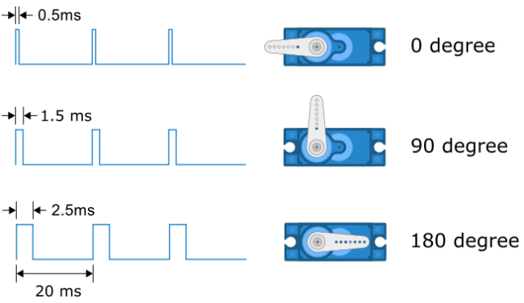
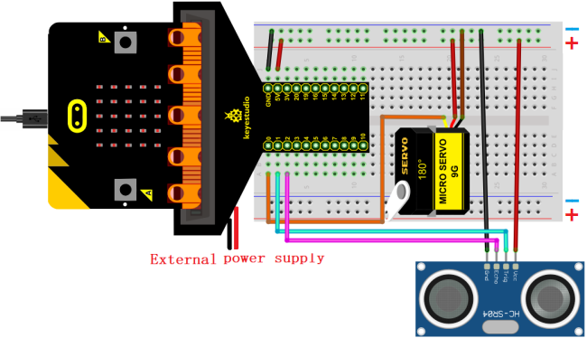
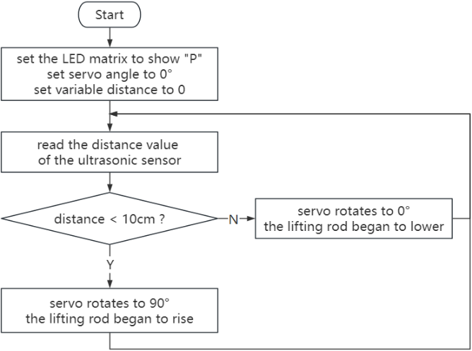
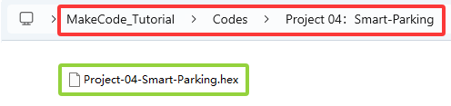
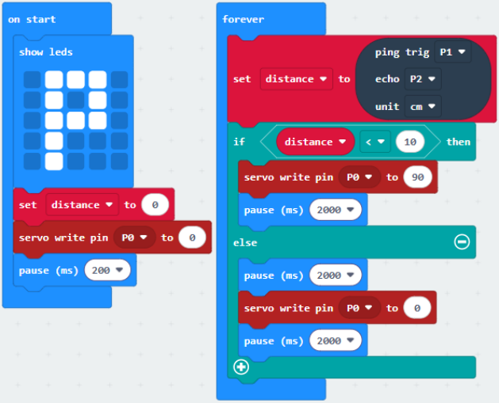
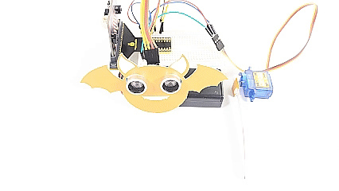

### プロジェクト04：スマート駐車

#### 1. 概要

スマート駐車場はどこにでもあります。私たちもスマート駐車場を作ることができるでしょうか？もちろんです。超音波センサーを使って前方に車両があるかどうかを検出します。車両（または物）が近づいていると検出したら、サーボを制御してリフトロッドを上げます。離れていると検出したら、サーボはリフトロッドを下げます。

#### 2. コンポーネント

| |  |  |
| :--: | :--: | :--: |
| micro:bit ボード *1 | micro:bit T型拡張ボード *1 | micro USB ケーブル *1 |
| | |  |
| 超音波センサー *1 | サーボ *1 | DuPont ワイヤー |
| |  |  |
| ブレッドボード *1 | ジャンプワイヤー | 電池ホルダー *1   (自分で用意した単三電池 *2)|
| | | |
| バットカード *1 | リフトロッドカード *1| |

#### 3. コンポーネントの知識

**サーボ**

サーボは位置駆動装置です。サーボを使って正確な位置制御や高トルクの出力が可能です。通常、ロボットやリモコンカー、さらには航空機モデルに使われます。多くの仕様がありますが、すべてのサーボは3本の線を持っています：信号線（オレンジ）、プラス線（赤）、マイナス線（茶色）。色はサーボのブランドによって異なります。

**内部構造図：**

① 信号：マイコンからの制御信号を受け取る；

② ポテンショメーター：出力軸の位置を測定し、サーボ全体のフィードバック部分に属する；

③ 内部コントローラー：組み込み基板が外部制御からの信号を処理し、モーターとフィードバック位置信号を駆動する。サーボ全体のコア；

④ DCモーター：速度、トルク、位置を出力するアクチュエーター；

⑤ 伝達/サーボ機構：モーターのストローク出力を一定の伝達比で最終出力角度に拡大する機構。

**サーボの駆動**

PWM信号をサーボの信号線に送って出力を制御します。PWMのデューティ比が出力軸の位置を直接決定します。周期は通常20ミリ秒で、50Hzの周波数でパルスを生成するように設定されます。

例えば（180°サーボ）：

180°サーボに1.5ミリ秒（ms）のパルス幅を送ると、サーボの出力軸は中央位置（90度）に動きます；

パルス幅が0.5msの場合、出力軸は0度に動きます；

パルス幅が2.5msの場合、出力軸は180度に動きます；

**パラメータ：**

- 動作電圧：DC 3.3V～5V

- 動作温度：-10°C ～ +50°C

- 寸法：32.25mm x 12.25mm x 30.42mm

- インターフェース：ピッチ2.54mmの3ピンインターフェース

#### 4. 配線図

**超音波センサーとサーボを使用する場合は、必ず外部電源を接続し、DIPスイッチをONにしてください。**

#### 5. コードフロー

#### 6. テストコード

コードファイルはフォルダ Project 04：Smart-Parking 内のファイル Project-04-Smart-Parking.hex にあります。

**コードブロックの読み込み：** **条件10の閾値は実際の状況に応じて変更可能です。**

#### 7. テスト結果

コードをボードにダウンロードした後、超音波センサーが車両（または物）が近づいていると検出すると、サーボがリフトロッドを上げます。センサーが離れていると検出すると、サーボはリフトロッドを下げます。

**注意：** 配線が正しいのに結果が見えない場合は、ボードの裏側のリセットボタンを押してください。

