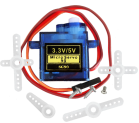
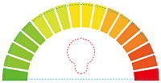
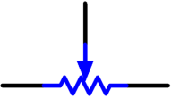
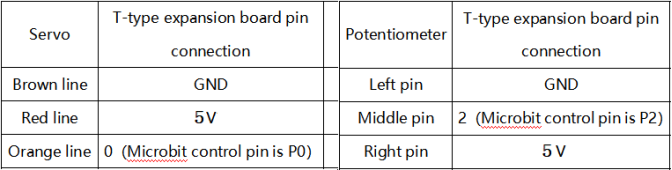
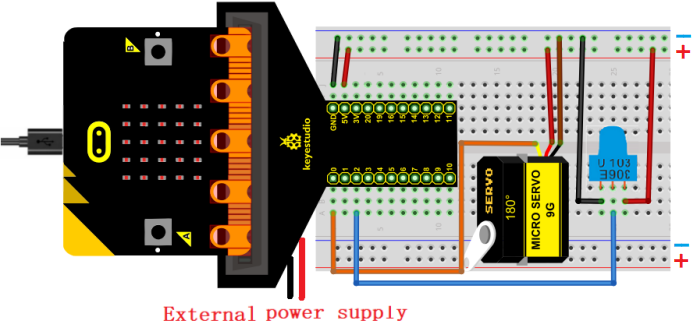
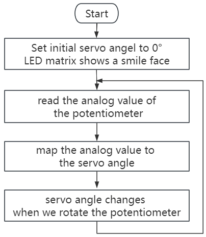
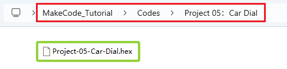
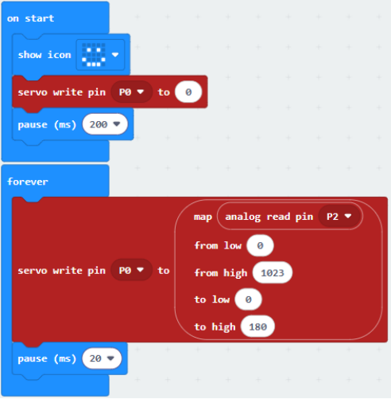
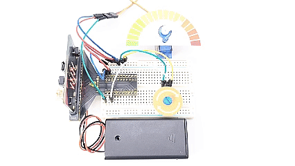

### Project 05: Auto Wijzerplaat

#### 1. Overzicht

In dit project combineren we een instelbare potentiometer, een servo en een mooie wijzerplaatkaart om een eenvoudig auto wijzerplaatmodel te maken.

#### 2. Componenten

| |  |  |
| :--: | :--: | :--: |
| micro:bit board *1 | micro:bit T-type uitbreidingsbord *1 | micro USB-kabel *1 |
| | |  |
| potentiometer *1 | servo *1 | verbindingsdraden |
|  |  | |
| breadboard *1 | batterijhouder *1   (zelf meegebrachte AA-batterijen *2)| potentiometer kaart *1 |
| |  |  |
| auto wijzerplaat kaart*1| |  |

#### 3. Componenten Kennis

**potentiometer**

Een potentiometer is ook een weerstandselement met drie aansluitingen, waarvan de weerstandwaarde volgens een bepaalde regelmaat kan worden aangepast.

Ze zijn er in allerlei vormen, maten en waarden, maar ze hebben allemaal het volgende gemeen:

① Drie terminals (of aansluitpunten).

② Een beweegbare knop of schuifregelaar die de weerstand tussen de middelste terminal en een van de externe terminals kan veranderen.

③ Terwijl de knop wordt bewogen, varieert de weerstand tussen de middelste terminal en een van de externe terminals van 0Ω tot de maximale waarde.

Het schakelsymbool van een potentiometer:

(1)\. Als spanningsdeler

De potentiometer is een continu instelbare weerstand. Wanneer je de schuifregelaar draait, schuift het bewegende contact over de weerstand. Op dat moment kan een spanning worden uitgegeven afhankelijk van de spanning die op de potentiometer wordt toegepast en de hoek of slag van de draaibeweging van de beweegbare schuifregelaar.

(2)\. Als variabele weerstand

Wanneer de potentiometer als variabele weerstand wordt gebruikt, sluit je de middelste terminal aan op een van de twee extra terminals in het circuit. Op deze manier kun je een stabiele en continu variërende weerstandwaarde binnen het bereik verkrijgen.

(3)\. Als stroomregelaar

Wanneer het wordt gebruikt als stroomregelaar, moet het bewegende contact worden aangesloten als een van de uitgangsterminals.

#### 4. Aansluitschema

Bij gebruik van de servo moeten we een externe voeding aansluiten en de DIP-schakelaar op ON zetten.

#### 5. Code Stroomdiagram

#### 6. Testcode

Het codebestand is te vinden in map Project 05：Car Dial, bestand Project-05-Car-Dial.hex.

**Laad codeblokken:**

#### 7. Testresultaat

Na het downloaden van de code naar het bord, draai je aan de knop van de potentiometer en beweegt de servo de wijzer op de wijzerplaat.

**LET OP:** Als de bedrading correct is maar je ziet geen resultaat, druk dan op de resetknop aan de achterkant van het bord.

