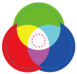
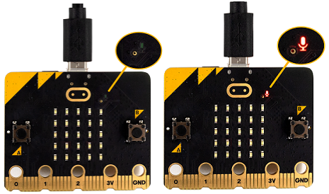
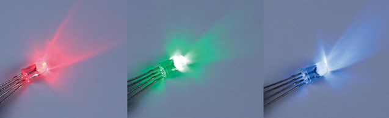
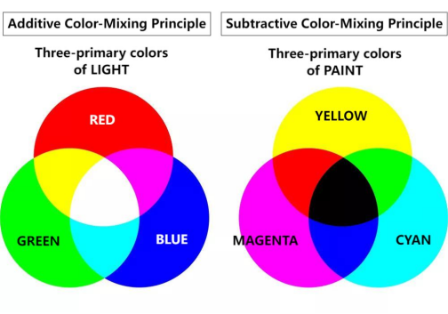
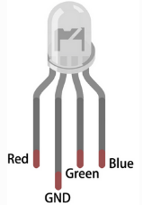
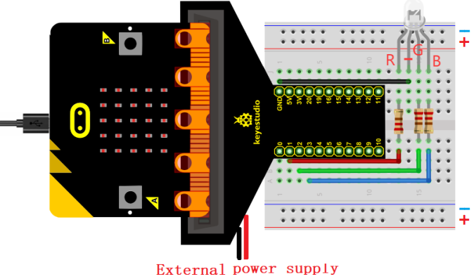
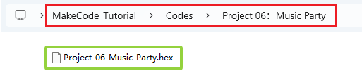
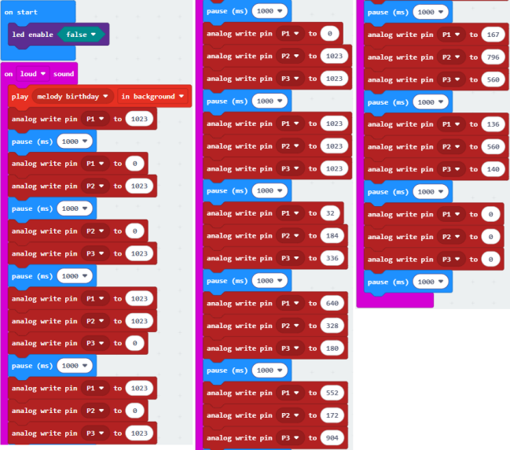

### Progetto 06: Festa Musicale

#### 1. Panoramica

Quando battiamo le mani, il microfono sulla scheda rileva i segnali sonori, e l'altoparlante riproduce una allegra canzone di compleanno mentre il LED RGB emette una luce abbagliante.

#### 2. Componenti

| |  |  |
| :--: | :--: | :--: |
| scheda micro:bit *1 | scheda di espansione micro:bit tipo T *1 | cavo micro USB *1 |
| |  |  |
| LED rosso *1 | resistore 220Ω *3 | filo jumper *2 |
|  |  |   |
| breadboard *1 | portabatterie *1   (batterie AA auto-fornite *2)| scheda RGB *1 |

#### 3. Conoscenza dei Componenti

**Microfono**

Un microfono digitale di alta qualità è integrato sul lato frontale della scheda micro:bit V2 per rilevare segnali sonori e audio. Il chip che controlla e processa il microfono si trova sul retro.

Il microfono è in un piccolo foro rotondo sulla parte frontale della scheda, comodo per catturare i segnali sonori circostanti. Basta posizionare la scheda micro:bit con il lato frontale rivolto verso l'alto durante l'uso. Accanto al foro c'è un indicatore LED del microfono. Quando il micro:bit misura i livelli sonori, l'indicatore si accende.

**LED RGB**

Il LED RGB è rappresentato dall'intersezione di tre colori primari (RGB): rosso, verde e blu. La maggior parte dei colori può essere sintetizzata da RGB in proporzioni diverse. I LED rosso, verde e blu sono racchiusi in un involucro di plastica trasparente per emettere colori di luce variando la tensione di ingresso dei pin R, G e B.

**Teoria tricromatica:**

Il LED RGB può essere diviso in due tipi: anodo comune e catodo comune:

In un LED RGB a catodo comune, i tre LED condividono una connessione negativa (catodo);

In un LED RGB ad anodo comune, i tre LED condividono una connessione positiva (anodo).

**Nota: Qui forniamo un LED RGB a catodo comune.**

**Pin del LED RGB:**

Il LED RGB ha 4 pin: GND (il più lungo), R (rosso), G (verde) e B (blu). Posizionare il LED RGB come mostrato sotto, i pin da sinistra a destra sono rosso, GND, verde e blu.

#### 4. Schema di Collegamento

#### 5. Flusso del Codice

#### 6. Codice di Test

Il file del codice è fornito nella cartella Progetto 06：Festa Musicale, file Project-06-Music-Party.hex.

**Carica i blocchi di codice:**

#### 7. Risultato del Test

Dopo aver scaricato il codice sulla scheda, quando battiamo le mani, il microfono sulla scheda rileva i segnali sonori, e l'altoparlante riproduce una allegra canzone di compleanno mentre il LED RGB emette una luce abbagliante. Non è forse la festa musicale in un'atmosfera felice e gioiosa?

**ATTENZIONE:** Se il collegamento è corretto ma non si vedono i risultati, premere il pulsante di reset sul retro della scheda.

