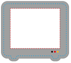
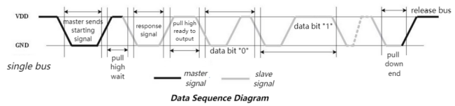
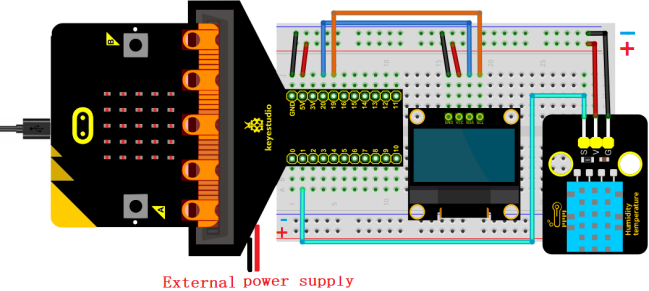
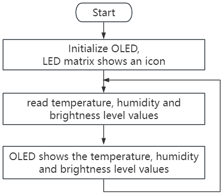
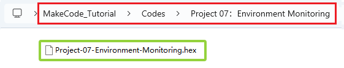
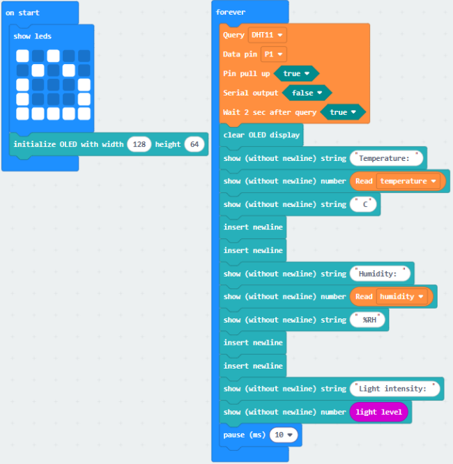
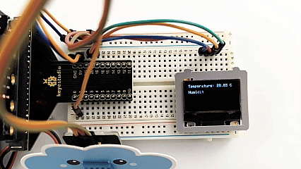

### プロジェクト07：環境モニタリング

#### 1. 概要

OLEDには、DHT11センサーで検出した温度と湿度の値、および基板上の光センサーで検出した周囲光の明るさレベルの値をリアルタイムで表示するスマート環境モニタリングシステムが表示されます。

#### 2. コンポーネント

| |  |  |
| :--: | :--: | :--: |
| micro:bitボード *1 | micro:bit T型拡張ボード *1 | micro USBケーブル *1 |
| | |  |
| XHT11温湿度センサー *1 | OLEDモジュール *1 | DuPontワイヤー |
| |  |  |
|ブレッドボード *1 | ジャンプワイヤー | 電池ホルダー *1   (自前の単三電池 *2)|
| |  | |
|クラウドカード *1| OLEDカード *1 | |

#### 3. コンポーネント知識

**XHT11温湿度センサー**

XHT11温湿度センサーは、較正済みのデジタル信号出力を持つ複合センサーで、空気中の湿度と温度を検出できます。

**精度**：湿度 ±5%RH、温度 ±2℃

**検出範囲**：湿度 5%RH ~ 95%RH、温度 -25℃ ~ +60℃

このセンサーは、特殊なデジタルモジュール取得および温湿度検知技術を使用しており、非常に高い信頼性と優れた長期安定性を保証します。抵抗性湿度検知素子とNTC温度検知素子を含み、比較的低精度かつリアルタイム性が求められる測定に非常に適しています。

**XHT11通信方式：**

シングルバス通信を採用しています。これは、システム内でデータ交換と制御のために1本のデータ線のみがあることを意味します。

- シングルバスで送信されるデータビットの定義：

シングルバスデータフォーマット：40ビットのデータを一度に送信し、上位ビットが先に来ます。

8bit湿度整数部 + 8bit湿度小数部 + 8bit温度整数部 + 8bit温度小数部 + 8bitパリティビット（湿度の小数部は0）

- パリティビットの定義

8bit湿度整数部 + 8bit湿度小数部 + 8bit温度整数部 + 8bit温度小数部。8bitパリティビット = 取得結果の最後の8ビット

- データタイムライン：

ユーザーホスト（MCU）が開始信号を送信した後、XHT11は低電力モードから高速モードに切り替わります。開始信号の後、XHT11は応答信号と40ビットデータを送信し、信号取得をトリガーします。

- 信号伝送は以下の図の通りです：

 **パラメータ**

- 動作電圧：DC 3.3V～5V

- 動作電流：2.1mA

- 最大消費電力：0.0105W

- 温度範囲：-25℃～+60℃（±2℃）

- 湿度範囲：5%RH～95%RH（約25℃付近で精度±5%RH）

**Microbit光センサー**

光センサーは外部光の明るさを測定する入力デバイスです。micro:bitボードには内蔵光センサーはありません。LEDマトリックスが光の強度を繰り返し値に変換し、その後電圧減衰時間をサンプリングすることで周囲の明るさを検出・感知します。このため、検出される明るさレベルは相対値です。

#### 4. 配線図

OLEDディスプレイを使用する場合は、必ず外部電源を接続し、DIPスイッチをONにしてください。

#### 5. コードフロー

#### 6. テストコード

コードファイルはフォルダ Project 07：Environment Monitoring 内のファイル Project-07-Environment-Monitoring.hex にあります。

**コードブロックの読み込み：**

#### 7. テスト結果

コードをボードにダウンロードすると、OLEDに温度・湿度の値と光の明るさレベルがリアルタイムで表示されます。

**注意：** 配線が正しいのに結果が表示されない場合は、ボード裏面のリセットボタンを押してください。

