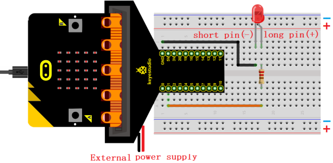
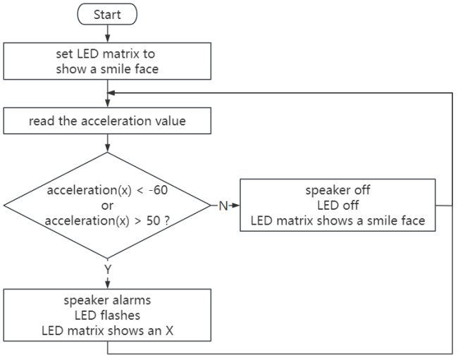
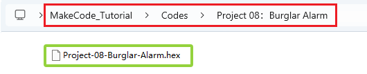
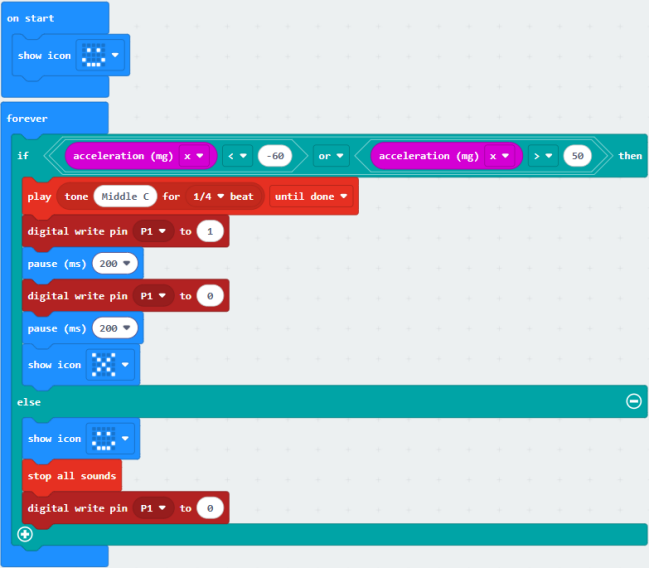

### プロジェクト08：盗難防止アラーム

#### 1. 概要

スマート盗難防止アラームが盗難防止ボックスの移動を検知すると、micro:bitボードのスピーカーが警報を鳴らし、赤色LEDが点滅します。

#### 2. 部品

| |  |  |
| :--: | :--: | :--: |
| micro:bitボード *1 | micro:bit T型拡張ボード *1 | micro USBケーブル *1 |
| |  |  |
| 赤色LED *1 | 220Ω抵抗 *1 | ジャンプワイヤー *2 |
|  |  |   |
| ブレッドボード *1 | 電池ホルダー *1   (自前の単三電池 *2)| アラームカード *1 |

#### 3. 部品の知識

**加速度センサー**

micro:bitボードにはLSM303AGR加速度センサー（加速度計）が内蔵されており、標準、ファスト、プラス、高速モード（100 kHz、400 kHz、1 MHz、3.4 MHz）のI2CシリアルバスインターフェースとSPIシリアル標準インターフェースを備えています。分解能は8/10/12ビット、測定範囲は±2g、±4g、または±8gです。

micro:bitボードが静止または等速運動している場合、加速度計は重力加速度のみを検出します。わずかに揺らした場合、検出される加速度は重力加速度よりはるかに小さいため、その差は無視できます。したがって、主にx、y、z軸の重力加速度の変化を検出します。

#### 4. 配線図

**LEDのボード制御ピンはP1です（T型拡張ボードのピンはデジタル1）。**

#### 5. コードの流れ

#### 6. テストコード

コードファイルはフォルダ Project 08：Burglar Alarm 内のファイル Project-08-Burglar-Alarm.hex にあります。

**コードブロックの読み込み：**

**コードをインポートした後、ブレッドボードを動かしていないのにブザーが鳴り続ける場合は、地理的要因による可能性があります。条件内の閾値 -60 と 50 を実際の状況に応じて変更してください。**

#### 7. テスト結果

コードをボードにダウンロードした後、ブレッドボードを動かします。加速度値が x＜-60 または x＞50 の場合、ボードのスピーカーが警報を鳴らし、LEDが点滅し、micro:bitのLEDマトリックスは  を表示します。そうでない場合はスピーカーは無音でLEDは消灯し、micro:bitのLEDマトリックスは  を表示します。

**注意：** 配線が正しいのに結果が見えない場合は、ボード裏面のリセットボタンを押してください。

