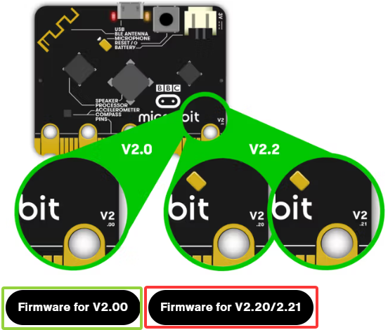
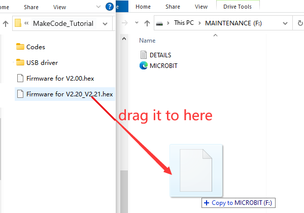
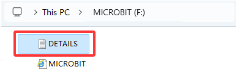
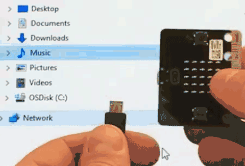
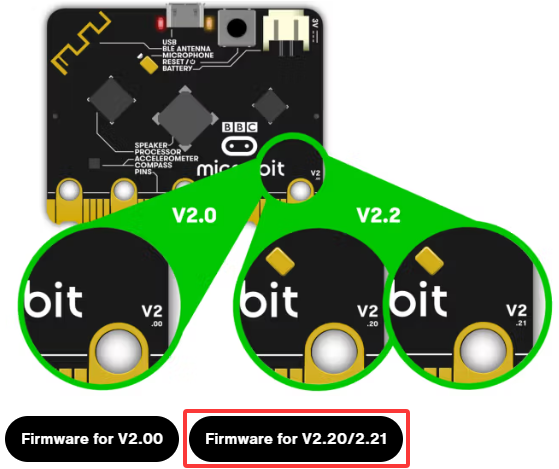

## 3. Risoluzione dei problemi

#### MAINTENANCE: Il codice non viene scaricato su Micro:bit

**1. Problema**

Recentemente, molti utenti riscontrano il problema che la scheda Micro:bit non risponde durante il download del codice.

Se il modo in cui operi è corretto, forse hai premuto accidentalmente il pulsante di reset ed entrato in modalità MAINTENANCE oppure il firmware è andato perso a causa di un errore operativo.

Collega la scheda Micro:bit, appare l’unità “MAINTENANCE”, il che significa che il programma non può essere scaricato.

**2. Soluzioni**

(1) Scarica il file .hex da questa pagina sul tuo computer.

Scarica [l’ultimo firmware micro:bit-0255](https://www.microbit.org/get-started/user-guide/firmware/). Se non vuoi scaricarlo da questo sito, lo forniamo anche nel nostro tutorial.

(2) Dopo aver scaricato l’ultimo firmware, trascina Firmware per V2.20_V2.21 nell’unità “MAINTENANCE” per riportare Micro:bit alla modalità normale.

Installiamo firmware diversi a seconda dei modelli di scheda micro:bit. Qui è Firmware per V2.20_V2.21.

**3. Evitare di entrare in “MAINTENANCE”**

(1) Assicurati che il pulsante Reset non venga premuto quando colleghi la scheda tramite cavo USB.

(2) Non scollegare improvvisamente il cavo durante il download del programma micro:bit, altrimenti il firmware andrà perso e micro:bit entrerà in modalità “MAINTENANCE”.

(3) Nell’esperimento, un cablaggio errato può anche causare un cortocircuito o la perdita del firmware.

#### Risoluzione dei problemi di download con WebUSB

Clicca: [Risoluzione dei problemi di download con WebUSB](https://makecode.microbit.org/device/usb/webusb/troubleshoot)

Hai problemi ad associare il tuo micro:bit con WebUSB? Proviamo a capire perché!

**Passo 1: Controlla il cavo**

Assicurati che il tuo micro:bit sia collegato al computer con un cavo micro USB. Ad esempio, in Esplora risorse di Windows dovrebbe apparire un’unità **MICROBIT** quando è collegato.

Se vedi l’unità MICROBIT passa al passo 2. Se non vedi l’unità:

(1) Assicurati che il cavo USB funzioni.

Il cavo funziona su un altro computer? Se no, trova un cavo diverso da usare. Alcuni cavi forniscono solo alimentazione e non trasferiscono dati.

(2) Prova un’altra porta USB sul tuo computer.

Il cavo è buono ma non vedi ancora l’unità MICROBIT? Hmm, potresti avere un problema con il tuo micro:bit.

Prova i passaggi aggiuntivi descritti nella [pagina di risoluzione problemi su microbit.org](https://support.microbit.org/support/solutions/articles/19000024000-fault-finding-with-a-micro-bit). Se questo non aiuta, puoi [creare un ticket di supporto](https://support.microbit.org/support/tickets/new) per notificare il problema alla Micro:bit Foundation. Salta i restanti passaggi di risoluzione.

**Passo 2: Controlla la versione del firmware**

Se i download ancora non funzionano, è possibile che la versione del firmware sul micro:bit debba essere aggiornata. Controlliamo:

1. Vai all’unità **MICROBIT**;

2. Apri il file DETAILS.TXT;

3. Trova il numero della versione del firmware; Cerca una riga nel file che indica il numero di versione. Dovrebbe dire Version:

Se la versione è 0234, 0241, 0243 DEVI aggiornare il firmware sul tuo micro:bit. Vai al Passo 3 e segui le istruzioni di aggiornamento.

Se la versione è 0249, 0250 o superiore, hai il firmware corretto, vai al passo 4.

**Passo 3: Aggiorna il firmware**

(1) Metti il tuo micro:bit in modalità MAINTENANCE.

Per farlo, scollega il cavo USB dal micro:bit e poi ricollega il cavo USB tenendo premuto il pulsante di reset. Una volta inserito il cavo, puoi rilasciare il pulsante di reset.

Ora dovresti vedere un’unità MAINTENANCE invece dell’unità MICROBIT come prima. Inoltre, un LED giallo rimarrà acceso accanto al pulsante di reset.

(2) Scarica il [file firmware .hex](https://microbit.org/guide/firmware/).

Installiamo firmware diversi a seconda dei modelli di scheda micro:bit. Qui è Firmware per V2.20_V2.21.

(3) Trascina e rilascia quel file sull’unità **MAINTENANCE**.

(4) Osserva il LED lampeggiante.

Il LED giallo lampeggia mentre il file HEX viene copiato. Quando la copia termina, il LED si spegne e il micro:bit si resetta. L’unità MAINTENANCE ora torna a MICROBIT.

(5) Aggiornamento completato.

L’aggiornamento è completato! Puoi aprire il file DETAILS.TXT per verificare che la versione del firmware sia cambiata e corrisponda alla versione del file HEX copiato.

Se vuoi saperne di più su come collegare la scheda, la modalità MAINTENANCE e l’aggiornamento del firmware, leggilo nella [Guida al firmware](https://microbit.org/guide/firmware/).

**Passo 4: Controlla la versione del browser**

WebUSB è una funzione abbastanza nuova e potrebbe richiedere l’aggiornamento del browser. Controlla che la versione del browser corrisponda a una di quelle elencate: versioni browser per Android, Chrome OS, Linux, macOS e Chrome 65+ per Windows 10.

**Passo 5: Associa il dispositivo**

Una volta aggiornato il firmware, apri il browser Chrome, vai all’editor e clicca su Associa dispositivo nel menu a forma di ingranaggio. Vedi [WebUSB(/device/usb/webusb)](https://microbit.org/get-started/user-guide/web-usb/) per le istruzioni di associazione.

Goditi download veloci!
