## 1. Informazioni sul Software Mu

### 1.1. Installare MU

Clicca per visitare il [sito ufficiale del software Mu](https://codewith.mu/).

Mu è un editor di codice Python per programmatori principianti, come insegnanti e studenti. Possiamo ottenerlo tramite l'installer ufficiale per Windows, Mac OSX o Linux (Mu non supporta più Windows a 32 bit). La versione consigliata è Mu 1.2.0.

**Passo 1 - Assicurati del tuo sistema operativo e poi scarica l'installer di Mu**

Prima scopri il sistema operativo del tuo computer (Windows o Mac OSX). Apri “**Questo PC**” per vedere le “**Proprietà**”.

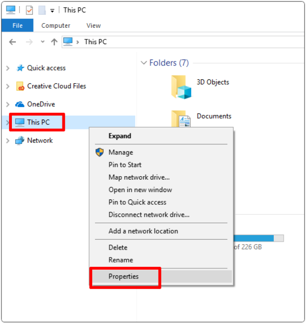

Controlla il tipo di sistema: 64-bit o 32-bit.

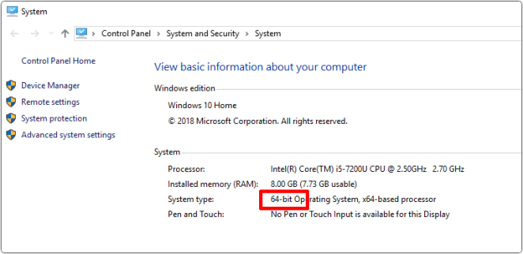

[Scarica MU](https://codewith.mu/en/download). Scarica la versione in base al sistema operativo del tuo computer.

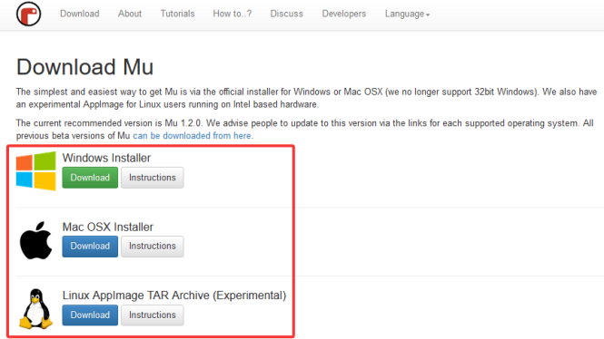

Qui prendiamo come esempio il sistema Windows, che può essere un riferimento per Mac OSX e Linux.

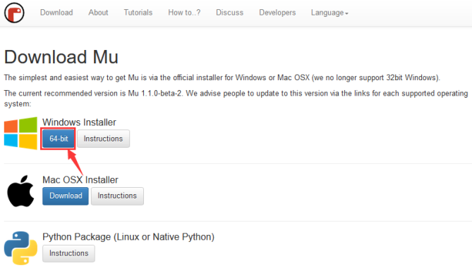

**Passo 2 - Esegui l'installer**

Fai doppio clic sull'installer (probabilmente nella cartella Download) per eseguirlo.

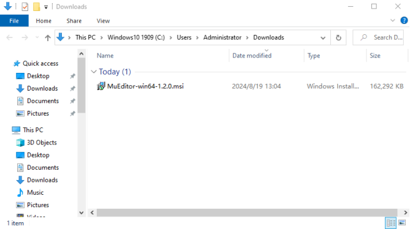

Abbiamo evidenziato i passaggi extra necessari per aiutare Windows a installare Mu su Windows 10. Le altre versioni saranno simili.

[Installer Mu per MacOS](https://codewith.mu/en/howto/1.1/install_macos).

[Installer Mu per sistema Linux](https://codewith.mu/en/howto/1.2/install_linux).

Per Windows 10, Defender mostrerà un messaggio di avviso. Dovresti cliccare sul link “**Ulteriori informazioni**”.

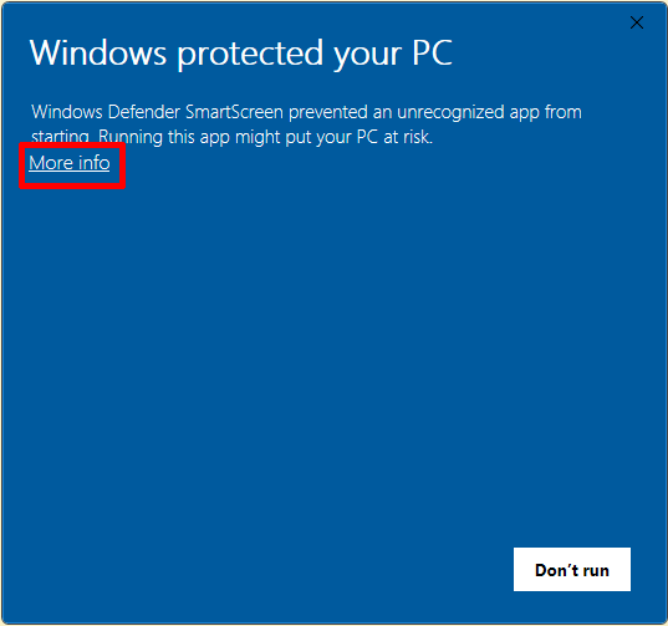

Il messaggio cambierà fornendo più informazioni sull'installer e mostrerà un pulsante “**Esegui comunque**”. Clicca “**Esegui comunque**”.

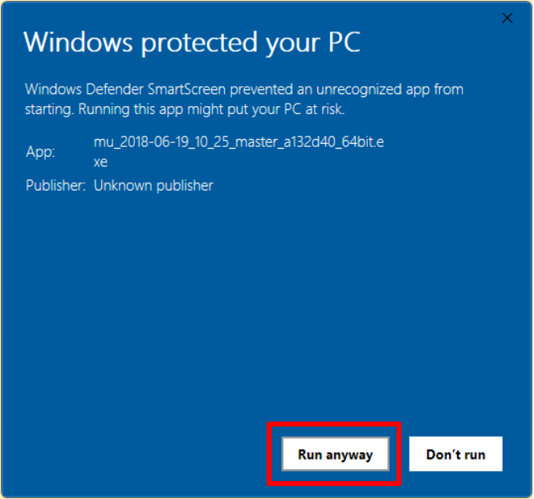

**Passo 3 - Accordo di Licenza**

Rivedi la licenza, seleziona la casella e clicca “**Installa**”.

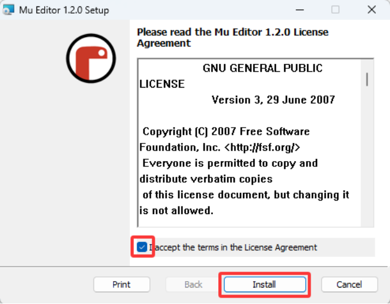

**Passo 4 - Installazione**

Prenditi un caffè mentre Mu si installa sul tuo computer.

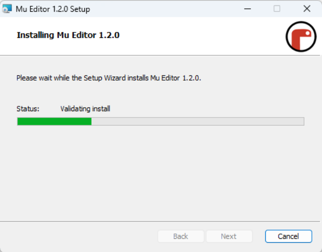

**Passo 5 - Completamento**

L'installazione è stata completata con successo, clicca “**Fine**” per chiudere l'installer.

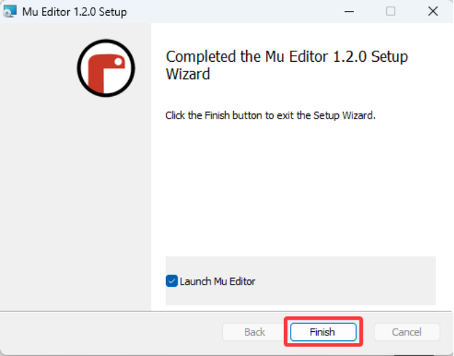

**Passo 6 - Avvia Mu**

Puoi avviare Mu cliccando sull'icona nel menu Start o digitando “Mu” nella casella di ricerca (entrambi evidenziati sotto). Al primo avvio, potrebbe richiedere un po' di tempo.

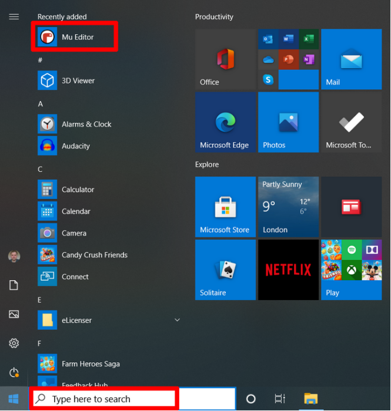

Ecco come appare:

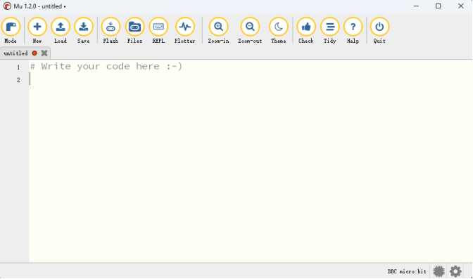

### 1.2. Uso delle Modalità e della Barra del Menu

Imposta “Modalità” su BBC micro:bit.

Nel menu, clicca “**Modalità**” per impostarla su “**BBC micro：bit**”. La modalità micro:bit capisce come interagire e connettersi a un micro:bit.

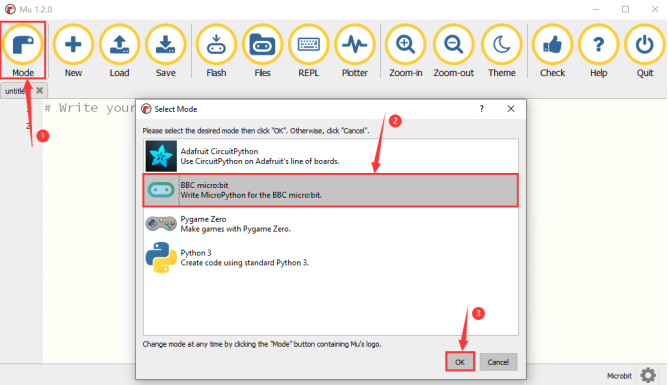

Clicca per [Iniziare con Mu](https://codewith.mu/en/tutorials/1.1/start).

Per ulteriori tutorial sull'uso di Mu, visita: https://codewith.mu/en/tutorials/

### 1.3. Programmare su Mu

Qui carichiamo il file “heartbeat\.py” su Mu. Lo trovi nella cartella “Heart beat” che abbiamo fornito.

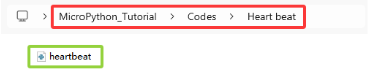

**Metodo uno:**

Apri Mu e clicca “Carica” per scegliere il percorso dove hai scaricato il codice.

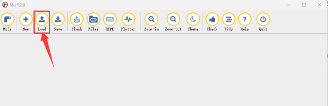

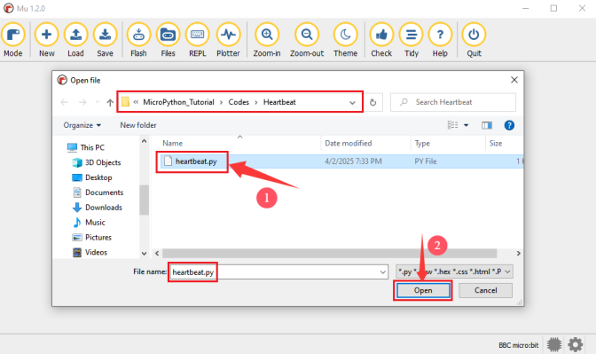

Caricato con successo, come mostrato sotto:

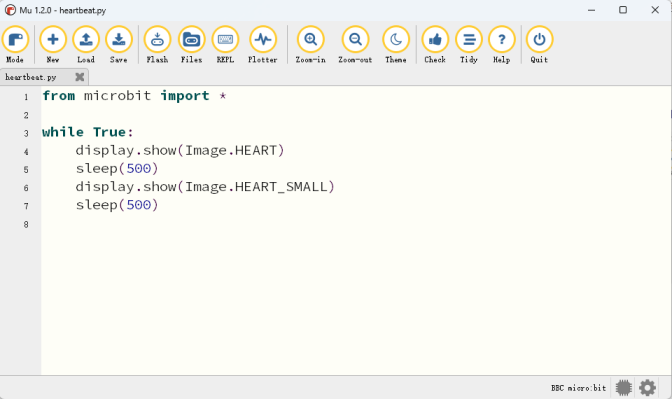

**Metodo due:**

Clicca “nuovo”  per creare un nuovo programma e trascina “heartbeat\.py” dentro:

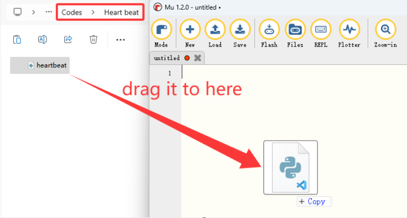

Caricato con successo, come mostrato sotto:

Lo stesso vale per aggiungere altri codici.

### 1.4. Scaricare il Codice su Micro:bit

Collega la scheda al computer tramite cavo USB.

Clicca “**Flash**” per scaricare il codice sulla scheda micro:bit.

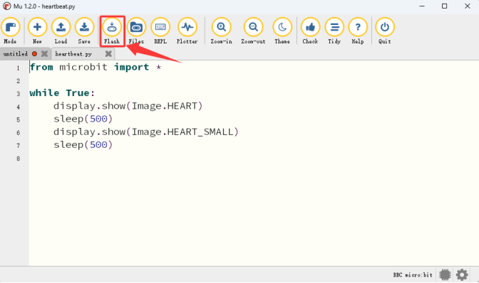

Dopo, **accendi tramite il cavo micro USB o alimentazione esterna (imposta l'interruttore DIP su ON)**. Vedrai la matrice LED 5×5 a bordo mostrare ripetutamente  e poi .

**Nota che se c'è un errore nel tuo codice, potrebbe comunque essere scaricato ma non funzionerà correttamente.**

Ad esempio, la funzione sleep() è scritta come sleeps() nel codice. Clicca “**Flash**” per caricare il codice sul micro:bit. Tuttavia, la matrice LED 5×5 mostra icone confuse.

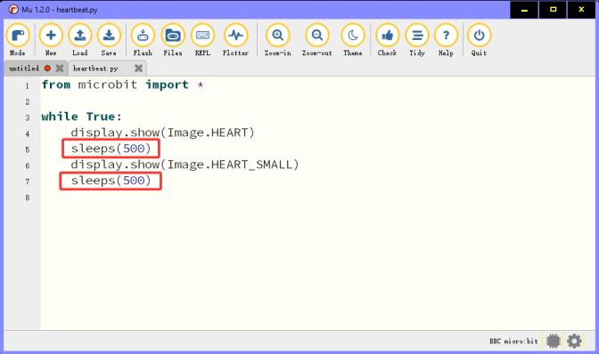

In questo caso, clicca “**REPL**” e premi il pulsante reset sulla scheda sul retro. Il messaggio di errore sarà mostrato nell'interfaccia REPL, come mostrato sotto:

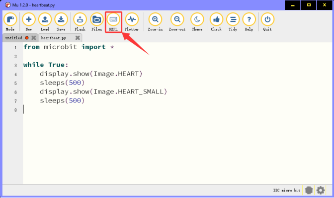

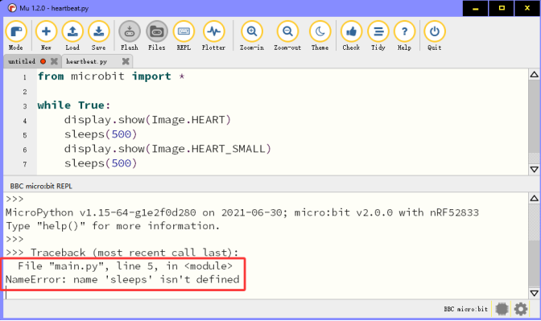

Clicca di nuovo “**REPL**” per chiudere REPL. Poi clicca “**Flash**”.

Per assicurarti che il codice sia corretto, clicca “**Controlla**” dopo aver finito, e Mu indicherà l'errore nel codice.

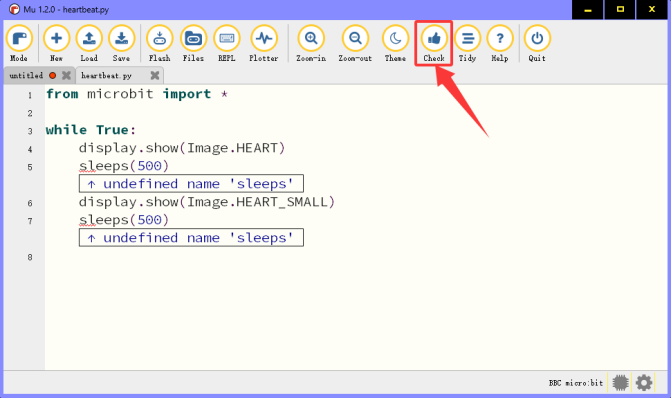

Modifica il codice secondo il messaggio di errore, e clicca di nuovo “**Controlla**”. Mu non mostrerà errori.

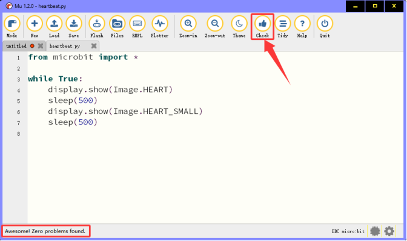

Vedi [più tutorial che spiegano aspetti specifici di Mu](https://codewith.mu/en/tutorials/).

## 2. Come Mu Importa le Librerie su Micro:bit

Prima di importare le librerie, dobbiamo caricare un codice .py (anche vuoto va bene) sulla scheda micro:bit. Qui prendiamo come esempio un codice vuoto.

Collega la scheda al computer tramite cavo USB. Apri Mu e clicca “Flash” per caricare il codice .py (vuoto) sulla scheda.

In questo tutorial, vengono usati i moduli OLED e DHT11. Pertanto, i file di libreria “**oled_ssd1306\.py**” e “**DHT11\.py**” devono essere importati nella scheda micro:bit.

La directory predefinita dove Mu salva i file è “mu_code” nella directory principale dell'utente.

Link di riferimento: [https://codewith.mu/en/tutorials/1.0/files](https://codewith.mu/en/tutorials/1.0/files)

**Istruzioni per importare le librerie:**

1\. Cerca la cartella “mu_code” nel Disco (C:).

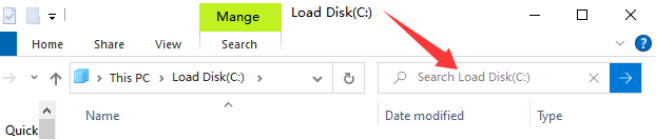

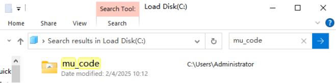

2\. Apri “mu_code”.

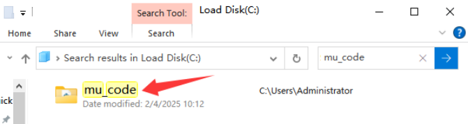

3\. Copia e incolla i file di libreria “**oled_ssd1306\.py**” e “**DHT11\.py**” in “**Libraries**”.

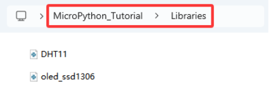

4\. Come mostrato sotto:

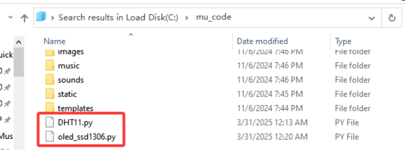

5\. Apri Mu e clicca “**Files**”. Qui trascini la libreria “**DHT11\.py**” nel micro:bit.

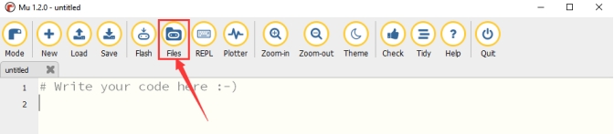

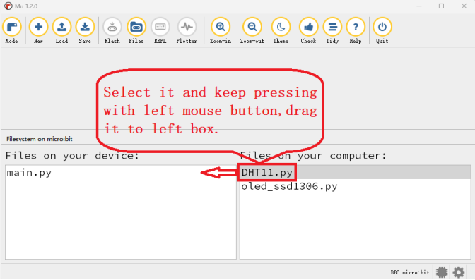

6\. Dopo aver importato “**DHT11\.py**”, la vedrai nella casella a sinistra.

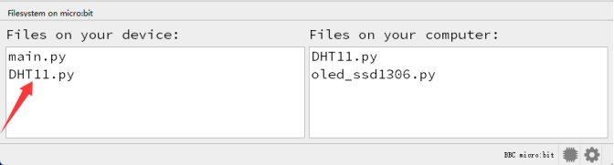

7\. Facciamo lo stesso con “**oled_ssd1306\.py**”.

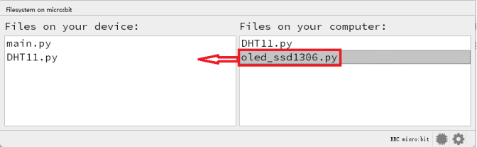

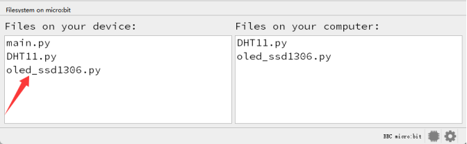

**Nota che quando carichi altri file sul micro:bit, sovrascriveranno il contenuto originale quindi devi reimportarli la prossima volta che li usi.**
