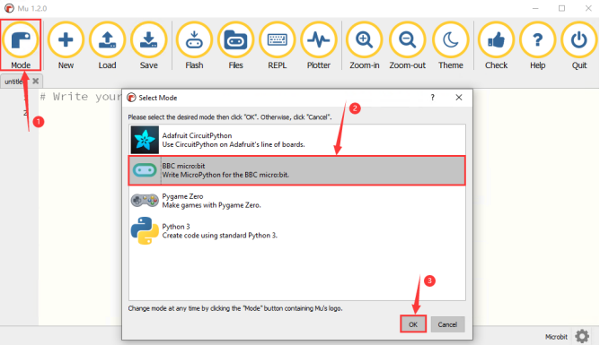
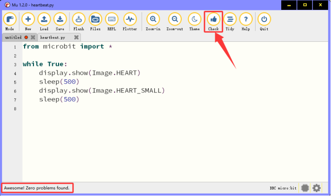
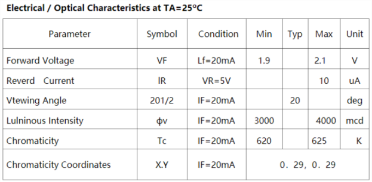
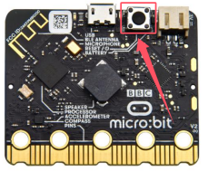
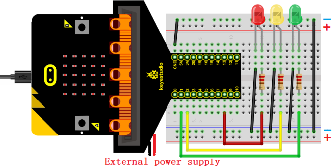
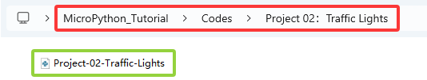
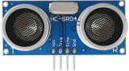
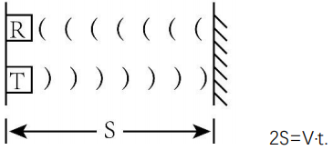

# MicroPython_Tutorial

## 1. About Mu Software

### 1.1. Install MU

Click to visit [Mu software official website](https://codewith.mu/).

Mu is a Python code editor for beginner programmers, like teachers and students. We can get it by the official installer for Windows, Mac OSX or Linux (Mu no longer supports 32-bit Windows). The recommended version is Mu 1.2.0. 

**Step 1 - Make sure your OS so then download Mu Installer**

First find out your computer operating system (Windows or Mac OSX). Open “**This PC**” to see  “**Properties**”.


Check the system type: 64-bit or 32-bit.


[Download MU](https://codewith.mu/en/download). Download the version according to your computer operating system.


<span style="color: rgb(255, 76, 65);">Here we take the Windows system as an example, which can be a reference for Mac OSX and Linux.</span>


**Step 2 - Run the installer**

Double-click the installer (it is probably in your Downloads folder) to run it.


We’ve outlined the extra steps needed to help Windows install Mu for Windows 10. Other versions will be similar. 

[Mu installer for MacOS](https://codewith.mu/en/howto/1.1/install_macos). 

[Mu installer for Linux system](https://codewith.mu/en/howto/1.2/install_linux). 

 

For Windows 10, the Defender will pop up with a warning message. You should click on the “**More info**” link.


The message will change giving you more information about the installer and display a “**Run anyway**” button. Click “**Run anyway**”.


**Step 3 - License Agreement**

Review the license, select the check box and click “**Install**” .


**Step 4 - Installing**

Go make a cup of coffee as Mu installs on your computer.


**Step 5 - Complete**

The installation has completed successfully, click “**Finish**” to close the installer.


**Step 6 - Start Mu**

You can start Mu by clicking on the icon in the Start menu or by typing “Mu” into the search box (both highlighted below). On first start, this may take some time.


Here’s what it looks like:


### 1.2. Using Modes & Menu Bar

Set  “<span style="color: rgb(255, 76, 65);">Mode</span>” to BBC micro:bit .

On the menu, click “**Mode**” to set it to “**BBC micro：bit**”. The micro:bit mode understands how to interact with and connect to a micro:bit.



Click to [Start with Mu](https://codewith.mu/en/tutorials/1.1/start). 

For more tutorials on using Mu, please visit: https://codewith.mu/en/tutorials/

### 1.3. Program on Mu

Here we load the “<span style="color: rgb(255, 76, 65);">heartbeat\.py</span>” to Mu. Find it in the folder “<span style="color: rgb(255, 76, 65);">Heart beat</span>” we provided.


**Method one:**

Open the Mu and click “<span style="color: rgb(255, 76, 65);">Load</span>”  to choose the path where you downloaded the code.


Loaded successfully, as shown below:


**Method two:** 

Click “new” to create a new program and drag “heartbeat\.py” into it:


Loaded successfully, as shown below:


<span style="color: rgb(255, 76, 65);">The same is true for adding other codes.</span>

### 1.4. Download Code to Mciro:bit

Connect the board to computer via USB cable.


Click “<span style="color: rgb(255, 76, 65);">**Flash**</span>” to download the code to the micro:bit board.


After that, <span style="color: rgb(255, 76, 65);">**power on by the micro USB cable or external power supply (turn DIP switch to ON)**</span>. You will see the on-board 5×5 LED matrix repeatedly shows  and then .

<span style="color: rgb(255, 76, 65);">**Note that if there is an error in your code, it can also be able to download yet it will not work properly.**</span>

<span style="color: rgb(0, 209, 0);">For example, the function sleep() is written as sleeps() in the code. Click “**Flash**” to load code to micro:bit. However, the 5×5 LED matrix shows messy icons. </span>


In this case, click “**REPL**”  and press the reset button on the board on its back. The error message will be displayed in the REPL interface, as shown below:


Click “**REPL**” again to close REPL. And then click “<span style="color: rgb(255, 76, 65);">**Flash**</span>”.

To ensure that the code is correct, click “<span style="color: rgb(255, 76, 65);">**Check**</span>” after completing, and Mu will point out the error in the code.


Modify the code according to the error message, and click “<span style="color: rgb(255, 76, 65);">**Check**</span>” again. Mu does not show an error.



See [more tutorials explaining specific aspects of Mu](https://codewith.mu/en/tutorials/). 

## 2. How Mu Import Library to Micro:bit

<span style="color: rgb(255, 76, 65);">Before importing libraries, we need to upload a .py code (empty code is also ok) to the micro:bit board. Here we take an empty code as an example.</span>

Connect the board to computer via USB cable. Open the Mu and click “Flash” to upload the .py code (empty code) to the board.


In this tutorial, OLED and DHT11 modules are used. Therefore, the “<span style="color: rgb(255, 76, 65);">**oled_ssd1306\.py**</span>” and “<span style="color: rgb(255, 76, 65);">**DHT11\.py**</span>” library files need to be imported into the micro:bit board. 

The default directory for Mu to save files is “mu_code”in the root directory of the user’s directory. 

References link: [https://codewith.mu/en/tutorials/1.0/files](https://codewith.mu/en/tutorials/1.0/files)

**Instructions for importing libraries:**

1\. Search for the “<span style="color: rgb(255, 76, 65);">mu_code</span>” folder on the Disk(C:).


2\. Open “<span style="color: rgb(255, 76, 65);">mu_code</span>”.


3\. Copy and paste the library files “<span style="color: rgb(255, 76, 65);">**oled_ssd1306\.py**</span>” and “<span style="color: rgb(255, 76, 65);">**DHT11\.py**</span>” to “<span style="color: rgb(255, 76, 65);">**Libraries**</span>”.


4\. As shown below:


5\. Open the Mu and click “<span style="color: rgb(255, 76, 65);">**Files**</span>”. Here we drag  “<span style="color: rgb(255, 76, 65);">**DHT11\.py**</span>” library into micro:bit.


6\. After importing “<span style="color: rgb(255, 76, 65);">**DHT11\.py**</span>”, you'll see it in the box on the left.


7\. Let’s do the same thing to the “<span style="color: rgb(255, 76, 65);">**oled_ssd1306\.py**</span>”.


<span style="color: rgb(255, 76, 65);">**Note that when you upload other files to the micro:bit, they will overwrite the original content so you need to re-import it for the next time you use.**</span>

## 3. Projects

### Project 01: Small Lamp with Button

#### 1. Overview

There are two programmable buttons on the front of the micro:bit board (A and B). We combine them with a red LED and a lamp card to build a small desk lamp. When the button A is pressed, the red LED lights up; when B is pressed, it goes off.

#### 2. Components

|  |                            |  |
| :---------------------: | :-----------------------------------------------: | :---------------------: |
|   micro:bit board *1    |        micro:bit T-type expansion board *1        |   micro USB cable *1    |
|  |                            |  |
|       red LED *1        |                 220Ω resistor *1                  |      jump wire *2       |
|  |                            |  |
|      breadboard *1      | battery holder *1 <br> (<span style="color: rgb(255, 76, 65);">self-provided AA batteries *2</span>) |      lamp card *1       |

#### 3. Components Knowledge

**Buttons**

Buttons can control the circuit on and off. When a button is connected to a circuit, the circuit is opened when the button is not pressed; the circuit will be closed after pressing the button. 

There are three buttons on the micro:bit board: a reset button on its back and two programmable buttons (A and B) on its front.


**Resistors**


A resistor is an electronic component that limits the current in a branch circuit. The resistance of a fixed resistor cannot be adjusted, while that of a potentiometer or a variable resistor can.

Here are two common circuit symbols for resistors. If you see these symbols in a circuit, they represent a resistor.


Ω is the unit of resistance, including Ω, KΩ, MΩ, etc. They can be expressed as: 1 MΩ=1000 KΩ, 1 KΩ =1000 Ω. In general, some resistances are marked on the surface.

When using a resistor, we first need to know its resistance. There are two ways: observe the color band on it, or measure its resistance by a multimeter. Obviously, the former one is more convenient and faster.


As shown in the resistor card, each color represents a number.


4- and 5-band resistors are commonly used.

Often, when you get a resistor, you may find it difficult to decide where to start reading the color.

**Therefore, you can observe the gap between the two bands at one end of it; if it is wider than any other band gap, read from the opposite end.**

<span style="color: rgb(255, 76, 65);">**Note that the gap between the 4th and 5th bands (the 3rd and 4th) is relatively wide in a 5-band (4-band) resistor.**</span>

Let’s see how to read the resistance of a 5-band resistor, as shown below:


For this resistor, the resistance should be read from left to right. The value should be: 1st band 2nd band 3rd band x 10^multiplier(Ω), ±tolerance%. 

Therefore, the resistance of this resistor is 2(red) 2(red) 0(black) × 10^0 (black)Ω = 220Ω, ±1%(brown). Learn more about [resistor from Wiki](https://en.wikipedia.org/wiki/Resistor).

**LED**

LED, fully called “light-emitting diode”, which is an electronic device made of semiconductor materials (silicon, selenium, germanium, etc.). It is polar, with a positive pole - the long pin connected to VCC (V or 3.3V or 5V or +), and a negative pole - the short pin connected to GND (G or-). The current flows from the positive to the negative, in a one-way flow.

Electronic and graphic symbol of LED:


LED in various sizes and colors:


Red, yellow, blue, green and white are the most common colors of LED, which is same as their appearance colors. We rarely use transparent LED, and the light emitted may not be white. There are four sizes of LED: 3mm, 5mm(most common), 8mm and 10mm.


Forward voltage needs to be used when the LED is on. It is a very important parameter to know when using an LED, as it determines how much power you use and how large the current limiting resistor should be. For most red, yellow, orange and light green LED, they typically use a voltage between 1.9V and 2.1V.


According to Ohm's law, the current through the circuit decreases as the resistance increases, causing the LED to dim.

I = (VP-Vl)/R

In order to make the LED safe and have the right brightness, how much resistance should we use in the circuit?

For 99% of 5mm LED, the recommended current is 20mA, which can be seen from the conditions column in its data sheet:



Now convert the above formula to the following:

R = (VP-Vl)/I

If VP = 5V, Vl (forward voltage) = 2V, and I = 20mA, we can tell R is 150Ω. Therefore, we can make the LED brighter by reducing the resistance, but the resistance should not be below 150Ω (this value may not be accurate because the provided LED varies).

The forward voltage and wavelength of different colors of LED are shown below for your reference:


<span style="color: rgb(255, 76, 65);">**Do not connect a resistor with very low resistance directly to the two poles of the power supply, or the electronic components may be damaged due to excessive current. Resistors are non-polar.**</span>

**Breadboard**

Before completing any circuit, a breadboard is used for quickly designing and testing circuits. There are many holes on a breadboard that can be inserted with circuit components (say, resistors). A typical breadboard is shown below:


A breadboard has many metal strips under it to connect to the holes at the top. They are arranged as shown below.

<span style="color: rgb(255, 76, 65);">**Note that the top and bottom holes are horizontally connected, while the rest of the holes are vertically connected.**</span>


The first two rows(top) and the last two(bottom) of the breadboard are used for the positive(+) and negative(-) poles of the power supply, respectively. The conductive layout diagram is shown below:


When connecting DIP(Dual In-line Packages) components, such as integrated circuits, microcontrollers, chips, etc., the groove isolates the two parts. Therefore, DIP components can be connected as shown below:


**Jump wire and DuPont wire**

Jump wires and DuPont wires connect two terminals. There are various types of them, but here we focus on those used in breadboard. They transmit electrical signals from anywhere on the breadboard to the input/output pins of a microcontroller.

When using, insert “two pins” of the wires into the breadboard without soldering. Several sets of parallel boards are arranged under the surface of the breadboard, so wires only need to be inserted in specific holes in a particular prototype.

There are three types of DuPont wires: F-F, M-M and M-F. On the wire, the pin is called male end(M), while the hole is female(F).


More than one type can be used in a project. Although the colors of wires are different, they serve the same purpose. Colors are used to distinguish circuits.

#### 4. Wiring Diagram

<span style="color: rgb(255, 76, 65);">Note: the micro:bit board needs to be inserted into the T-type expansion board as shown below. The micro:bit board LED matrix should be on the same side with the logo of the expansion board.</span>


<span style="color: rgb(255, 76, 65);">**The board control pin of LED is P0 (the pin of T-type expansion board is digital 0).**</span>

#### 5. Code Flow


#### 6. Test Code

The code file is provided in folder Project 01：Small Lamp with Button, file Project-01-Small-Lamp-with-Button\.py.


**Complete code:**

```python
'''
Function: microbit on-board buttons A&B control LED
Compiling IDE: MU 1.2.0
Author: https://docs.keyestudio.com
'''
# import microbit related libraries
from microbit import *

display.show(Image.HEART) # LED matrix displays ❤
pin0.write_digital(0) # set P0 pin to low

while True:
    if button_a.is_pressed():     # if A is pressed
        pin0.write_digital(1)     # P0 is high
        display.show(Image.HAPPY) # LED matrix displays a smile face
    elif button_b.is_pressed():   # or else B is pressed
        pin0.write_digital(0)     # P0 is low
        display.show(Image.SAD)   # LED matrix displays a crying face
```

#### 7. Test Result

Click “<span style="color: rgb(255, 76, 65);">Flash</span>” to load the code to the micro:bit board.


After downloading the code to the board, **power on via micro USB cable or external power supply(turn the DIP switch to ON)**, and press the reset button on the board.



We can see the phenomenon：5x5 LED matrix shows . Press button A, and 5x5 LED matrix shows , LED turns on. Press button B, 5x5 LED matrix shows , LED goes off. Does it look like a mini lamp?

<span style="color: rgb(255, 76, 65);">**ATTENTION:** If the wiring is correct but you cannot see the results, press the reset button on the back of the board again.</span>


<span style="color: rgb(255, 76, 65);">When powering on via external power supply, turn the DIP switch to ON.</span>


### Project 02: Traffic Lights

#### 1. Overview

In this project, we adopt three LEDs( red, yellow and green), a speaker on micro:bit board and 5x5 LED matrix to make a model of traffic lights.

#### 2. Components

|                            |              |  |
| :-----------------------------------------------: | :---------------------------------: | :---------------------: |
|                micro:bit board *1                 | micro:bit T-type expansion board *1 |   micro USB cable *1    |
|                            |             |  |
|                    red LED *1                     |            yellow LED *1            |      green LED *1       |
|                            |              |  |
|                 220Ω resistor *3                  |             jump wires              |      breadboard *1      |
|                            |              |                         |
| battery holder *1 <br> (<span style="color: rgb(255, 76, 65);">self-provided AA batteries *2</span>)|       traffic lights card *1        |                         |

#### 3. Components Knowledge

**Speaker**


Micro: bit comes with a speaker, which makes it easy to make sound in your project.

#### 4. Wiring Diagram


<span style="color: rgb(255, 76, 65);">**Note:** the micro:bit board needs to be inserted into the T-type expansion board as shown below. The micro:bit board LED matrix should be on the same side with the logo of the expansion board.</span>



#### 5. Code Flow


#### 6. Test Code

The code file is provided in folder Project 02：Traffic Lights, file Project-02-Traffic-Lights\.py.



**Complete code:** 

```python
'''
Function: traffic lights with countdowns and buzzes
Compiling IDE: MU 1.2.0
Author: https://docs.keyestudio.com
'''
# import microbit related libraries
from microbit import *

pin1.write_digital(0) # set P1 pin to low
pin2.write_digital(0) # set P2 pin to low
pin8.write_digital(0) # set P8 pin to low

import music # import music libraries

while True:
   pin1.write_digital(1)  # P1 pin to high
   display.show('6')  # LED matrixs shows 6
   sleep(1000)        # delay 1s
   display.show('5')
   sleep(1000)
   display.show('4')
   sleep(1000)
   display.show('3')
   sleep(1000)
   display.show('2')
   sleep(1000)
   display.show('1')
   sleep(1000)
   display.show('0')
   sleep(1000)
   pin1.write_digital(0)
   pin2.write_digital(1)
   music.play("C4:4")    # speaker plays C4 tone
   display.show('2')
   sleep(500)
   pin2.write_digital(0)
   music.reset()         # no tone
   sleep(500)
   pin2.write_digital(1)
   music.play("C4:4")
   display.show('1')
   sleep(500)
   pin2.write_digital(0)
   music.reset()
   sleep(500)
   pin2.write_digital(1)
   music.play("C4:4")
   display.show('0')
   sleep(500)
   pin2.write_digital(0)
   music.reset()
   sleep(500)
   pin8.write_digital(1)
   display.show('6')
   sleep(1000)
   display.show('5')
   sleep(1000)
   display.show('4')
   sleep(1000)
   display.show('3')
   sleep(1000)
   display.show('2')
   sleep(1000)
   display.show('1')
   sleep(1000)
   display.show('0')
   sleep(1000)
   pin8.write_digital(0)
```

#### 7. Test Result

Click “<span style="color: rgb(255, 76, 65);">Flash</span>” to load the code to the micro:bit board.


After downloading the code to the board, **power on via micro USB cable or external power supply(turn the DIP switch to ON)**, and press the reset button on the board.


The green LED turns on and the 5×5 LED matrix counts down 6 seconds. After the green LED is off, the yellow LED flashes and the matrix counts down 3s with speaker sounding. At last, the red LED is on with a countdown of 6s. These actions repeat.

<span style="color: rgb(255, 76, 65);">**ATTENTION:** If the wiring is correct but you cannot see the results, press the reset button on the back of the board.</span>


<span style="color: rgb(255, 76, 65);">**When powering on via external power supply, turn the DIP switch to ON.**</span>


### Project 03: Ranging Bat

#### 1. Overview

Based on an ultrasonic sensor, the ranging bat detects the distance of obstacles and displays it in real time on an OLED. When it is less than 10cm, the speaker alarms.

#### 2. Components

|  |              |                            |
| :---------------------: | :---------------------------------: | :-----------------------------------------------: |
|   micro:bit board *1    | micro:bit T-type expansion board *1 |                micro USB cable *1                 |
|  |              |                            |
|  ultrasonic sensor *1   |           OLED module *1            |                   DuPont wires                    |
|  |              |                            |
|      breadboard *1      |             jump wires              | battery holder *1 <br> (<span style="color: rgb(255, 76, 65);">self-provided AA batteries *2</span>)|
|  |              |                                                   |
|       bat card *1       |            OLED card *1             |                                                   |

#### 3. Components Knowledge

**ultrasonic sensor**

Ultrasonic waves bounce back when they hit an obstacle. We measure the distance by calculating the time interval between sending and receiving the waves. Since the propagation speed of sound in air is a constant v=340m/s, we calculate the distance between the sensor and the obstacle: s=vt/2.



The HC-SR04 ultrasonic module integrates a transmitter and receiver. The former converts electrical signals (electric energy) into high frequency (beyond human hearing) sound waves (mechanical energy), while the latter does the opposite.

The schematic diagram of the HC SR04:


**Pin definition:**


**Parameters:**

- Operating voltage: 5V
- Operating current: 12mA
- Minimum measuring distance: 2cm
- Maximum measuring distance: 200cm

**Working principle:**

A high level pulse lasting at least 10us is output on the Trig pin, and the module starts transmitting ultrasonic waves. At the same time, the Echo pin is pulled up. When the module receives an ultrasonic wave back when it encounters an obstacle, the Echo pin will be pulled down. The duration of the high level of the Echo pin is the total time of wave from sending to receiving: s=vt/2.


**OLED module**

OLED technology features rich color performance, high contrast and wide perspective, providing clear and vivid pictures, especially outstanding in black. 

Each pixel of the OLED display emits light itself without backlight, so it consumes relatively low power. With small size, high resolution and low power consumption, the 0.9-inch OLED display is very suitable for wearable devices.


<span style="color: rgb(255, 76, 65);">**In this project, the OLED display module connects the SDA interface to pin P20 and SCL to pin P19.**</span>

**Parameters:**

- Operating voltage: DC 3.3V-5V

- Operating current: 30mA

- Interface: Pin ports with a spacing of 2.54mm

- Communication mode: I2C

- Internal driver chip: SSD1306

- Resolution: 128*64

- Viewing Angle: greater than 150°

#### 4. Wiring Diagram


<span style="color: rgb(255, 76, 65);">**When using the OLED display and ultrasonic sensor, we must connect an external power supply and turn the DIP switch to ON.**</span>


#### 5. Import Library

If you haven’t added the required library files yet (oled_ssd1306), please import it referring to [How Mu Import Library to Micro:bit](https://docs.keyestudio.com/projects/FKS0004/en/latest/docs/MicroPython_Tutorial/MicroPython_Tutorial.html#how-mu-import-library-to-micro-bit).

#### 6. Code Flow


#### 7. Test Code

The code file is provided in folder Project 03：Ranging Bat, file Project-03-Ranging-Bat\.py.


**Complete code:** <span style="color: rgb(255, 76, 65);">**The threshold in the condition 10 can be modified according to actual conditions.**</span>

```python
'''
Function: bat ranging
Compiling IDE: MU 1.2.0
Author: https://docs.keyestudio.com
'''
# import related libraries
from microbit import *
import ustruct
import machine
from time import sleep_us
import oled_ssd1306 as oled
import music

display.show(Image.HAPPY) # LED matrix displays a smile face
distance = 0              # set variable distance initial value to 0
lastEchoDuration = 0      # set variable lastEchoDuration initial value to 0

# initialize and clear oled
oled.initialize()
oled.clear_oled()

while True:
    # Ultrasonic sensor sends and receives signals
    pin1.write_digital(0)
    sleep_us(2)
    pin1.write_digital(1)
    sleep_us(15)
    pin1.write_digital(0)

    # measure the time interval between "when rising edge detected from the pin2" and "until the pin becomes low again"
    # unit is μs. Assign the interval to variable t.
    t = machine.time_pulse_us(pin2, 1, 35000)

    # a conditional statement, used to check whether the values of two variables t and lastechoduration satisfy specific conditions.
    # If both conditions are met, the block of code under the condition statement is executed.
    if (t <= 0 and lastEchoDuration >= 0):
        t = lastEchoDuration   # variable t = variable lastechoduration
    else:
        lastEchoDuration = t
    distance = int(t * 0.017)  # calculate distance
    oled.clear_oled()          # clear OLED
    oled.add_text(1, 0, str(distance) + 'cm')  # Display distance in the corresponding position of OLED
    sleep(200)
    if distance < 10:       # if distance < 10cm
        music.play("C4:4")  # speaker plays C4 tone
        sleep(200)          # delay 
        music.reset()       # no tone
        sleep(200)
```

#### 8. Test Result

Click “<span style="color: rgb(255, 76, 65);">Flash</span>” to load the code to the micro:bit board.


After downloading the code to the board, **power on via micro USB cable or external power supply(turn the DIP switch to ON)**, and press the reset button on the board.


The OLED displays the distance between the ultrasonic sensor and the obstacle in real time. When the distance value is less than 10cm, the speaker on micro:bit board alarms.

<span style="color: rgb(255, 76, 65);"><span style="color: rgb(255, 76, 65);">**ATTENTION:** If the wiring is correct but you cannot see the results, press the reset button on the back of the board.</span></span>


### Project 04: Smart Paeking

#### 1. Overview

Smart parking lots are everywhere. Can we also create a smart parking lot? Of course. We can use ultrasonic sensor to detect if there are vehicles ahead. When a vehicle (or thing) is detected approaching, we control servo to raise the lift rod; If it is detected to be moving away, the servo will lower the lift rod.

#### 2. Components

|  |              |                            |
| :---------------------: | :---------------------------------: | :-----------------------------------------------: |
|   micro:bit board *1    | micro:bit T-type expansion board *1 |                micro USB cable *1                 |
|  |              |                            |
|  ultrasonic sensor *1   |              servo *1               |                   DuPont wires                    |
|  |              |                            |
|      breadboard *1      |             jump wires              |battery holder *1 <br> (<span style="color: rgb(255, 76, 65);">self-provided AA batteries *2</span>)|
|  |              |                                                   |
|       bat card *1       |          lift rod card *1           |                                                   |

#### 3. Components Knowledge

**Servo**

Servo is a position driver. We can use servo to control the exact position or output high torque. Usually, it is used in robots, remote control cars, and even aircraft models. There are many specifications, but all servos comes with three wires: signal(orange), positive(red) and negative(brown). The color will vary from servo brands.


**Internal structure diagram:**


① Signal: receives control signals from the microcontroller;

② potentiometer: The position of the output shaft can be measured, which belongs to the feedback part of the whole servo;

③ Internal controller: The embedded board processes signals from external control, drives the motor and feedback position signals, which is the core of the whole servo;

④ DC motor: It is as an actuator to output speed, torque, position;

⑤ Transmission / servo mechanism: The mechanism zooms in the stroke output by the motor to the final output angle according to a certain transmission ratio.

**Drive the servo**

Send PWM signals to the servo signal line to control its output. The duty cycle of PWM directly determines the position of the output shaft. The period is usually 20 milliseconds and is typically set to generate pulses at a frequency of 50Hz.

<span style="color: rgb(255, 0, 0);">For example (180° servo):</span>

When we send a pulse width of 1.5 milliseconds (ms) to the 180° servo, the output shaft of the servo will move to the middle position (90 degrees);

If the pulse width is 0.5ms, the output shaft will move to 0 degree;

If the pulse width is 2.5ms, the output shaft will move to 180 degree;


**Parameters:**

- Operating voltage: DC 3.3V~5V

- Operating temperature: -10°C ~ +50°C

- Dimensions: 32.25mm x 12.25mm x 30.42mm

- Interface: 3pin interface with a spacing of 2.54mm

#### 4. Wiring Diagram


<span style="color: rgb(255, 76, 65);">**When using the ultrasonic sensor and servo, we must connect an external power supply and turn the DIP switch to ON.**</span>


#### 5. Code Flow


#### 6. Test Code

The code file is provided in folder Project 04：Smart-Parking, file Project-04-Smart-Parking\.py.


**Complete code:** <span style="color: rgb(255, 76, 65);">The threshold in the condition 10 can be modified according to actual conditions.</span>

```python
'''
Function: smart parking
Compiling IDE: MU 1.2.0
Author: https://docs.keyestudio.com
'''
# import related libraries
from microbit import *
import ustruct
import machine
from time import sleep_us

distance = 0              # set variable distance initial value to 0
lastEchoDuration = 0      # set variable lastEchoDuration initial value to 0

val = Image("09990:""09090:""09990:""09000:""09000")  # set iamge
display.show(val)        # LED matrix shows image
pin0.write_analog(25.6)    # set P0 pin analog to 25.6, servo angle to 0°
sleep(200)

while True:
    pin0.set_analog_period(20) # set servo frequency
    # Ultrasonic sensor sends and receives signals
    pin1.write_digital(0)
    sleep_us(2)
    pin1.write_digital(1)
    sleep_us(15)
    pin1.write_digital(0)

    # measure the time interval between "when rising edge detected from the pin2" and "until the pin becomes low again"
    # unit is μs. Assign the interval to variable t.
    t = machine.time_pulse_us(pin2, 1, 35000)

    # a conditional statement, used to check whether the values of two variables t and lastechoduration satisfy specific conditions.
    # If both conditions are met, the block of code under the condition statement is executed.
    if (t <= 0 and lastEchoDuration >= 0):
        t = lastEchoDuration   # variable t = variable lastechoduration
    else:
        lastEchoDuration = t
    distance = int(t * 0.017)  # calculate distance
    if distance < 10:          # if distance < 10cm
       pin0.write_analog(77)   # servo rotate to 90°
       sleep(2000)
    else:  # or
       sleep(2000)
       pin0.write_analog(25.6)
       sleep(2000)
```

#### 7. Test Result

Click “<span style="color: rgb(255, 76, 65);">Flash</span>” to load the code to the micro:bit board.


After downloading the code to the board, **power on via micro USB cable or external power supply(turn the DIP switch to ON)**, and press the reset button on the board.


When the ultrasonic sensor detect a vehicle (or thing) approaching, the servo controls the lift rod to raise; If the sensor detects it moving away, the servo will lower the lift rod.

<span style="color: rgb(255, 76, 65);">**ATTENTION:** If the wiring is correct but you cannot see the results, press the reset button on the back of the board.</span>


### Project 05: Car Dial

#### 1. Overview

In this project, we combine an adjustable potentiometer, a servo and a beautiful dial card to make a simple car dial model.

#### 2. Components

|   |                            |  |
| :----------------------: | :-----------------------------------------------: | :---------------------: |
|    micro:bit board *1    |        micro:bit T-type expansion board *1        |   micro USB cable *1    |
|   |                            |  |
|     potentiometer *1     |                     servo *1                      |       jump wires        |
|   |                            |  |
|      breadboard *1       |battery holder *1 <br> (<span style="color: rgb(255, 76, 65);">self-provided AA batteries *2</span>)|  potentiometer card *1  |
|  |                                                   |                         |
|     car dial card*1      |                                                   |                         |

#### 3. Components Knowledge

**potentiometer**


A potentiometer is also a resistor element with three contacts, whose resistance value can be adjusted according to some regularity.

They come in all shapes, sizes and values, but they all have the followings in common:

① Three terminals (or connection points).

② A movable knob or slider that can change the resistance between the intermediate terminal and any external terminal.

③ As the knob is moved, the resistance between the intermediate terminal and any external terminal varies from 0Ω to its maximum.

The circuit symbol of potentiometer:


(1)\. As a voltage divider

The potentiometer is a continuously adjustable resistor. When you rotate its slider, the moving contact slides across the resistor. At this point, a voltage can be output according to the voltage applied to potentiometer and the angle or stroke of rotation of the movable slider.

(2)\. As a variable resistor

When potentiometer is used as a variable resistor, connect its intermediate terminal to one of two additional terminals in the circuit. In this way, you can obtain a steady and continuously varying resistance value within the range of it.

(3)\. As a current controller

When it is used as a current controller, the moving contact must be connected as one of the output terminals.

#### 4. Wiring Diagram


<span style="color: rgb(255, 76, 65);">**When using the servo, we must connect an external power supply and turn the DIP switch to ON.**</span>


#### 5. Code Flow


#### 6. Test Code

The code file is provided in folder Project 05：Car Dial, file Project-05-Car-Dial\.py.


**Complete code:**

```python
'''
Function: The potentiometer controls the servo to simulate the car dial
Compiling IDE: MU 1.2.0
Author: https://docs.keyestudio.com
'''
# import microbit related libraries
from microbit import *

display.show(Image.HAPPY)  # LED matrix displays a smile face
pin0.write_analog(25.6)    # set P0 pin analog to 25.6, servo initial angle to 0°
sleep(200)

# map function
def map(value,fromLow,fromHigh,toLow,toHigh):
    return (toHigh-toLow)*(value-fromLow) / (fromHigh-fromLow) + toLow

while True:
    value=pin2.read_analog()    # Read the analog value of the potentiometer (ADC value)
    pin0.set_analog_period(20)  # set servo frequency
    pin0.write_analog(map(value,0,1023,25.6,128))  # Map the analog value of the potentiometer to that of the servo
    sleep(20)
```

#### 7. Test Result

Click “<span style="color: rgb(255, 76, 65);">Flash</span>” to load the code to the micro:bit board.


After downloading the code to the board, **power on via micro USB cable or external power supply(turn the DIP switch to ON)**, and press the reset button on the board.


Rotate the knob on potentiometer and the servo moves the pointer on the dial.

<span style="color: rgb(255, 76, 65);">**ATTENTION:** If the wiring is correct but you cannot see the results, press the reset button on the back of the board.</span>


### Project 06: Music Party


#### 1. Overview

When we clap our hands, the microphone on the board picks up sound signals, and the speaker plays a cheerful birthday song while the RGB LED emits dazzling light.

#### 2. Components

|  |                            |  |
| :---------------------: | :-----------------------------------------------: | :---------------------: |
|   micro:bit board *1    |        micro:bit T-type expansion board *1        |   micro USB cable *1    |
|  |                            |  |
|       red LED *1        |                 220Ω resistor *3                  |      jump wire *2       |
|  |                            |  |
|      breadboard *1      |battery holder *1 <br> (<span style="color: rgb(255, 76, 65);">self-provided AA batteries *2</span>)|       RGB card *1       |

#### 3. Components Knowledge

**Microphone**

A high-quality digital microphone is integrated on the front side of the micro:bit V2 board to detect sound and audio signals. The chip that controls and processes the microphone is on its back.


The microphone is in a small round hole on the front of the board, which is convenient to capture surrounding sound signals. Just place the micro:bit board face up when using. Next to the hole is a microphone LED indicator. When the micro:bit measures sound levels, the indicator will light up.


**RGB LED**


RGB LED is imaged in the intersection of three primary colors (RGB): red, green and blue. Most colors can be synthesized by RGB in different proportions. The red, green and blue LEDs are packaged in a transparent plastic case to emit colors of light by changing the input voltage of R, G and B pins.


**Trichromatic theory:**


RGB LED can be divided into two types: common anode and common cathode:

In a common cathode RGB LED, the three LEDs share a negative connection (cathode);

In a common anode RGB LED, the three LEDs share a positive connection (anode).


<span style="color: rgb(255, 76, 65);">**Note: Herein, we provide a common cathode RGB LED.**</span>

**RGB LED pins:**

RGB LED boasts 4 pins: GND(the longest one), R(red), G(green) and B(blue). Place the RGB LED as shown below, pins from left to right are red, GND, green and blue.


#### 4. Wiring Diagram


#### 5. Code Flow


#### 6. Test Code

The code file is provided in folder Project 06：Music Party, file Project-06-Music-Party\.py.


**Complete code:**

```python
'''
Function: Clap your hands, the microbit microphone receives the sound signal, the music sounds, and the RGB emits a dazzling light to simulate a musical party
Compiling IDE: MU 1.2.0
Author: https://docs.keyestudio.com
'''
# import related libraries
from microbit import *
import music

display.clear() # clear LED matrix

while True:
    if microphone.current_event() == SoundEvent.LOUD:  # If the microphone picks up a loud signal
       music.play(["G3:4", "G3", "A4"]) # the speaker plays some tones
       pin1.write_analog(1023)      # P1 analog value is 1023,RGB is red
       pin2.write_analog(0)
       # pin3.write_analog(0)
       sleep(100)
       music.play(["G4:4", "C5", "B4"])
       pin1.write_analog(0)         # P1 analog value is 0,RGB is not red
       pin2.write_analog(1023)      # P2 analog value is 1023,RGB is green
       # pin3.write_analog(0)
       sleep(100)
       pin1.write_analog(10)
       pin2.write_analog(10)
       # pin3.write_analog(1023)      # P3 analog value is 1023,RGB is blue
       sleep(100)
       music.play(["G4:4", "D5", "C5"])
       pin1.write_analog(123)
       pin2.write_analog(123)
       # pin3.write_analog(0)
       sleep(100)
       music.play(["G4:4", "D5", "C5"])
       pin1.write_analog(1023)
       pin2.write_analog(400)
       # pin3.write_analog(1023)
       sleep(100)
       music.play(["G3:4", "G3", "G4"])
       pin1.write_analog(10)
       pin2.write_analog(1023)
       # pin3.write_analog(1023)
       sleep(100)
       pin1.write_analog(1023)
       pin2.write_analog(1023)
       # pin3.write_analog(1023)
       sleep(100)
       music.play(["E5:4", "C5", "B4", "A4"])
       pin1.write_analog(32)
       pin2.write_analog(184)
       # pin3.write_analog(336)
       sleep(100)
       pin1.write_analog(640)
       pin2.write_analog(328)
       # pin3.write_analog(180)
       sleep(100)
       music.play(["F5:4", "F5", "E5"])
       pin1.write_analog(552)
       pin2.write_analog(172)
       # pin3.write_analog(904)
       sleep(100)
       pin1.write_analog(1020)
       pin2.write_analog(796)
       # pin3.write_analog(560)
       sleep(100)
       music.play(["C5:4", "D5", "C5"])
       pin1.write_analog(136)
       pin2.write_analog(560)
       # pin3.write_analog(140)
       sleep(100)
       pin1.write_analog(0)
       pin2.write_analog(0)
       # pin3.write_analog(0)
       sleep(100)
if microphone.current_event() == SoundEvent.QUIET:  # If the microphone picks up a quie signal
       pin1.write_analog(0)
       pin2.write_analog(0)
```

#### 7. Test Result

Click “<span style="color: rgb(255, 76, 65);">Flash</span>” to load the code to the micro:bit board.


After downloading the code to the board, **power on via micro USB cable or external power supply(turn the DIP switch to ON)**, and press the reset button on the board.


When we clap our hands, the microphone on the board picks up sound signals, and the speaker plays a cheerful birthday song while the RGB LED emits dazzling light. Isn’t the music party in a happy and joyful atmosphere?

<span style="color: rgb(255, 76, 65);">**ATTENTION:** If the wiring is correct but you cannot see the results, press the reset button on the back of the board.</span>


### Project 07: Environment Monitoring

#### 1. Overview

On the OLED, the smart environment monitoring system displays the temperature and humidity values detected by the DHT11 sensor in real time, as well as the brightness level value of ambient light detected by the on-board light sensor.

#### 2. Components

|                   |              |                            |
| :--------------------------------------: | :---------------------------------: | :-----------------------------------------------: |
|            micro:bit board *1            | micro:bit T-type expansion board *1 |                micro USB cable *1                 |
|                  |              |                            |
| XHT11 temperature and humidity sensor *1 |           OLED module *1            |                   DuPont wires                    |
|                   |              |                            |
|              breadboard *1               |             jump wires              |battery holder *1 <br> (<span style="color: rgb(255, 76, 65);">self-provided AA batteries *2</span>)|
|                  |              |                                                   |
|              cloud card *1               |            OLED card *1             |                                                   |

#### 3. Component Knowledge

**XHT11 temperature and humidity sensor**


XHT11 temperature and humidity sensor is a composite sensor with calibrated digital signal output, which can detect the humidity and temperature in the air. 

**Accuracy**: humidity ±5%RH, temperature ±2℃

**Detection range**: humidity 5%RH ~ 95%RH, temperature -25℃ ~ +60℃

The sensor uses special digital module acquisition and temperature and humidity sensing technology to ensure extremely high reliability and excellent long-term stability. It includes a resistive humidity sensing element and an NTC temperature sensing element, which is very suitable for measurement with relatively low accuracy and real-time requirements.

**XHT11 communication mode:**

Single bus communication is adopted. It means that there is only one data line for data exchange and control in the system.

- Definition of data bits transmitted by single bus:

Single bus data format: 40 bits of data are transmitted at a time, with the high bit coming first.

8bit humidity integer + 8bit humidity decimal + 8bit temperature integer + 8bit temperature decimal + 8bit parity bit (The decimal part of the humidity is 0)

- Definition of parity bit:

8bit humidity integer + 8bit humidity decimal + 8bit temperature integer + 8bit temperature decimal. 8bit parity bit = the last 8 bits of the obtained result

- Data timeline:

After the user host (MCU) sends a starting signal, the XHT11 switches from low power mode to high speed mode. After the starting signal, XHT11 sends a response signal and 40bit data, and triggers a signal acquisition.

- The signal transmission is shown in the figure:


 **Parameters**

- Operating voltage: DC 3.3V to 5V

- Operating current: 2.1mA

- Maximum power: 0.0105W

- Temperature range: -25℃ ~ +60℃ (± 2℃)

- Humidity range: 5%RH ~ 95%RH (accuracy ±5%RH under around 25 ° C)

**Microbit Light Sensor**


A light sensor is an input device that measures the brightness of external light. The micro:bit board does not include a built-in light sensor. It detects and senses ambient brightness by an LED matrix that repeatedly convert the light intensity into a value input, and then the voltage attenuation time is sampled. In this way, <span style="color: rgb(255, 76, 65);">the detected brightness level is a relative value</span>.

#### 4. Wiring Diagram


<span style="color: rgb(255, 76, 65);">**When using the OLED display, we must connect an external power supply and turn the DIP switch to ON.**</span>


#### 5. Import Library

If you haven’t added the required library files yet (DHT11 and oled_ssd1306), please import it referring to [How Mu Import Library to Micro:bit](https://docs.keyestudio.com/projects/FKS0004/en/latest/docs/MicroPython_Tutorial/MicroPython_Tutorial.html#how-mu-import-library-to-micro-bit).

#### 6. Code Flow


#### 7. Test Code

The code file is provided in folder Project 07：Environment Monitoring中找文件Project-07-Environment-Monitoring\.py.


**Complete code:**

```python
'''
Function: OLED displays temperature and humidity values and brightness level values in real time to simulate intelligent environment detection
Compiling IDE: MU 1.2.0
Author: https://docs.keyestudio.com
'''
# import related libraries
import oled_ssd1306 as oled
from microbit import *
from DHT11 import *

val = Image("90900:""09090:""90009:""90009:""99999")  # Set pattern
display.show(val)   # LED matrix displays the set pattern

#initialize and clear oled
oled.initialize()
oled.clear_oled()

sensor = DHT11(pin1)  # set temperature and humidity pins

while True:
    oled.clear_oled() # clear oled
    sensor.read()     # read the temperature and humidity values
    T = sensor.temp   # store the temperature values in T
    H = sensor.humid  # store the humidity values in H
    L = display.read_light_level()  # read the brightness level value of the light and store it in L
    oled.add_text(1, 0, 'T:' + str(T) + 'C')   # Display the temperature value at the corresponding position of the OLED
    oled.add_text(1, 1, 'H:' + str(H) + '%')   # Display the humidity value at the corresponding position of the OLED
    oled.add_text(1, 2, 'L:' + str(L))         # Display the brightness level value at the corresponding position of the OLED
    sleep(2000)
```

#### 8. Test Result

Click “<span style="color: rgb(255, 76, 65);">Flash</span>” to load the code to the micro:bit board.


After downloading the code to the board, **power on via micro USB cable or external power supply(turn the DIP switch to ON)**, and press the reset button on the board.


The OLED displays the temperature and humidity values and the light brightness level in real time.

<span style="color: rgb(255, 76, 65);">**ATTENTION:** If the wiring is correct but you cannot see the results, press the reset button on the back of the board.</span>


### Project 08: Anti-theft Alarm

#### 1. Overview

When the smart anti-theft alarm detects that the anti-theft box has been moved, the speaker on the micro:bit board will alarm and the red LED will flash.

#### 2. Components

|  |                            |  |
| :---------------------: | :-----------------------------------------------: | :---------------------: |
|   micro:bit board *1    |        micro:bit T-type expansion board *1        |   micro USB cable *1    |
|  |                            |  |
|       red LED *1        |                 220Ω resistor *1                  |      jump wire *2       |
|  |                            |  |
|      breadboard *1      |battery holder *1 <br> (<span style="color: rgb(255, 76, 65);">self-provided AA batteries *2</span>)|      alarm card *1      |

#### 3. Components Knowledge

**Accelerometer**


The micro:bit board boasts a built-in LSM303AGR acceleration sensor (we called accelerometer) which includes standard, fast, plus and high-speed mode (100 kHz, 400 kHz, 1 MHz and 3.4 MHz) of I2C serial bus interface and SPI serial standard interface for external communication, with resolution of 8/10/12 bits and range of ±2g, ±4g, or ±8g. 

When the micro:bit board is at rest or in uniform motion, the accelerometer only detects the acceleration of gravity. If it is slightly swung, the detected acceleration is much less than the that of gravity, so the difference can be ignored. Therefore, we mainly detect the change of gravitational acceleration on x, y, and z axes.

#### 4. Wiring Diagram


<span style="color: rgb(255, 76, 65);">The board control pin of LED is P1 (the pin of T-type expansion board is digital 1).</span>

#### 5. Code Flow


#### 6. Test Code

The code file is provided in folder Project 08：Burglar Alarm, file Project-08-Burglar-Alarm\.py.


**Complete code:** 

<span style="color: rgb(255, 76, 65);">**After importing the code, if the buzzer keeps sounding even though the breadboard is not moved; it may be caused by geographical factors. You can modify the threshold in the condition -60 and 50 according to actual conditions.**</span>

```python
'''
Function: The accelerometer controls a buzzer and LED to simulate a anti-theft alarm
Compiling IDE: MU 1.2.0
Author: https://docs.keyestudio.com
'''
# import related libraries
from microbit import *
import music

display.show(Image.HAPPY) # LED matrix displays a smile face

while True:
    if accelerometer.get_x()<-60 or accelerometer.get_x()>50: # If the value of the accelerometer in the X direction is less than -60 or greater than 50
       music.play("C4:4")      # speaker plays C4 tone
       pin1.write_digital(1)   # P1 pin value is high, LED on
       sleep(200)
       pin1.write_digital(0)   # P1 pin value is low, LED off
       sleep(200)
       display.show(Image.NO)  # LED matrix shows X
    else:  # or
        display.show(Image.HAPPY) # LED matrix displays a smile face
        pin1.write_digital(0)
        music.reset()             # no tone
```

#### 7. Test Result

Click “<span style="color: rgb(255, 76, 65);">Flash</span>” to load the code to the micro:bit board.


After downloading the code to the board, **power on via micro USB cable or external power supply(turn the DIP switch to ON)**, and press the reset button on the board.


After downloading the code to the board, move the breadboard. If the acceleration value x＜-60 or x＞50, the speaker on the board alarms and the LED flashes, and the micro:bit LED matrix shows . Otherwise, the speaker makes no sound and LED is off, and the micro:bit LED matrix shows .

<span style="color: rgb(255, 76, 65);">**ATTENTION:** If the wiring is correct but you cannot see the results, press the reset button on the back of the board.</span>


## 4. Troubleshooting

**Errors for Uploading Codes**

- If messy icons are displayed on the matrix of the board after uploading code, check if any characters have been accidentally added or deleted. You may click “check”. But note that some are not errors, just warnings.

- If the code is with a library, check whether the library is uploaded to the board. See “**How Mu Import Library to Micro:bit**”. And then check if any characters have been accidentally added or deleted.

**No Printings on REPL**

- After uploading code, click “REPL”  and it prints nothing. In this case, we need to press the reset button on the back of micro:bit board. 


