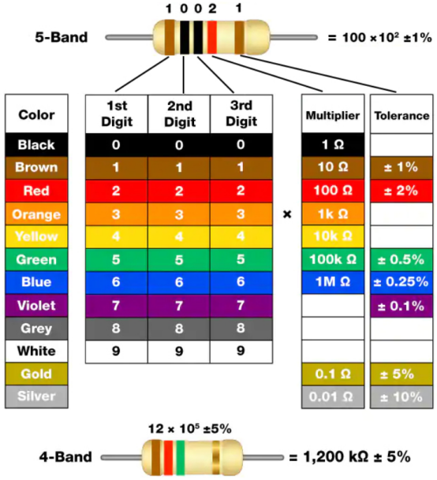
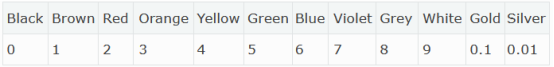
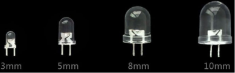
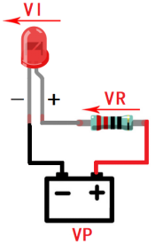
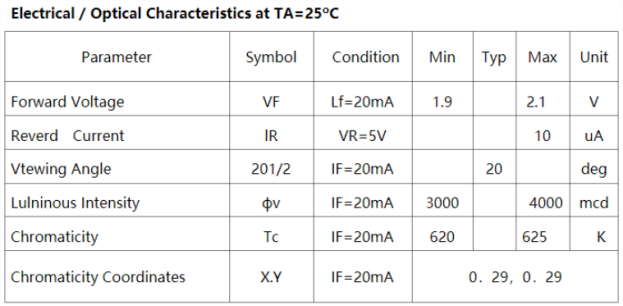
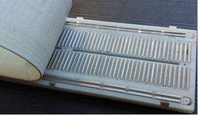
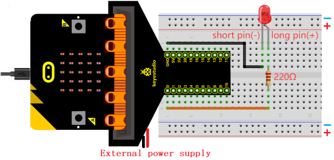
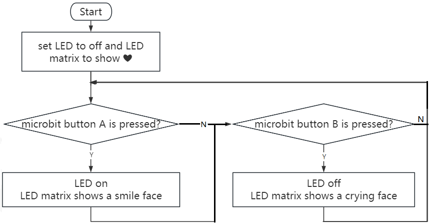
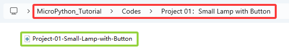
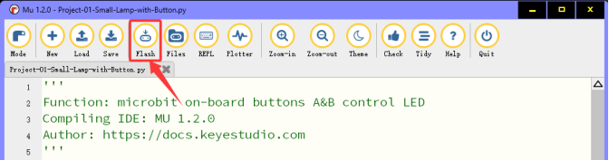

### Project 01: Kleine Lamp met Knop

#### 1. Overzicht

Er zijn twee programmeerbare knoppen aan de voorkant van de micro:bit board (A en B). We combineren ze met een rode LED en een lampkaart om een kleine bureaulamp te bouwen. Wanneer knop A wordt ingedrukt, gaat de rode LED aan; wanneer B wordt ingedrukt, gaat deze uit.

#### 2. Componenten

|  |                            |  |
| :---------------------: | :-----------------------------------------------: | :---------------------: |
|   micro:bit board *1    |        micro:bit T-type uitbreidingsbord *1       |   micro USB-kabel *1    |
|  |                            |  |
|       rode LED *1       |                 220Ω weerstand *1                  |      jumperdraad *2     |
|  |                            |  |
|      breadboard *1      | batterijhouder *1 <br> (<span style="color: rgb(255, 76, 65);">zelf meegebrachte AA-batterijen *2</span>) |      lampkaart *1       |

#### 3. Componentkennis

**Knoppen**

Knoppen kunnen de schakeling aan en uit zetten. Wanneer een knop is aangesloten op een schakeling, is de schakeling open wanneer de knop niet wordt ingedrukt; de schakeling wordt gesloten nadat de knop is ingedrukt.

Er zijn drie knoppen op de micro:bit board: een resetknop aan de achterkant en twee programmeerbare knoppen (A en B) aan de voorkant.


**Weerstanden**


Een weerstand is een elektronisch component dat de stroom in een tak van een schakeling beperkt. De weerstand van een vaste weerstand kan niet worden aangepast, terwijl die van een potentiometer of variabele weerstand dat wel kan.

Hier zijn twee veelvoorkomende schakelsymbolen voor weerstanden. Als je deze symbolen in een schakeling ziet, vertegenwoordigen ze een weerstand.


Ω is de eenheid van weerstand, inclusief Ω, KΩ, MΩ, enz. Ze kunnen worden uitgedrukt als: 1 MΩ=1000 KΩ, 1 KΩ=1000 Ω. Over het algemeen zijn sommige weerstanden gemarkeerd op het oppervlak.

Bij het gebruik van een weerstand moeten we eerst de weerstand weten. Er zijn twee manieren: observeer de kleurband erop, of meet de weerstand met een multimeter. Uiteraard is de eerste manier handiger en sneller.



Zoals te zien is op de weerstandkaart, vertegenwoordigt elke kleur een nummer.



4- en 5-band weerstanden worden vaak gebruikt.

Vaak, wanneer je een weerstand krijgt, kan het moeilijk zijn te bepalen waar je moet beginnen met het lezen van de kleur.

**Daarom kun je de ruimte tussen de twee banden aan één uiteinde observeren; als deze breder is dan de andere bandruimtes, lees dan vanaf de tegenovergestelde kant.**

<span style="color: rgb(255, 76, 65);">**Let op dat de ruimte tussen de 4e en 5e band (de 3e en 4e) relatief breed is bij een 5-band (4-band) weerstand.**</span>

Laten we zien hoe we de weerstand van een 5-band weerstand lezen, zoals hieronder weergegeven:


Voor deze weerstand moet de weerstand van links naar rechts worden gelezen. De waarde moet zijn: 1e band 2e band 3e band x 10^vermenigvuldiger(Ω), ±tolerantie%.

Daarom is de weerstand van deze weerstand 2(rood) 2(rood) 0(zwart) × 10^0 (zwart)Ω = 220Ω, ±1%(bruin). Leer meer over [weerstand op Wiki](https://en.wikipedia.org/wiki/Resistor).

**LED**

LED, voluit “light-emitting diode”, is een elektronisch apparaat gemaakt van halfgeleidermaterialen (silicium, selenium, germanium, enz.). Het is polair, met een positieve pool - de lange pin verbonden met VCC (V of 3.3V of 5V of +), en een negatieve pool - de korte pin verbonden met GND (G of -). De stroom vloeit van positief naar negatief, in één richting.

Elektronisch en grafisch symbool van LED:


LED in verschillende maten en kleuren:


Rood, geel, blauw, groen en wit zijn de meest voorkomende kleuren van LED, wat overeenkomt met hun uiterlijk. We gebruiken zelden transparante LED's, en het uitgezonden licht is mogelijk niet wit. Er zijn vier maten LED: 3mm, 5mm (meest voorkomend), 8mm en 10mm.



Voorwaartse spanning is nodig wanneer de LED aan is. Het is een zeer belangrijke parameter om te weten bij het gebruik van een LED, omdat het bepaalt hoeveel stroom je gebruikt en hoe groot de stroombegrenzende weerstand moet zijn. Voor de meeste rode, gele, oranje en lichtgroene LED's gebruiken ze typisch een spanning tussen 1,9V en 2,1V.



Volgens de wet van Ohm neemt de stroom door de schakeling af naarmate de weerstand toeneemt, waardoor de LED dimt.

I = (VP-Vl)/R

Om de LED veilig te maken en de juiste helderheid te hebben, hoeveel weerstand moeten we dan in de schakeling gebruiken?

Voor 99% van de 5mm LED's is de aanbevolen stroom 20mA, wat te zien is in de kolom voorwaarden in het datasheet:



Nu zetten we de bovenstaande formule om in het volgende:

R = (VP-Vl)/I

Als VP = 5V, Vl (voorwaartse spanning) = 2V, en I = 20mA, kunnen we zeggen dat R 150Ω is. Daarom kunnen we de LED helderder maken door de weerstand te verlagen, maar de weerstand mag niet lager zijn dan 150Ω (deze waarde is mogelijk niet exact omdat de geleverde LED kan variëren).

De voorwaartse spanning en golflengte van verschillende kleuren LED's worden hieronder ter referentie weergegeven:


<span style="color: rgb(255, 76, 65);">**Sluit geen weerstand met zeer lage weerstand direct aan op de twee polen van de voeding, anders kunnen de elektronische componenten beschadigd raken door overmatige stroom. Weerstanden zijn niet-polair.**</span>

**Breadboard**

Voordat je een schakeling voltooit, wordt een breadboard gebruikt om snel schakelingen te ontwerpen en te testen. Er zijn veel gaten op een breadboard waarin schakelingcomponenten (zoals weerstanden) kunnen worden gestoken. Een typisch breadboard wordt hieronder getoond:


Een breadboard heeft veel metalen strips eronder die verbinding maken met de gaten aan de bovenkant. Ze zijn gerangschikt zoals hieronder weergegeven.

<span style="color: rgb(255, 76, 65);">**Let op dat de bovenste en onderste gaten horizontaal verbonden zijn, terwijl de rest van de gaten verticaal verbonden zijn.**</span>



De eerste twee rijen (boven) en de laatste twee (onder) van het breadboard worden respectievelijk gebruikt voor de positieve (+) en negatieve (-) polen van de voeding. Het geleidende layoutdiagram wordt hieronder getoond:


Bij het aansluiten van DIP (Dual In-line Packages) componenten, zoals geïntegreerde schakelingen, microcontrollers, chips, enz., scheidt de groef de twee delen. Daarom kunnen DIP-componenten worden aangesloten zoals hieronder getoond:


**Jumperdraad en DuPont-draad**

Jumperdraden en DuPont-draden verbinden twee aansluitingen. Er zijn verschillende types, maar hier richten we ons op die gebruikt worden in breadboards. Ze zenden elektrische signalen uit van overal op het breadboard naar de input/output-pinnen van een microcontroller.

Bij gebruik steek je “twee pinnen” van de draden in het breadboard zonder te solderen. Er zijn meerdere sets parallelle banen onder het oppervlak van het breadboard, dus draden hoeven alleen in specifieke gaten in een bepaald prototype te worden gestoken.

Er zijn drie types DuPont-draden: F-F, M-M en M-F. Op de draad wordt de pin mannelijke kant (M) genoemd, terwijl het gat vrouwelijk (F) is.


Meer dan één type kan in een project worden gebruikt. Hoewel de kleuren van de draden verschillen, dienen ze hetzelfde doel. Kleuren worden gebruikt om schakelingen te onderscheiden.

#### 4. Aansluitschema

<span style="color: rgb(255, 76, 65);">Let op: de micro:bit board moet in het T-type uitbreidingsbord worden gestoken zoals hieronder getoond. De LED-matrix van de micro:bit board moet aan dezelfde kant zijn als het logo van het uitbreidingsbord.</span>



<span style="color: rgb(255, 76, 65);">**De besturingspin van de LED op het bord is P0 (de pin van het T-type uitbreidingsbord is digitaal 0).**</span>

#### 5. Code Flow



#### 6. Testcode

Het codebestand is te vinden in map Project 01：Small Lamp with Button, bestand Project-01-Small-Lamp-with-Button\.py.



**Volledige code:**

```python
'''
Function: microbit on-board buttons A&B control LED
Compiling IDE: MU 1.2.0
Author: https://docs.keyestudio.com
'''
# import microbit related libraries
from microbit import *

display.show(Image.HEART) # LED matrix displays ❤
pin0.write_digital(0) # set P0 pin to low

while True:
    if button_a.is_pressed():     # if A is pressed
        pin0.write_digital(1)     # P0 is high
        display.show(Image.HAPPY) # LED matrix displays a smile face
    elif button_b.is_pressed():   # or else B is pressed
        pin0.write_digital(0)     # P0 is low
        display.show(Image.SAD)   # LED matrix displays a crying face
```

#### 7. Testresultaat

Klik op “<span style="color: rgb(255, 76, 65);">Flash</span>” om de code op de micro:bit board te laden.



Na het downloaden van de code naar het bord, **zet de voeding aan via micro USB-kabel of externe voeding (zet de DIP-schakelaar op ON)**, en druk op de resetknop op het bord.


We kunnen het fenomeen zien: de 5x5 LED-matrix toont . Druk op knop A, en de 5x5 LED-matrix toont , LED gaat aan. Druk op knop B, de 5x5 LED-matrix toont , LED gaat uit. Lijkt het op een mini-lamp?

<span style="color: rgb(255, 76, 65);">**LET OP:** Als de bedrading correct is maar je ziet geen resultaat, druk dan nogmaals op de resetknop aan de achterkant van het bord.</span>


<span style="color: rgb(255, 76, 65);">Wanneer je de voeding via externe voeding aanzet, zet dan de DIP-schakelaar op ON.</span>


