### Projekt 02: Ampel

#### 1. Übersicht

In diesem Projekt verwenden wir drei LEDs (rot, gelb und grün), einen Lautsprecher auf dem micro:bit Board und eine 5x5 LED-Matrix, um ein Modell einer Ampel zu erstellen.

#### 2. Komponenten

|              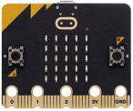              |       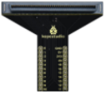       | 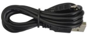 |
| :-----------------------------------------------: | :---------------------------------: | :---------------------: |
|                micro:bit Board *1                 | micro:bit T-Typ Erweiterungsboard *1 |   micro USB Kabel *1    |
|              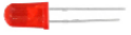              |      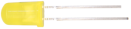       | 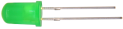 |
|                    rote LED *1                     |            gelbe LED *1              |      grüne LED *1       |
|                            |       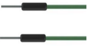       | 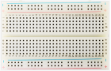 |
|                 220Ω Widerstand *3                  |             Jumper-Kabel             |      Steckbrett *1      |
|              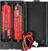              |              |                         |
| Batteriehalter *1 <br> (<span style="color: rgb(255, 76, 65);">selbst mitgebrachte AA Batterien *2</span>)|       Ampelkarte *1        |                         |

#### 3. Komponentenwissen

**Lautsprecher**

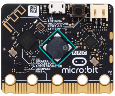

Der micro:bit verfügt über einen Lautsprecher, der es einfach macht, in deinem Projekt Töne zu erzeugen.

#### 4. Schaltplan

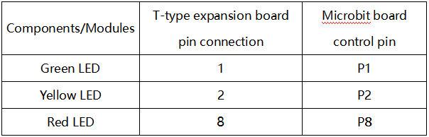

<span style="color: rgb(255, 76, 65);">**Hinweis:** Das micro:bit Board muss wie unten gezeigt in das T-Typ Erweiterungsboard eingesteckt werden. Die LED-Matrix des micro:bit Boards sollte auf derselben Seite wie das Logo des Erweiterungsboards sein.</span>

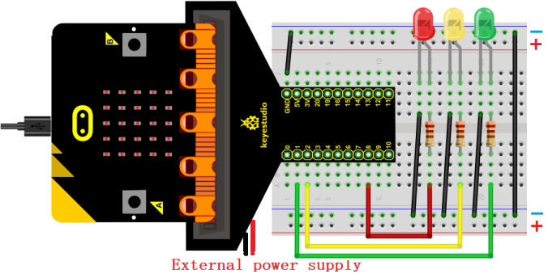

#### 5. Programmablauf


#### 6. Testcode

Die Code-Datei befindet sich im Ordner Projekt 02：Ampel, Datei Project-02-Traffic-Lights\.py.

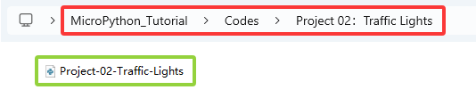

**Vollständiger Code:** 

```python
'''
Function: traffic lights with countdowns and buzzes
Compiling IDE: MU 1.2.0
Author: https://docs.keyestudio.com
'''
# import microbit related libraries
from microbit import *

pin1.write_digital(0) # set P1 pin to low
pin2.write_digital(0) # set P2 pin to low
pin8.write_digital(0) # set P8 pin to low

import music # import music libraries

while True:
   pin1.write_digital(1)  # P1 pin to high
   display.show('6')  # LED matrixs shows 6
   sleep(1000)        # delay 1s
   display.show('5')
   sleep(1000)
   display.show('4')
   sleep(1000)
   display.show('3')
   sleep(1000)
   display.show('2')
   sleep(1000)
   display.show('1')
   sleep(1000)
   display.show('0')
   sleep(1000)
   pin1.write_digital(0)
   pin2.write_digital(1)
   music.play("C4:4")    # speaker plays C4 tone
   display.show('2')
   sleep(500)
   pin2.write_digital(0)
   music.reset()         # no tone
   sleep(500)
   pin2.write_digital(1)
   music.play("C4:4")
   display.show('1')
   sleep(500)
   pin2.write_digital(0)
   music.reset()
   sleep(500)
   pin2.write_digital(1)
   music.play("C4:4")
   display.show('0')
   sleep(500)
   pin2.write_digital(0)
   music.reset()
   sleep(500)
   pin8.write_digital(1)
   display.show('6')
   sleep(1000)
   display.show('5')
   sleep(1000)
   display.show('4')
   sleep(1000)
   display.show('3')
   sleep(1000)
   display.show('2')
   sleep(1000)
   display.show('1')
   sleep(1000)
   display.show('0')
   sleep(1000)
   pin8.write_digital(0)
```

#### 7. Testergebnis

Klicke auf „<span style="color: rgb(255, 76, 65);">Flash</span>“, um den Code auf das micro:bit Board zu laden.

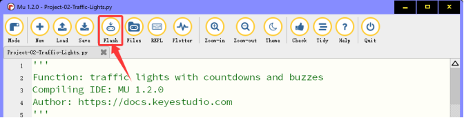

Nach dem Herunterladen des Codes auf das Board **mit dem micro USB Kabel oder einer externen Stromversorgung einschalten (DIP-Schalter auf ON stellen)** und die Reset-Taste auf dem Board drücken.


Die grüne LED leuchtet und die 5×5 LED-Matrix zählt 6 Sekunden herunter. Nachdem die grüne LED aus ist, blinkt die gelbe LED und die Matrix zählt 3 Sekunden herunter, während der Lautsprecher Töne abspielt. Zum Schluss leuchtet die rote LED mit einem Countdown von 6 Sekunden. Diese Abläufe wiederholen sich.

<span style="color: rgb(255, 76, 65);">**ACHTUNG:** Wenn die Verkabelung korrekt ist, aber keine Ergebnisse sichtbar sind, drücke die Reset-Taste auf der Rückseite des Boards.</span>


<span style="color: rgb(255, 76, 65);">**Beim Einschalten über externe Stromversorgung den DIP-Schalter auf ON stellen.**</span>


