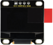
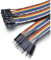
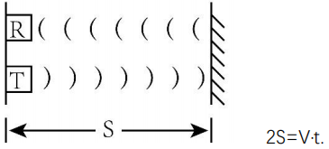
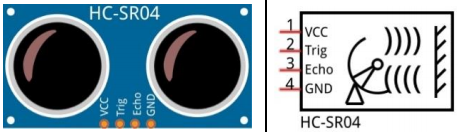
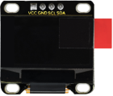
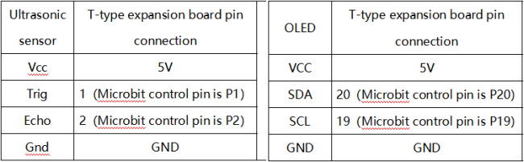
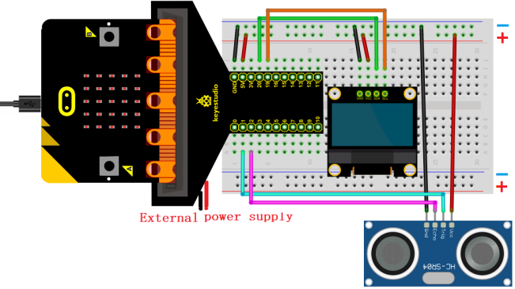
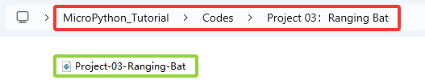
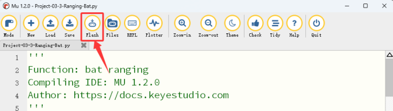

### Progetto 03: Pipistrello a Rilevamento Distanza

#### 1. Panoramica

Basato su un sensore ad ultrasuoni, il pipistrello a rilevamento distanza misura la distanza degli ostacoli e la visualizza in tempo reale su un OLED. Quando la distanza è inferiore a 10cm, l'altoparlante emette un allarme.

#### 2. Componenti

|  |              |                            |
| :---------------------: | :---------------------------------: | :-----------------------------------------------: |
|   scheda micro:bit *1   | scheda di espansione micro:bit tipo T *1 |                cavo micro USB *1                 |
|  |              |                            |
|  sensore ad ultrasuoni *1 |           modulo OLED *1            |                   fili DuPont                    |
|  |              |                            |
|      breadboard *1      |             fili jumper             | portabatterie *1 <br> (<span style="color: rgb(255, 76, 65);">batterie AA auto-fornite *2</span>)|
|  |              |                                                   |
|       scheda bat *1     |            scheda OLED *1            |                                                   |

#### 3. Conoscenza dei Componenti

**sensore ad ultrasuoni**

Le onde ultrasoniche rimbalzano quando incontrano un ostacolo. Misuriamo la distanza calcolando l'intervallo di tempo tra l'invio e la ricezione delle onde. Poiché la velocità di propagazione del suono nell'aria è costante v=340m/s, calcoliamo la distanza tra il sensore e l'ostacolo: s=vt/2.



Il modulo ad ultrasuoni HC-SR04 integra un trasmettitore e un ricevitore. Il primo converte segnali elettrici (energia elettrica) in onde sonore ad alta frequenza (oltre la percezione umana) (energia meccanica), mentre il secondo fa l'operazione inversa.

Lo schema del HC SR04:



**Definizione dei pin:**


**Parametri:**

- Tensione di funzionamento: 5V
- Corrente di funzionamento: 12mA
- Distanza minima di misura: 2cm
- Distanza massima di misura: 200cm

**Principio di funzionamento:**

Un impulso di livello alto della durata di almeno 10us viene inviato sul pin Trig, e il modulo inizia a trasmettere onde ultrasoniche. Allo stesso tempo, il pin Echo viene portato alto. Quando il modulo riceve un'onda ultrasonica di ritorno dopo aver incontrato un ostacolo, il pin Echo viene portato basso. La durata del livello alto del pin Echo è il tempo totale dell'onda dall'invio alla ricezione: s=vt/2.


**Modulo OLED**

La tecnologia OLED offre una ricca resa cromatica, alto contrasto e ampio angolo di visione, fornendo immagini chiare e vivide, particolarmente eccellenti nel nero.

Ogni pixel del display OLED emette luce propria senza retroilluminazione, quindi consuma relativamente poca energia. Con dimensioni ridotte, alta risoluzione e basso consumo, il display OLED da 0.9 pollici è molto adatto per dispositivi indossabili.



<span style="color: rgb(255, 76, 65);">**In questo progetto, il modulo display OLED collega l'interfaccia SDA al pin P20 e SCL al pin P19.**</span>

**Parametri:**

- Tensione di funzionamento: DC 3.3V-5V

- Corrente di funzionamento: 30mA

- Interfaccia: porte pin con passo di 2.54mm

- Modalità di comunicazione: I2C

- Chip driver interno: SSD1306

- Risoluzione: 128*64

- Angolo di visuale: maggiore di 150°

#### 4. Schema di Collegamento



<span style="color: rgb(255, 76, 65);">**Quando si utilizzano il display OLED e il sensore ad ultrasuoni, è necessario collegare un'alimentazione esterna e impostare l'interruttore DIP su ON.**</span>




#### 5. Importazione Libreria

Se non hai ancora aggiunto i file di libreria richiesti (oled_ssd1306), importali facendo riferimento a [Come Mu Importa la Libreria su Micro:bit](https://docs.keyestudio.com/projects/FKS0004/en/latest/docs/MicroPython_Tutorial/MicroPython_Tutorial.html#how-mu-import-library-to-micro-bit).

#### 6. Flusso del Codice


#### 7. Codice di Test

Il file di codice è fornito nella cartella Progetto 03：Pipistrello a Rilevamento Distanza, file Project-03-Ranging-Bat\.py.



**Codice completo:** <span style="color: rgb(255, 76, 65);">**La soglia nella condizione 10 può essere modificata in base alle condizioni reali.**</span>

```python
'''
Function: bat ranging
Compiling IDE: MU 1.2.0
Author: https://docs.keyestudio.com
'''
# import related libraries
from microbit import *
import ustruct
import machine
from time import sleep_us
import oled_ssd1306 as oled
import music

display.show(Image.HAPPY) # LED matrix displays a smile face
distance = 0              # set variable distance initial value to 0
lastEchoDuration = 0      # set variable lastEchoDuration initial value to 0

# initialize and clear oled
oled.initialize()
oled.clear_oled()

while True:
    # Ultrasonic sensor sends and receives signals
    pin1.write_digital(0)
    sleep_us(2)
    pin1.write_digital(1)
    sleep_us(15)
    pin1.write_digital(0)

    # measure the time interval between "when rising edge detected from the pin2" and "until the pin becomes low again"
    # unit is μs. Assign the interval to variable t.
    t = machine.time_pulse_us(pin2, 1, 35000)

    # a conditional statement, used to check whether the values of two variables t and lastechoduration satisfy specific conditions.
    # If both conditions are met, the block of code under the condition statement is executed.
    if (t <= 0 and lastEchoDuration >= 0):
        t = lastEchoDuration   # variable t = variable lastechoduration
    else:
        lastEchoDuration = t
    distance = int(t * 0.017)  # calculate distance
    oled.clear_oled()          # clear OLED
    oled.add_text(1, 0, str(distance) + 'cm')  # Display distance in the corresponding position of OLED
    sleep(200)
    if distance < 10:       # if distance < 10cm
        music.play("C4:4")  # speaker plays C4 tone
        sleep(200)          # delay 
        music.reset()       # no tone
        sleep(200)
```

#### 8. Risultato del Test

Clicca su “<span style="color: rgb(255, 76, 65);">Flash</span>” per caricare il codice sulla scheda micro:bit.



Dopo aver scaricato il codice sulla scheda, **accendi tramite cavo micro USB o alimentazione esterna (imposta l'interruttore DIP su ON)** e premi il pulsante di reset sulla scheda.


L'OLED visualizza in tempo reale la distanza tra il sensore ad ultrasuoni e l'ostacolo. Quando il valore della distanza è inferiore a 10cm, l'altoparlante sulla scheda micro:bit emette un allarme.

<span style="color: rgb(255, 76, 65);"><span style="color: rgb(255, 76, 65);">**ATTENZIONE:** Se il cablaggio è corretto ma non si vedono risultati, premi il pulsante di reset sul retro della scheda.</span></span>


