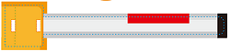
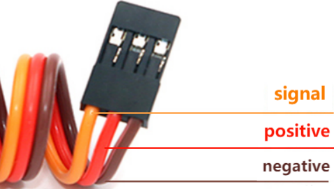
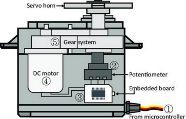
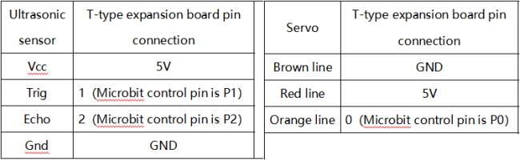
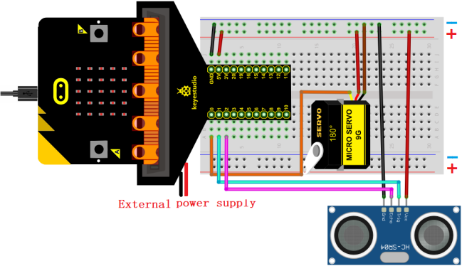
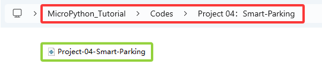
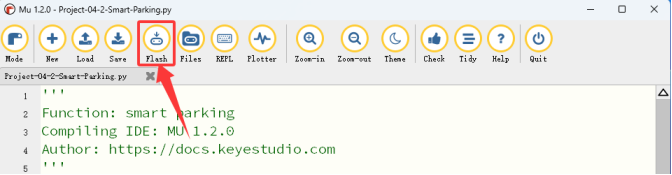

### Projet 04 : Parking Intelligent

#### 1. Aperçu

Les parkings intelligents sont partout. Pouvons-nous aussi créer un parking intelligent ? Bien sûr. Nous pouvons utiliser un capteur ultrasonique pour détecter s'il y a des véhicules devant. Lorsqu'un véhicule (ou un objet) est détecté en approche, nous contrôlons le servo pour lever la barre de levage ; s'il est détecté en train de s'éloigner, le servo abaissera la barre de levage.

#### 2. Composants

|  |              |                            |
| :---------------------: | :---------------------------------: | :-----------------------------------------------: |
|   micro:bit board *1    | micro:bit T-type expansion board *1 |                micro USB cable *1                 |
|  |              |                            |
|  ultrasonic sensor *1   |              servo *1               |                   DuPont wires                    |
|  |              |                            |
|      breadboard *1      |             jump wires              |battery holder *1 <br> (<span style="color: rgb(255, 76, 65);">piles AA auto-fournies *2</span>)|
|  |              |                                                   |
|       bat card *1       |          lift rod card *1           |                                                   |

#### 3. Connaissances sur les composants

**Servo**

Le servo est un actionneur de position. Nous pouvons utiliser le servo pour contrôler la position exacte ou fournir un couple élevé. Habituellement, il est utilisé dans les robots, les voitures télécommandées, et même les modèles d'avions. Il existe de nombreuses spécifications, mais tous les servos ont trois fils : signal (orange), positif (rouge) et négatif (marron). La couleur peut varier selon les marques de servo.



**Schéma de structure interne :**



① Signal : reçoit les signaux de contrôle du microcontrôleur ;

② potentiomètre : la position de l'arbre de sortie peut être mesurée, ce qui fait partie du retour d'information de l'ensemble du servo ;

③ Contrôleur interne : la carte embarquée traite les signaux de contrôle externes, pilote le moteur et les signaux de position de retour, c'est le cœur de l'ensemble du servo ;

④ Moteur DC : agit comme un actionneur pour fournir vitesse, couple, position ;

⑤ Transmission / mécanisme servo : le mécanisme amplifie la course de sortie du moteur à l'angle final de sortie selon un certain rapport de transmission.

**Piloter le servo**

Envoyer des signaux PWM à la ligne de signal du servo pour contrôler sa sortie. Le rapport cyclique du PWM détermine directement la position de l'arbre de sortie. La période est généralement de 20 millisecondes et est typiquement réglée pour générer des impulsions à une fréquence de 50Hz.

<span style="color: rgb(255, 0, 0);">Par exemple (servo 180°) :</span>

Lorsque nous envoyons une largeur d'impulsion de 1,5 millisecondes (ms) au servo 180°, l'arbre de sortie du servo se déplacera à la position médiane (90 degrés) ;

Si la largeur d'impulsion est de 0,5 ms, l'arbre de sortie se déplacera à 0 degré ;

Si la largeur d'impulsion est de 2,5 ms, l'arbre de sortie se déplacera à 180 degrés ;


**Paramètres :**

- Tension de fonctionnement : DC 3,3V~5V

- Température de fonctionnement : -10°C ~ +50°C

- Dimensions : 32,25 mm x 12,25 mm x 30,42 mm

- Interface : interface 3 broches avec un espacement de 2,54 mm

#### 4. Schéma de câblage



<span style="color: rgb(255, 76, 65);">**Lors de l'utilisation du capteur ultrasonique et du servo, nous devons connecter une alimentation externe et mettre l'interrupteur DIP sur ON.**</span>




#### 5. Flux du code


#### 6. Code de test

Le fichier de code est fourni dans le dossier Projet 04 : Smart-Parking, fichier Project-04-Smart-Parking\.py.



**Code complet :** <span style="color: rgb(255, 76, 65);">Le seuil dans la condition 10 peut être modifié selon les conditions réelles.</span>

```python
'''
Function: smart parking
Compiling IDE: MU 1.2.0
Author: https://docs.keyestudio.com
'''
# import related libraries
from microbit import *
import ustruct
import machine
from time import sleep_us

distance = 0              # set variable distance initial value to 0
lastEchoDuration = 0      # set variable lastEchoDuration initial value to 0

val = Image("09990:""09090:""09990:""09000:""09000")  # set iamge
display.show(val)        # LED matrix shows image
pin0.write_analog(25.6)    # set P0 pin analog to 25.6, servo angle to 0°
sleep(200)

while True:
    pin0.set_analog_period(20) # set servo frequency
    # Ultrasonic sensor sends and receives signals
    pin1.write_digital(0)
    sleep_us(2)
    pin1.write_digital(1)
    sleep_us(15)
    pin1.write_digital(0)

    # measure the time interval between "when rising edge detected from the pin2" and "until the pin becomes low again"
    # unit is μs. Assign the interval to variable t.
    t = machine.time_pulse_us(pin2, 1, 35000)

    # a conditional statement, used to check whether the values of two variables t and lastechoduration satisfy specific conditions.
    # If both conditions are met, the block of code under the condition statement is executed.
    if (t <= 0 and lastEchoDuration >= 0):
        t = lastEchoDuration   # variable t = variable lastechoduration
    else:
        lastEchoDuration = t
    distance = int(t * 0.017)  # calculate distance
    if distance < 10:          # if distance < 10cm
       pin0.write_analog(77)   # servo rotate to 90°
       sleep(2000)
    else:  # or
       sleep(2000)
       pin0.write_analog(25.6)
       sleep(2000)
```

#### 7. Résultat du test

Cliquez sur “<span style="color: rgb(255, 76, 65);">Flash</span>” pour charger le code sur la carte micro:bit.



Après avoir téléchargé le code sur la carte, **alimentez via le câble micro USB ou une alimentation externe (mettre l'interrupteur DIP sur ON)**, et appuyez sur le bouton reset de la carte.


Lorsque le capteur ultrasonique détecte un véhicule (ou un objet) en approche, le servo contrôle la barre de levage pour la lever ; si le capteur détecte qu'il s'éloigne, le servo abaissera la barre de levage.

<span style="color: rgb(255, 76, 65);">**ATTENTION :** Si le câblage est correct mais que vous ne voyez pas les résultats, appuyez sur le bouton reset à l'arrière de la carte.</span>


