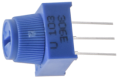
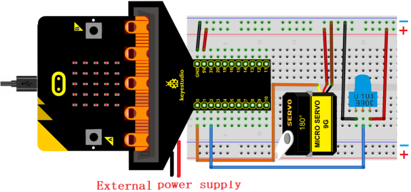
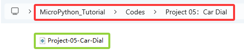
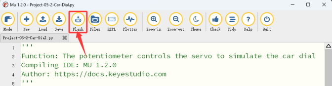

### Progetto 05: Quadrante Auto

#### 1. Panoramica

In questo progetto, combiniamo un potenziometro regolabile, un servo e una bella scheda quadrante per realizzare un semplice modello di quadrante per auto.

#### 2. Componenti

|   |                            |  |
| :----------------------: | :-----------------------------------------------: | :---------------------: |
|    scheda micro:bit *1    |        scheda di espansione micro:bit tipo T *1        |   cavo micro USB *1    |
|   |                            |  |
|     potenziometro *1     |                     servo *1                      |       cavi jumper        |
|   |                            |  |
|      breadboard *1       |portapile *1 <br> (<span style="color: rgb(255, 76, 65);">pile AA auto-fornite *2</span>)|  scheda quadrante potenziometro *1  |
|  |                                                   |                         |
|     scheda quadrante auto*1      |                                                   |                         |

#### 3. Conoscenza dei Componenti

**potenziometro**


Un potenziometro è anche un elemento resistivo con tre contatti, il cui valore di resistenza può essere regolato secondo una certa regolarità.

Esistono in tutte le forme, dimensioni e valori, ma hanno tutti in comune:

① Tre terminali (o punti di connessione).

② Una manopola o cursore mobile che può cambiare la resistenza tra il terminale intermedio e uno qualsiasi dei terminali esterni.

③ Quando la manopola viene spostata, la resistenza tra il terminale intermedio e uno qualsiasi dei terminali esterni varia da 0Ω al suo massimo.

Il simbolo circuitale del potenziometro:


(1)\. Come partitore di tensione

Il potenziometro è una resistenza regolabile continuamente. Quando ruoti il suo cursore, il contatto mobile scivola lungo la resistenza. A questo punto, può essere fornita una tensione in uscita in base alla tensione applicata al potenziometro e all'angolo o alla corsa di rotazione del cursore mobile.

(2)\. Come resistore variabile

Quando il potenziometro è usato come resistore variabile, collega il suo terminale intermedio a uno dei due terminali aggiuntivi nel circuito. In questo modo, puoi ottenere un valore di resistenza stabile e variabile continuamente all'interno del suo intervallo.

(3)\. Come controllore di corrente

Quando è usato come controllore di corrente, il contatto mobile deve essere collegato come uno dei terminali di uscita.

#### 4. Schema di Collegamento


<span style="color: rgb(255, 76, 65);">**Quando si usa il servo, dobbiamo collegare un'alimentazione esterna e impostare l'interruttore DIP su ON.**</span>




#### 5. Flusso del Codice


#### 6. Codice di Test

Il file del codice è fornito nella cartella Progetto 05：Quadrante Auto, file Project-05-Car-Dial\.py.



**Codice completo:**

```python
'''
Function: The potentiometer controls the servo to simulate the car dial
Compiling IDE: MU 1.2.0
Author: https://docs.keyestudio.com
'''
# import microbit related libraries
from microbit import *

display.show(Image.HAPPY)  # LED matrix displays a smile face
pin0.write_analog(25.6)    # set P0 pin analog to 25.6, servo initial angle to 0°
sleep(200)

# map function
def map(value,fromLow,fromHigh,toLow,toHigh):
    return (toHigh-toLow)*(value-fromLow) / (fromHigh-fromLow) + toLow

while True:
    value=pin2.read_analog()    # Read the analog value of the potentiometer (ADC value)
    pin0.set_analog_period(20)  # set servo frequency
    pin0.write_analog(map(value,0,1023,25.6,128))  # Map the analog value of the potentiometer to that of the servo
    sleep(20)
```

#### 7. Risultato del Test

Clicca “<span style="color: rgb(255, 76, 65);">Flash</span>” per caricare il codice sulla scheda micro:bit.



Dopo aver scaricato il codice sulla scheda, **accendi tramite cavo micro USB o alimentazione esterna (imposta l'interruttore DIP su ON)**, e premi il pulsante di reset sulla scheda.


Ruota la manopola sul potenziometro e il servo muove la lancetta sul quadrante.

<span style="color: rgb(255, 76, 65);">**ATTENZIONE:** Se il cablaggio è corretto ma non vedi i risultati, premi il pulsante di reset sul retro della scheda.</span>


