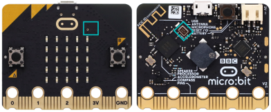
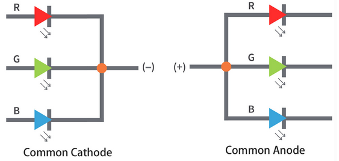
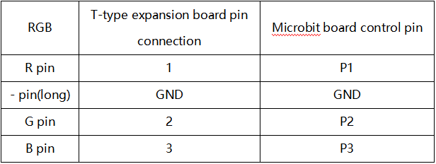
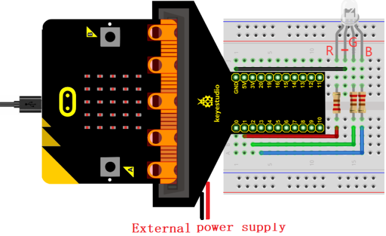
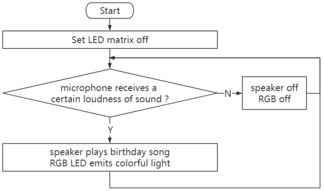
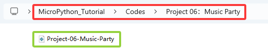
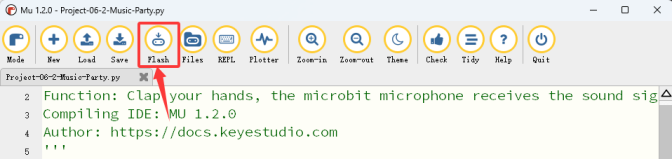

### Projekt 06: Musikparty



#### 1. Übersicht

Wenn wir in die Hände klatschen, nimmt das Mikrofon auf dem Board Tonsignale auf, und der Lautsprecher spielt ein fröhliches Geburtstagslied, während die RGB-LED blendendes Licht aussendet.

#### 2. Komponenten

|  |                            |  |
| :---------------------: | :-----------------------------------------------: | :---------------------: |
|   micro:bit Board *1    |        micro:bit T-Typ Erweiterungsboard *1       |   micro USB Kabel *1    |
|  |                            |  |
|       rote LED *1       |                 220Ω Widerstand *3                 |      Steckdraht *2      |
|  |                            |  |
|      Steckbrett *1      |Batteriehalter *1 <br> (<span style="color: rgb(255, 76, 65);">selbst mitgebrachte AA Batterien *2</span>)|       RGB Karte *1      |

#### 3. Komponentenwissen

**Mikrofon**

Ein hochwertiges digitales Mikrofon ist auf der Vorderseite des micro:bit V2 Boards integriert, um Ton- und Audiosignale zu erfassen. Der Chip, der das Mikrofon steuert und verarbeitet, befindet sich auf der Rückseite.


Das Mikrofon befindet sich in einem kleinen runden Loch auf der Vorderseite des Boards, was das Erfassen von Umgebungsgeräuschen erleichtert. Legen Sie das micro:bit Board beim Gebrauch einfach mit der Vorderseite nach oben. Neben dem Loch befindet sich eine Mikrofon-LED-Anzeige. Wenn das micro:bit den Geräuschpegel misst, leuchtet die Anzeige auf.


**RGB LED**


Die RGB LED basiert auf der Mischung der drei Grundfarben (RGB): Rot, Grün und Blau. Die meisten Farben können durch unterschiedliche Anteile von RGB erzeugt werden. Die roten, grünen und blauen LEDs sind in einem transparenten Kunststoffgehäuse verpackt, um durch Änderung der Eingangsspannung an den R-, G- und B-Pins Lichtfarben auszusenden.


**Dreifarbentheorie:**


RGB LEDs können in zwei Typen unterteilt werden: gemeinsamer Anode und gemeinsamer Kathode:

Bei einer RGB LED mit gemeinsamer Kathode teilen sich die drei LEDs einen negativen Anschluss (Kathode);

Bei einer RGB LED mit gemeinsamer Anode teilen sich die drei LEDs einen positiven Anschluss (Anode).



<span style="color: rgb(255, 76, 65);">**Hinweis: Hier verwenden wir eine RGB LED mit gemeinsamer Kathode.**</span>

**RGB LED Pins:**

Die RGB LED verfügt über 4 Pins: GND (der längste), R (rot), G (grün) und B (blau). Platzieren Sie die RGB LED wie unten gezeigt, die Pins von links nach rechts sind rot, GND, grün und blau.


#### 4. Schaltplan





#### 5. Programmablauf



#### 6. Testcode

Die Code-Datei befindet sich im Ordner Projekt 06：Musikparty, Datei Project-06-Music-Party\.py.



**Vollständiger Code:**

```python
'''
Function: Clap your hands, the microbit microphone receives the sound signal, the music sounds, and the RGB emits a dazzling light to simulate a musical party
Compiling IDE: MU 1.2.0
Author: https://docs.keyestudio.com
'''
# import related libraries
from microbit import *
import music

display.clear() # clear LED matrix

while True:
    if microphone.current_event() == SoundEvent.LOUD:  # If the microphone picks up a loud signal
       music.play(["G3:4", "G3", "A4"]) # the speaker plays some tones
       pin1.write_analog(1023)      # P1 analog value is 1023,RGB is red
       pin2.write_analog(0)
       # pin3.write_analog(0)
       sleep(100)
       music.play(["G4:4", "C5", "B4"])
       pin1.write_analog(0)         # P1 analog value is 0,RGB is not red
       pin2.write_analog(1023)      # P2 analog value is 1023,RGB is green
       # pin3.write_analog(0)
       sleep(100)
       pin1.write_analog(10)
       pin2.write_analog(10)
       # pin3.write_analog(1023)      # P3 analog value is 1023,RGB is blue
       sleep(100)
       music.play(["G4:4", "D5", "C5"])
       pin1.write_analog(123)
       pin2.write_analog(123)
       # pin3.write_analog(0)
       sleep(100)
       music.play(["G4:4", "D5", "C5"])
       pin1.write_analog(1023)
       pin2.write_analog(400)
       # pin3.write_analog(1023)
       sleep(100)
       music.play(["G3:4", "G3", "G4"])
       pin1.write_analog(10)
       pin2.write_analog(1023)
       # pin3.write_analog(1023)
       sleep(100)
       pin1.write_analog(1023)
       pin2.write_analog(1023)
       # pin3.write_analog(1023)
       sleep(100)
       music.play(["E5:4", "C5", "B4", "A4"])
       pin1.write_analog(32)
       pin2.write_analog(184)
       # pin3.write_analog(336)
       sleep(100)
       pin1.write_analog(640)
       pin2.write_analog(328)
       # pin3.write_analog(180)
       sleep(100)
       music.play(["F5:4", "F5", "E5"])
       pin1.write_analog(552)
       pin2.write_analog(172)
       # pin3.write_analog(904)
       sleep(100)
       pin1.write_analog(1020)
       pin2.write_analog(796)
       # pin3.write_analog(560)
       sleep(100)
       music.play(["C5:4", "D5", "C5"])
       pin1.write_analog(136)
       pin2.write_analog(560)
       # pin3.write_analog(140)
       sleep(100)
       pin1.write_analog(0)
       pin2.write_analog(0)
       # pin3.write_analog(0)
       sleep(100)
if microphone.current_event() == SoundEvent.QUIET:  # If the microphone picks up a quie signal
       pin1.write_analog(0)
       pin2.write_analog(0)
```

#### 7. Testergebnis

Klicken Sie auf „<span style="color: rgb(255, 76, 65);">Flash</span>“, um den Code auf das micro:bit Board zu laden.



Nachdem Sie den Code auf das Board heruntergeladen haben, **schalten Sie die Stromversorgung über das micro USB Kabel oder eine externe Stromquelle ein (stellen Sie den DIP-Schalter auf ON)** und drücken Sie die Reset-Taste auf dem Board.


Wenn wir in die Hände klatschen, nimmt das Mikrofon auf dem Board Tonsignale auf, und der Lautsprecher spielt ein fröhliches Geburtstagslied, während die RGB LED blendendes Licht aussendet. Ist die Musikparty nicht in einer fröhlichen und glücklichen Atmosphäre?

<span style="color: rgb(255, 76, 65);">**ACHTUNG:** Wenn die Verkabelung korrekt ist, Sie aber keine Ergebnisse sehen, drücken Sie die Reset-Taste auf der Rückseite des Boards.</span>


