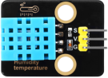
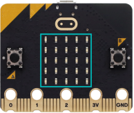
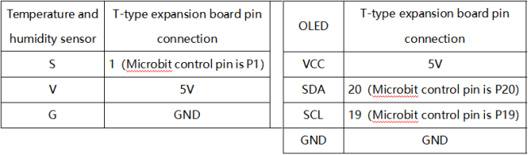
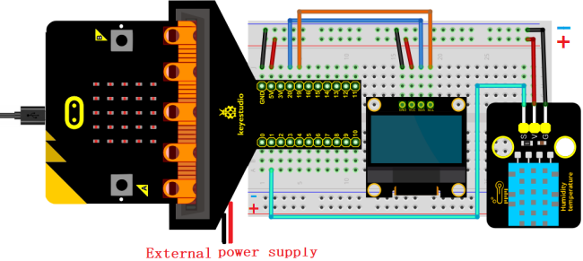
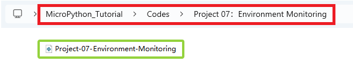
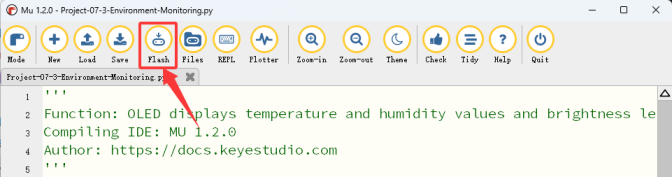

### Progetto 07: Monitoraggio Ambientale

#### 1. Panoramica

Sull'OLED, il sistema intelligente di monitoraggio ambientale visualizza in tempo reale i valori di temperatura e umidità rilevati dal sensore DHT11, oltre al valore del livello di luminosità della luce ambientale rilevato dal sensore di luce integrato.

#### 2. Componenti

|                   |              |                            |
| :--------------------------------------: | :---------------------------------: | :-----------------------------------------------: |
|            scheda micro:bit *1            | scheda di espansione micro:bit tipo T *1 |                cavo micro USB *1                 |
|                  |              |                            |
| sensore di temperatura e umidità XHT11 *1 |           modulo OLED *1            |                   fili DuPont                    |
|                   |              |                            |
|              breadboard *1               |             fili jumper              |portabatterie *1 <br> (<span style="color: rgb(255, 76, 65);">batterie AA auto-fornite *2</span>)|
|                  |              |                                                   |
|              scheda cloud *1               |            scheda OLED *1             |                                                   |

#### 3. Conoscenza dei Componenti

**Sensore di temperatura e umidità XHT11**


Il sensore di temperatura e umidità XHT11 è un sensore composito con uscita digitale calibrata, in grado di rilevare l'umidità e la temperatura nell'aria.

**Precisione**: umidità ±5%RH, temperatura ±2℃

**Intervallo di rilevamento**: umidità 5%RH ~ 95%RH, temperatura -25℃ ~ +60℃

Il sensore utilizza un modulo digitale speciale per l'acquisizione e la tecnologia di rilevamento di temperatura e umidità per garantire un'affidabilità estremamente elevata e un'eccellente stabilità a lungo termine. Include un elemento resistivo per il rilevamento dell'umidità e un elemento NTC per il rilevamento della temperatura, risultando molto adatto per misurazioni con requisiti di precisione relativamente bassi e in tempo reale.

**Modalità di comunicazione XHT11:**

Viene adottata la comunicazione a bus singolo. Ciò significa che esiste una sola linea dati per lo scambio di dati e il controllo nel sistema.

- Definizione dei bit dati trasmessi dal bus singolo:

Formato dati bus singolo: vengono trasmessi 40 bit di dati alla volta, con il bit alto per primo.

8 bit interi umidità + 8 bit decimali umidità + 8 bit interi temperatura + 8 bit decimali temperatura + 8 bit di parità (la parte decimale dell'umidità è 0)

- Definizione del bit di parità:

8 bit interi umidità + 8 bit decimali umidità + 8 bit interi temperatura + 8 bit decimali temperatura. 8 bit di parità = gli ultimi 8 bit del risultato ottenuto

- Cronologia dei dati:

Dopo che l'host utente (MCU) invia un segnale di avvio, l'XHT11 passa dalla modalità a basso consumo alla modalità ad alta velocità. Dopo il segnale di avvio, l'XHT11 invia un segnale di risposta e 40 bit di dati, e attiva un'acquisizione del segnale.

- La trasmissione del segnale è mostrata nella figura:


 **Parametri**

- Tensione di funzionamento: DC 3.3V a 5V

- Corrente di funzionamento: 2.1mA

- Potenza massima: 0.0105W

- Intervallo di temperatura: -25℃ ~ +60℃ (± 2℃)

- Intervallo di umidità: 5%RH ~ 95%RH (precisione ±5%RH intorno a 25 °C)

**Sensore di luce Microbit**



Un sensore di luce è un dispositivo di input che misura la luminosità della luce esterna. La scheda micro:bit non include un sensore di luce integrato. Rileva e misura la luminosità ambientale tramite una matrice LED che converte ripetutamente l'intensità luminosa in un valore di input, quindi viene campionato il tempo di attenuazione della tensione. In questo modo, <span style="color: rgb(255, 76, 65);">il livello di luminosità rilevato è un valore relativo</span>.

#### 4. Schema di Collegamento



<span style="color: rgb(255, 76, 65);">**Quando si utilizza il display OLED, è necessario collegare un'alimentazione esterna e impostare l'interruttore DIP su ON.**</span>




#### 5. Importazione Libreria

Se non hai ancora aggiunto i file di libreria richiesti (DHT11 e oled_ssd1306), importali facendo riferimento a [Come Mu Importa Libreria su Micro:bit](https://docs.keyestudio.com/projects/FKS0004/en/latest/docs/MicroPython_Tutorial/MicroPython_Tutorial.html#how-mu-import-library-to-micro-bit).

#### 6. Flusso del Codice


#### 7. Codice di Test

Il file di codice è fornito nella cartella Project 07：Environment Monitoring中找文件Project-07-Environment-Monitoring\.py.



**Codice completo:**

```python
'''
Function: OLED displays temperature and humidity values and brightness level values in real time to simulate intelligent environment detection
Compiling IDE: MU 1.2.0
Author: https://docs.keyestudio.com
'''
# import related libraries
import oled_ssd1306 as oled
from microbit import *
from DHT11 import *

val = Image("90900:""09090:""90009:""90009:""99999")  # Set pattern
display.show(val)   # LED matrix displays the set pattern

#initialize and clear oled
oled.initialize()
oled.clear_oled()

sensor = DHT11(pin1)  # set temperature and humidity pins

while True:
    oled.clear_oled() # clear oled
    sensor.read()     # read the temperature and humidity values
    T = sensor.temp   # store the temperature values in T
    H = sensor.humid  # store the humidity values in H
    L = display.read_light_level()  # read the brightness level value of the light and store it in L
    oled.add_text(1, 0, 'T:' + str(T) + 'C')   # Display the temperature value at the corresponding position of the OLED
    oled.add_text(1, 1, 'H:' + str(H) + '%')   # Display the humidity value at the corresponding position of the OLED
    oled.add_text(1, 2, 'L:' + str(L))         # Display the brightness level value at the corresponding position of the OLED
    sleep(2000)
```

#### 8. Risultato del Test

Clicca su “<span style="color: rgb(255, 76, 65);">Flash</span>” per caricare il codice sulla scheda micro:bit.



Dopo aver scaricato il codice sulla scheda, **accendi tramite cavo micro USB o alimentazione esterna (imposta l'interruttore DIP su ON)**, e premi il pulsante di reset sulla scheda.


L'OLED visualizza in tempo reale i valori di temperatura e umidità e il livello di luminosità della luce.

<span style="color: rgb(255, 76, 65);">**ATTENZIONE:** Se il cablaggio è corretto ma non vedi i risultati, premi il pulsante di reset sul retro della scheda.</span>


