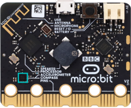
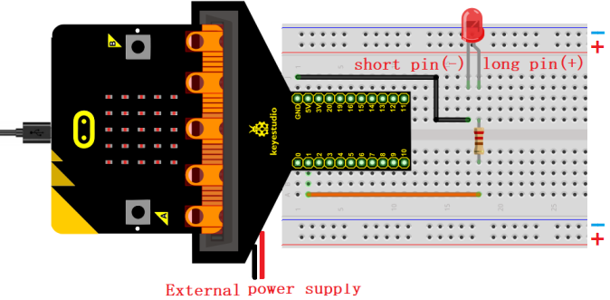
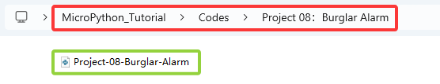
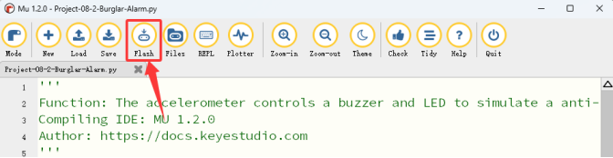
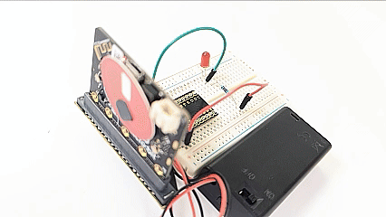

### Progetto 08: Allarme Antifurto

#### 1. Panoramica

Quando l'allarme antifurto intelligente rileva che la scatola antifurto è stata spostata, l'altoparlante sulla scheda micro:bit emetterà un allarme e il LED rosso lampeggierà.

#### 2. Componenti

|  |                            |  |
| :---------------------: | :-----------------------------------------------: | :---------------------: |
|   scheda micro:bit *1   |        scheda di espansione micro:bit tipo T *1   |   cavo micro USB *1     |
|  |                            |  |
|       LED rosso *1      |                 resistore 220Ω *1                  |      filo jumper *2     |
|  |                            |  |
|      breadboard *1      |portabatterie *1 <br> (<span style="color: rgb(255, 76, 65);">batterie AA auto-fornite *2</span>)|      scheda allarme *1  |

#### 3. Conoscenza dei Componenti

**Accelerometro**



La scheda micro:bit dispone di un sensore di accelerazione integrato LSM303AGR (chiamato accelerometro) che include modalità standard, veloce, plus e ad alta velocità (100 kHz, 400 kHz, 1 MHz e 3,4 MHz) per l'interfaccia bus seriale I2C e interfaccia standard seriale SPI per comunicazione esterna, con risoluzione di 8/10/12 bit e intervallo di ±2g, ±4g o ±8g.

Quando la scheda micro:bit è a riposo o in moto uniforme, l'accelerometro rileva solo l'accelerazione di gravità. Se viene leggermente oscillata, l'accelerazione rilevata è molto inferiore a quella della gravità, quindi la differenza può essere ignorata. Pertanto, rileviamo principalmente il cambiamento dell'accelerazione gravitazionale sugli assi x, y e z.

#### 4. Schema di Collegamento



<span style="color: rgb(255, 76, 65);">Il pin di controllo della scheda per il LED è P1 (il pin della scheda di espansione tipo T è digitale 1).</span>

#### 5. Flusso del Codice


#### 6. Codice di Test

Il file di codice è fornito nella cartella Progetto 08：Allarme Antifurto, file Project-08-Burglar-Alarm\.py.



**Codice completo:** 

<span style="color: rgb(255, 76, 65);">**Dopo aver importato il codice, se il buzzer suona continuamente anche se la breadboard non viene spostata; potrebbe essere causato da fattori geografici. Puoi modificare la soglia nelle condizioni -60 e 50 in base alle condizioni reali.**</span>

```python
'''
Function: The accelerometer controls a buzzer and LED to simulate a anti-theft alarm
Compiling IDE: MU 1.2.0
Author: https://docs.keyestudio.com
'''
# import related libraries
from microbit import *
import music

display.show(Image.HAPPY) # LED matrix displays a smile face

while True:
    if accelerometer.get_x()<-60 or accelerometer.get_x()>50: # If the value of the accelerometer in the X direction is less than -60 or greater than 50
       music.play("C4:4")      # speaker plays C4 tone
       pin1.write_digital(1)   # P1 pin value is high, LED on
       sleep(200)
       pin1.write_digital(0)   # P1 pin value is low, LED off
       sleep(200)
       display.show(Image.NO)  # LED matrix shows X
    else:  # or
        display.show(Image.HAPPY) # LED matrix displays a smile face
        pin1.write_digital(0)
        music.reset()             # no tone
```

#### 7. Risultato del Test

Clicca “<span style="color: rgb(255, 76, 65);">Flash</span>” per caricare il codice sulla scheda micro:bit.



Dopo aver scaricato il codice sulla scheda, **accendi tramite cavo micro USB o alimentazione esterna (imposta l'interruttore DIP su ON)**, e premi il pulsante di reset sulla scheda.


Dopo aver scaricato il codice sulla scheda, muovi la breadboard. Se il valore di accelerazione x＜-60 o x＞50, l'altoparlante sulla scheda emette l'allarme e il LED lampeggia, e la matrice LED del micro:bit mostra . Altrimenti, l'altoparlante non emette suono e il LED è spento, e la matrice LED del micro:bit mostra .

<span style="color: rgb(255, 76, 65);">**ATTENZIONE:** Se il cablaggio è corretto ma non vedi i risultati, premi il pulsante di reset sul retro della scheda.</span>


