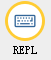

## 4. Troubleshooting

**Errors for Uploading Codes**

- If messy icons are displayed on the matrix of the board after uploading code, check if any characters have been accidentally added or deleted. You may click “check”. But note that some are not errors, just warnings.

- If the code is with a library, check whether the library is uploaded to the board. See “**How Mu Import Library to Micro:bit**”. And then check if any characters have been accidentally added or deleted.

**No Printings on REPL**

- After uploading code, click “REPL”  and it prints nothing. In this case, we need to press the reset button on the back of micro:bit board. 

