**After-sales Service**

Als er iets ontbreekt of kapot is, of als u moeite heeft met het leren van de kit, neem dan gerust contact met ons op. U bent welkom om een e-mail te sturen naar: service@keyestudio.com

We zullen ons best doen om projecten en producten continu bij te werken op basis van uw oprechte advies! Dank u!

# Productintroductie

**FKS0004 Keyestudio microbit leerset**

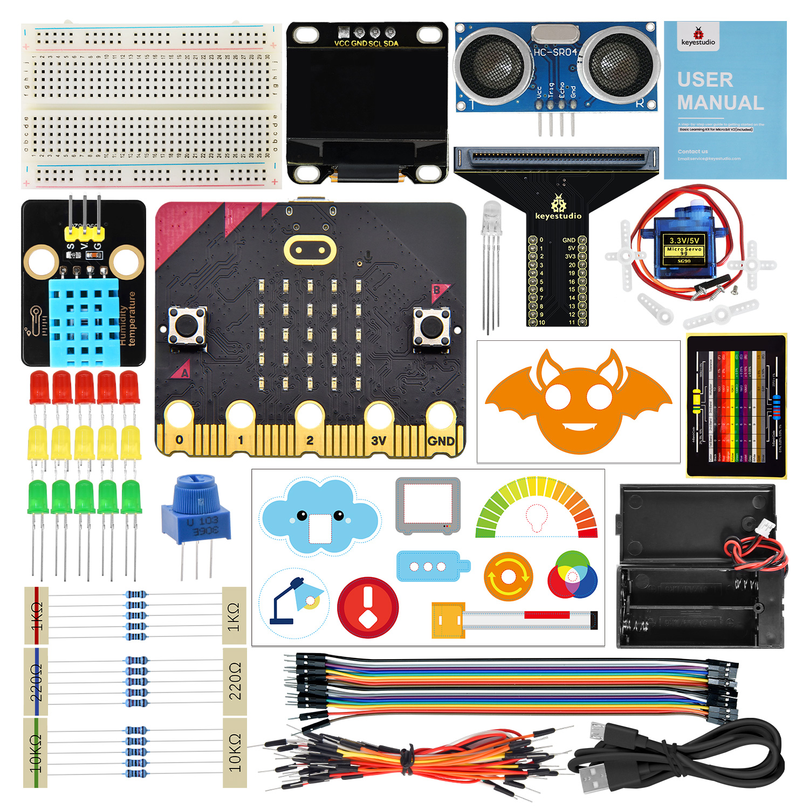

Deze leerset bevat sensoren en componenten evenals een Micro:bit board, en de bijgevoegde animatiekaart maakt experimenten verfijnder en mooier. Het stelt makers niet alleen in staat om de charme en bruikbaarheid van technologie te ervaren, maar ontwikkelt ook hun logisch denken.

Tegelijkertijd toont het volledig de praktische waarde en educatieve betekenis van de toepassing van wetenschap en technologie.

# Bronnen verkrijgen (**Belangrijk**) 

**Download (Belangrijk)**：[MakeCode_Tutorial](./MakeCode_Tutorial.7z) .

**Speciale herinnering:** Na het downloaden van het MakeCode_Tutorial-bestand, pak het uit. De map bevat codes, USB-driver, enz.

**Download (Belangrijk)**：[MicroPython_Tutorial](./MicroPython_Tutorial.7z) .

**Speciale herinnering:** Na het downloaden van het MicroPython_Tutorial-bestand, pak het uit. De map bevat codes, bibliotheek, USB-driver, enz.

# Product Kit Lijst

Controleer de lijst om te verzekeren dat alle onderdelen compleet zijn. Als u iets mist, neem dan onmiddellijk contact op met onze verkoopmedewerkers.

|  #   |           PIC            |                             NAAM                             | AANT  |
| :--: | :----------------------: | :----------------------------------------------------------: | :---: |
|  1   | 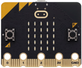  |                  micro:bit V2.0 hoofdboard                   |  1    |
|  2   | 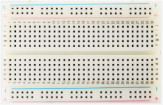  |                          breadboard                          |  1    |
|  3   | 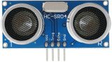  |                      ultrasone sensor                        |  1    |
|  4   | 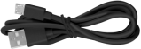  |                       Micro USB-kabel                        |  1    |
|  5   | 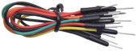  |                          jump wire                           |  1    |
|  6   |   |                            servo                             |  1    |
|  7   | 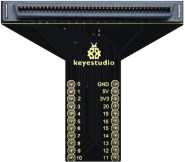  |               micro:bit T-type uitbreidingsboard            |  1    |
|  8   | 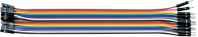  |                         DuPont draad                         |  1    |
|  9   | 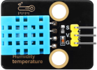  | XHT11 (compatibel met DHT11)                                 |  1    |
|  10  |   |                         OLED module                          |  1    |
|  11  | 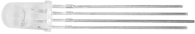  |                           RGB LED                            |  1    |
|  12  |   |                        potentiometer                         |  1    |
|  13  | 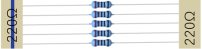  |                        220Ω weerstand                        |  5    |
|  14  | 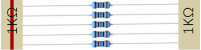  |                         1kΩ weerstand                        |  5    |
|  15  | 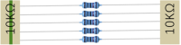  |                        10kΩ weerstand                        |  5    |
|  16  | 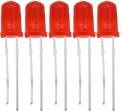  |                           rode LED                           |  5    |
|  17  | 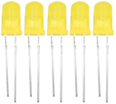  |                          gele LED                            |  5    |
|  18  | 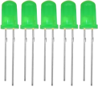  |                          groene LED                          |  5    |
|  12  | 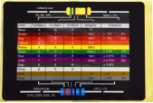  |                       weerstand kaart                        |  1    |
|  12  | 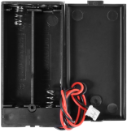  |                        batterijhouder                        |  1    |
|  13  | 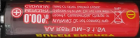  | AA batterij (zelf mee te brengen) |  2    |
|  14  | 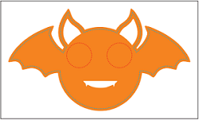 |                             kaart                            |  1    |
|  15  | 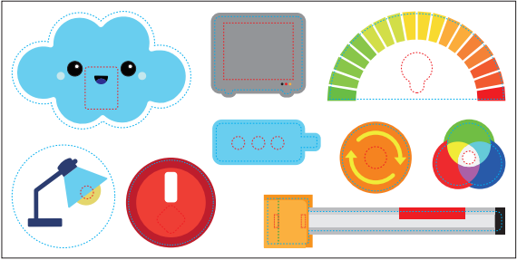 |                             kaart                            |  1    |

# T-type uitbreidingsboard

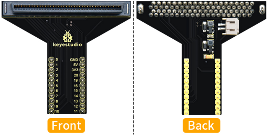

## 1. Introductie

In de educatieve markt worden micro:bit boards steeds populairder. Het is echter niet eenvoudig om een enkele micro:bit board te testen met andere sensormodules. Daarom hebben we speciaal dit micro:bit T-type uitbreidingsboard ontworpen.

Het micro:bit T-type uitbreidingsboard splitst alle IO-poorten op het board in pinnen met een afstand van 2,54mm (GND, 5V, 3V3, Signaal), wat zeer handig is om te verbinden met andere sensormodules en elektronische componenten.

Daarnaast kunt u het micro:bit board voeden via de witte DC-poort (DC 3V) of micro USB-interface (DC 5V) op het uitbreidingsboard.

Het uitbreidingsboard kan de spanning verhogen of omzetten. Als het wordt gevoed door een externe voeding van 3V, kan het 3,3V en 5V spanningen leveren.

## 2. Kenmerken

- Ingangsspanning: witte DC-poort (DC 3V) of micro USB-interface (DC 5V)

- Uitgangsspanning: 3,3V of 5V

- De IO-poorten van micro:bit zijn verdeeld in pinnen met een afstand van 2,54mm

- Afmetingen: 64mm x 56mm x 18mm

- Gewicht: 13,1g

## 3. Pin-out

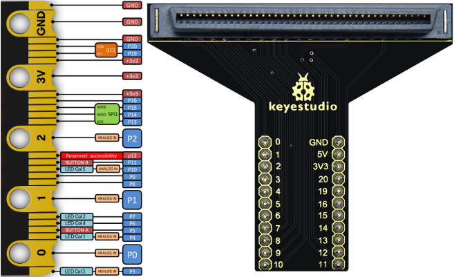

# Over Micro:bit

## 1. Wat is Micro:bit

Gelanceerd door de British Broadcasting Corporation (BBC), is micro:bit een microcomputer ontwikkelboard ontworpen voor programmeeronderwijs voor tieners.

Hoewel het slechts de grootte van een creditcard heeft, integreert het board veel componenten, waaronder een 5x5 LED-matrix, 2 programmeerbare knoppen, een versnellingsmeter, een kompas, een thermometer, een aanraakgevoelig logo en een MEMS-microfoon, een energiezuinige Bluetooth-module en een buzzer. Deze ingebouwde buzzer speelt allerlei geluiden zonder externe apparatuur. Bovendien verlaagt de slaapstand het stroomverbruik van batterijen wanneer de Reset&Power-knop lang wordt ingedrukt.

### 1.1. Micro:bit V2 Board Layout

### 1.2. Micro:bit V2 Pin-out

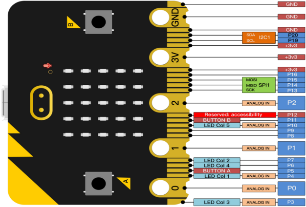

Micro:bit pinfuncties:

| functie             | pinnen                                                       |
| :------------------ | :----------------------------------------------------------- |
| GPIO                | P0，P1，P2，P3，P4，P5，P6，P7，P8，P9，P10，P11，P12，P13，P14，P15，P16，P19，P20 |
| ADC/DAC             | P0，P1，P2，P3，P4，P10                                      |
| IIC                 | P19（SCL），P20（SDA）                                       |
| SPI                 | P13（SCK），P14（MISO），P15（MOSI）                         |
| PWM (veelgebruikt)  | P0，P1，P2，P3，P4，P10                                      |
| bezet               | P5(Button A)，P6(LED Kol4)，P7(LED Kol2)，P10(LED Kol5)，P11(Button B) |

Voor meer informatie bezoek de officiële website:

- [https://tech.microbit.org/hardware/edgeconnector/](https://tech.microbit.org/hardware/edgeconnector/)

- [https://microbit.org/guide/hardware/pins/](https://microbit.org/guide/hardware/pins/)

### 1.3. Aandachtspunten voor het gebruik van Micro:bit V2

1. Het wordt aanbevolen om het te bedekken met een siliconen beschermhoes om kortsluiting te voorkomen, omdat het veel geavanceerde elektronische componenten bevat.

2. De IO-poort is zwak in het aansturen omdat het slechts een stroom van minder dan 300mA kan verwerken. Verbind het daarom niet met apparaten die grote stroom gebruiken, zoals servo MG995 en DC-motor, anders kan het verbranden. Verder moet u de stroomvereisten van de apparaten kennen voordat u ze gebruikt en wordt het over het algemeen aanbevolen om het board samen met een Micro:bit shield te gebruiken.

3. Het wordt aanbevolen om het hoofdboard via de USB-interface of via een 3V batterij van stroom te voorzien. De IO-poort van dit board is 3V3, dus het ondersteunt geen sensoren van 5V. Als u 5V nodig heeft, is het uitbreidingsboard vereist om op een externe voeding aan te sluiten.

4. Bij gebruik van pinnen (P3, P4, P6, P7 en P10) die gedeeld worden met de LED-dotmatrix, blokkeer ze dan van de matrix. Anders kan de LED willekeurig weergeven en kunnen de gegevens van aangesloten sensoren onjuist zijn.

5. **Pin 19 en 20 kunnen niet als IO-poorten worden gebruikt** hoewel Makecode laat zien dat ze dat kunnen. Ze kunnen alleen worden gebruikt voor I2C-communicatie.

6. De batterijpoort van 3V mag niet worden verbonden met batterijen van meer dan 3,3V, anders raakt het board beschadigd.

7. Het is verboden om het op metalen producten te gebruiken om kortsluiting te voorkomen.

Kort gezegd, micro:bit is als een microcomputer die programmeren binnen handbereik heeft gebracht en digitale innovatie heeft versterkt.

## 2. Micro:bit Driver

Micro:bit vereist geen driverinstallatie. Echter, als uw computer het hoofdboard niet herkent, moet u de driver installeren.

**Instructies voor driverinstallatie:**

Verbind het micro:bit hoofdboard met de computer via een USB-kabel.

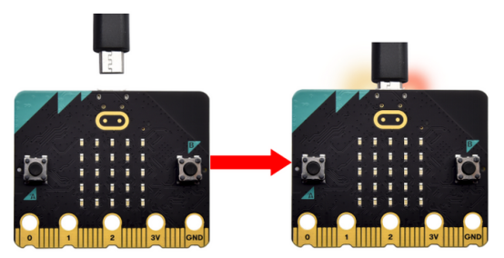

In zowel de MicroPython_Tutorial map als de MicroPython_Tutorial map bieden we driverbestanden aan. Kies er een. Klik op het driverbestand om te “**Installeren**”.

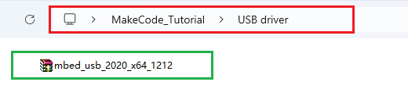

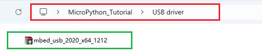

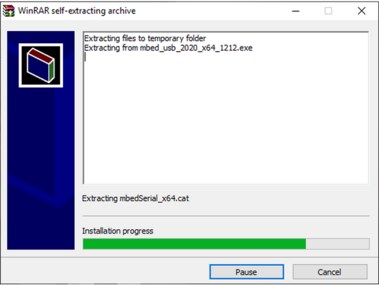

 “**Installeren**” en “**Volgende**”.

“**Installeren**” en “**Voltooien**”.

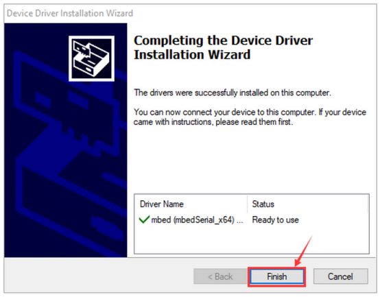

Daarna, ga naar “**Deze computer**” —> “**Eigenschappen**” —> “**Apparaatbeheer**”:

