**After-sales Service**

If something is found missing or broken, or you have some difficulty learning the kit, please feel free to contact us. Welcome to send email to us: service@keyestudio.com

We will endeavor to update projects and products continuously from your sincere advice! Thanks!

# Product Introduction

**FKS0004 Keyestudio microbit learning kit**

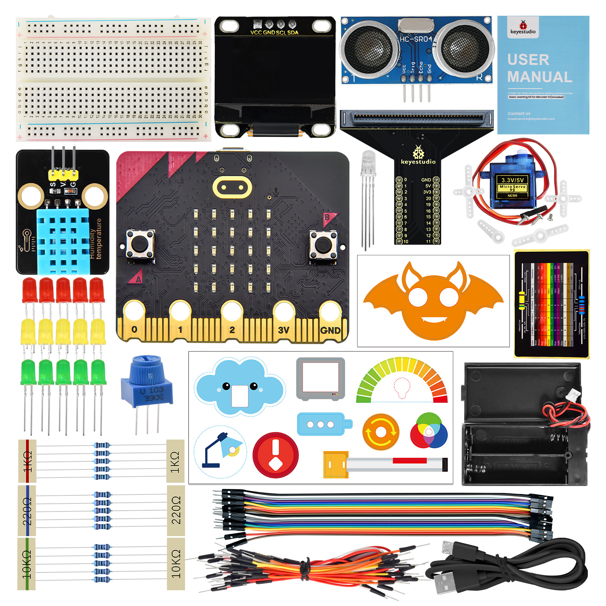

This learning kit covers sensors and components as well as a Micro:bit board, and the included animation card makes experiments more exquisite and beautiful. It not only enables makers to experience the charm and practicality of technology, but also cultivates their logical thinking.

At the same time, it fully demonstrates the practical value and educational significance of the application of science and technology.

# Obtain Resources (**Important**) 

**Download (Important)**：[MakeCode_Tutorial](./MakeCode_Tutorial.7z) .

**Special reminder:** After downloading MakeCode_Tutorial file, extract it. The folder includes codes, USB driver, etc.

**Download (Important)**：[MicroPython_Tutorial](./MicroPython_Tutorial.7z) .

**Special reminder:** After downloading MicroPython_Tutorial file, extract it. The folder includes codes, Library, USB driver, etc.

# Product Kit List

Please check the list to ensure that all parts are intact. If you find missing ones, please contact our sales staff immediately.

|  #   |           PIC            |                             NAME                             | QTY  |
| :--: | :----------------------: | :----------------------------------------------------------: | :--: |
|  1   | 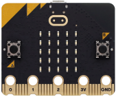  |                  micro:bit V2.0 main board                   |  1   |
|  2   | 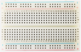  |                          breadboard                          |  1   |
|  3   |   |                      ultrasonic sensor                       |  1   |
|  4   | 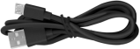  |                       Micro USB cable                        |  1   |
|  5   | 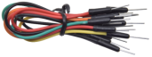  |                          jump wire                           |  1   |
|  6   |   |                            servo                             |  1   |
|  7   | 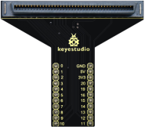  |               micro:bit T-type expansion board               |  1   |
|  8   | 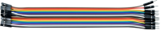  |                         DuPont wire                          |  1   |
|  9   | 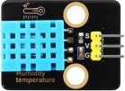  | XHT11 (compatible with DHT11) |  1   |
|  10  |   |                         OLED module                          |  1   |
|  11  | 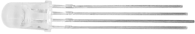  |                           RGB LED                            |  1   |
|  12  |   |                        potentiometer                         |  1   |
|  13  | 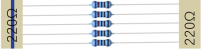  |                        220Ω resistor                         |  5   |
|  14  | 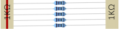  |                         1kΩ resistor                         |  5   |
|  15  |   |                        10kΩ resistor                         |  5   |
|  16  | 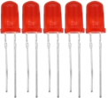  |                           red LED                            |  5   |
|  17  | 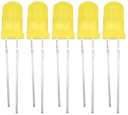  |                          yellow LED                          |  5   |
|  18  | 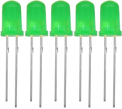  |                          green LED                           |  5   |
|  12  | 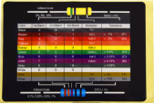  |                       resistance card                        |  1   |
|  12  | 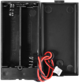  |                        battery holder                        |  1   |
|  13  | 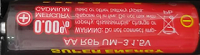  | AA battery (self-provided) |  2   |
|  14  |  |                             card                             |  1   |
|  15  | 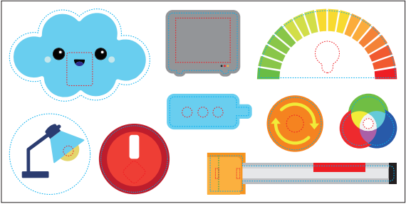 |                             card                             |  1   |

# T-type Expansion Board

## 1. Introduction

In the education market, micro:bit boards are becoming more and more popular. However, it is not easy to test a single micro:bit board with other sensor modules. Hence, we have specially designed this micro:bit T-type expansion board.

Micro:bit T-type expansion board splits all the IO ports on the board into pins with a spacing of 2.54mm (GND, 5V, 3V3, Signal), which is very convenient to connect with other sensor modules and electronic components.

In addition, you can power the micro:bit board through the white DC port (DC 3V) or micro USB interface (DC 5V) on the expansion board.

The expansion board is able to boost or converse the voltage. If it is powered by an external power 3V, it can output 3.3V and 5V voltages.

## 2. Features

- Input voltage: white DC port (DC 3V) or micro USB interface (DC 5V)

- Output voltage: 3.3V or 5V

- The IO ports of micro:bit is divided into pins with a spacing of 2.54mm

- Dimensions: 64mm x 56mm x 18mm

- Weight: 13.1g

## 3. Pin-out

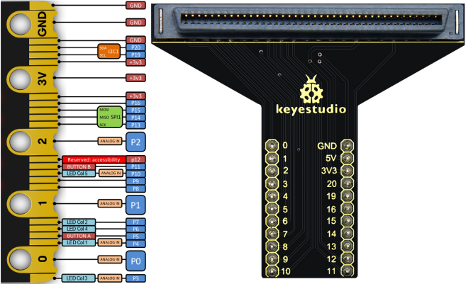

# About Micro:bit

## 1. What is Micro:bit

Launched by British Broadcasting Corporation (BBC), micro:bit is a microcomputer development board designed for programming education for teenagers.

Though it is just the size of a credit card, the board integrates many components, including a 5x5 LED matrix, 2 programmable buttons, an accelerometer, a compass, a thermometer, a touch-sensitive logo and a MEMS microphone, a low energy Bluetooth module and a buzzer. This built-in buzzer plays all kinds of sounds without any external equipment. Moreover, its sleeping mode lowers power consumption of batteries when the Reset&Power button is long-pressed. 

### 1.1. Micro:bit V2 Board Layout

### 1.2. Micro:bit V2 Pin-out

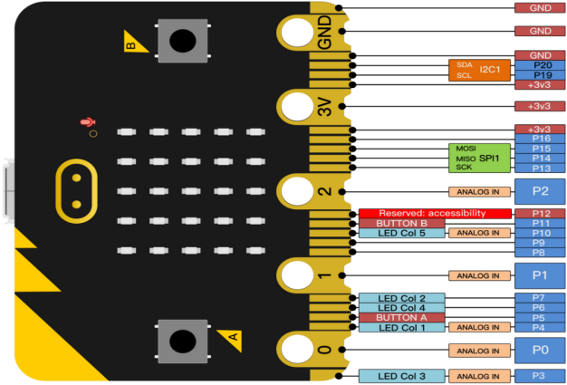

Micro:bit pin functions:

| function            | pins                                                         |
| :------------------ | :----------------------------------------------------------- |
| GPIO                | P0，P1，P2，P3，P4，P5，P6，P7，P8，P9，P10，P11，P12，P13，P14，P15，P16，P19，P20 |
| ADC/DAC             | P0，P1，P2，P3，P4，P10                                      |
| IIC                 | P19（SCL），P20（SDA）                                       |
| SPI                 | P13（SCK），P14（MISO），P15（MOSI）                         |
| PWM (commonly used) | P0，P1，P2，P3，P4，P10                                      |
| occupied            | P5(Button A)，P6(LED Col4)，P7(LED Col2)，P10(LED Col5)，P11(Button B) |

For more please visit official website:

- [https://tech.microbit.org/hardware/edgeconnector/](https://tech.microbit.org/hardware/edgeconnector/)

- [https://microbit.org/guide/hardware/pins/](https://microbit.org/guide/hardware/pins/)

### 1.3. Notes for the Application of Micro:bit V2

1. It is recommended to cover it with a silicone protector to prevent short circuit for it has a lot of sophisticated electronic components.

2. Its IO port is very weak in driving since it can merely handle current less than 300mA. Therefore, do not connect it with devices operating in large current, such as servo MG995 and DC motor, or it will get burnt. Furthermore, you must figure out the current requirements of the devices before you use them and it is generally recommended to use the board together with a Micro:bit shield.

3. It is recommended to power the main board via the USB interface or via the battery of 3V. The IO port of this board is 3V3, so it does not support sensors of 5V. If you need 5V, the expansion board is required to connect to an external power.

4. When using pins(P3, P4, P6, P7 and P10) shared with the LED dot matrix, block them from the matrix. Otherwise, the LED may display randomly and the data about connected sensors maybe wrong.

5. **Pin 19 and 20 can not be used as IO ports** though the Makecode shows they can. They can only be used for I2C communication.

6. The battery port of 3V cannot be connected with battery more than 3.3V, or the board will be damaged.

7. Forbid to operate it on metal products to avoid short circuit.

Simply put, micro:bit is like a microcomputer which has made programming at our fingertips and enhanced digital innovation. 

## 2. Micro:bit Driver

Micro:bit is free of driver installation. However, in case your computer fail to recognize the main board, you need to install the diver.

**Driver installation instructions:**

Connect micro:bit main board to computer via USB cable.

In both MicroPython_Tutorial folder and MicroPython_Tutorial folder, we provide driver files. You choose one of them. click the driver file to “**Install**”.

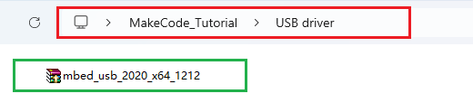

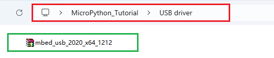

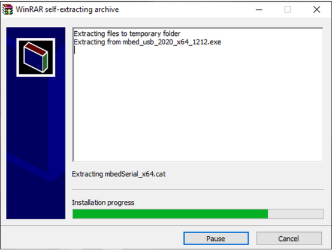

 “**Install**” and “**Next**”.

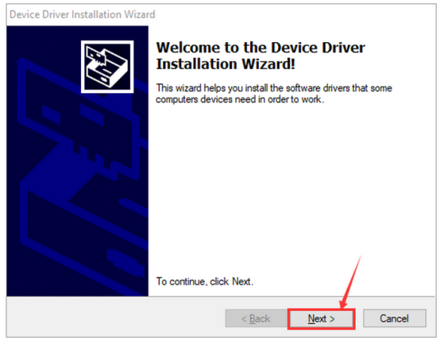

“**Install**” and “**Finish**”.

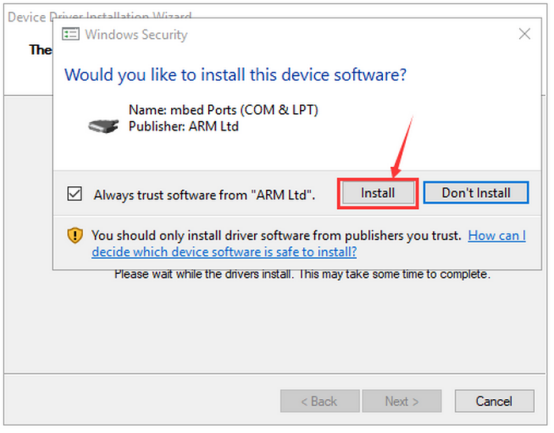

After that, enter “**Computer**” —> “**Properties**” —> “**Device manager**”:

